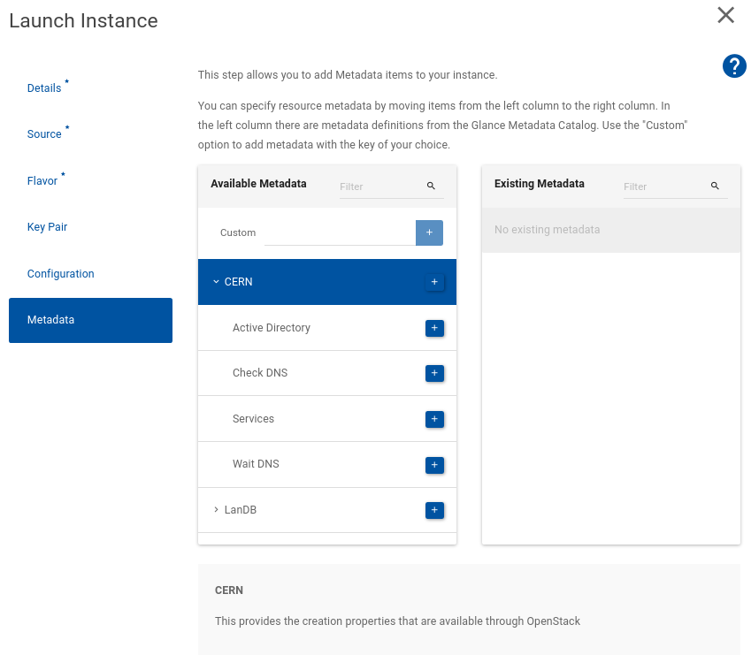

CERN instance boot properties
-----------------------------

The following properties can only be set during the `openstack server create` process. The term metadata is also used to describe these variables and values.

    $ openstack server create --property key=value ...

You can also set these properties at creation time using the Web UI. In that case, during the launch instance wizard you need to go to the metadata step. Then to show the available properties please click on the drop down button that will expand those. Later, you need to click on the + button to specify the properties to use. And finally in the right hand side, you can specify the value you want for each of the properties selected.

PropertyDescriptioncern-services(THIS OPTION IS DEPRECATED AND WILL BE REMOVED SOON. PLEASE USE: cern-waitdns and cern-activedirectory) Set to true (default) or false to determine whether the additional integration into the CERN services is required. These services include a DNS entry using the server name specified so the name matches the IP address in LANDB, Active directory so that kerberos identity is established before booting and an X.509 certificate for the host is available. However, this also makes the boot time significantly longer.

**Note:** This should not be used if an AFS client or other Kerberos/Grid tools are needed. Standard images such as the "CC7 Extra" images should not be used with this option.

cern-waitdnsSet to true (default) or false in order to wait for DNS propagation before booting the new instance. 

**Note:** Some CERN services require that the host is available in the DNS. DNS propagation can take up to 15 minutes.

cern-activedirectorySet to true (default) or false in order to register the new instance into Active Directory before boot 

**Note:** Some CERN services require that the host is registered into Active Directory.

cern-checkdnsSet to true (default) or false in order to check if the name is available in the DNS. If not available means that a previous instance was using that name and it's not removed yet from DNS (DNS propagation can take up to 15 minutes). 

**Note:** that if cern-checkdns=false the name resolution can be to a wrong IP until the DNS propagation.

Other properties
----------------

A virtual machine's configuration can be adjusted during its lifetime. The following properties can be changed in real time.

Metadata options can be passed to the virtual machine using the `--property` option such as

    $ openstack server set --property landb-description="document server" timdoc143

Properties can also be modified in the Web UI. In that case, you can click on the Update Metadata action for your virtual machine in the Instances view. Then you can see all the properties available by expanding the drop down buttons. You can add new ones by clicking on the + button or remove existing ones by clicking on the - button. Once you are ok with the changes click save to set the values in the machine

PropertyDescriptionlandb-descriptionSets the LanDB description field to the value provided. By default, this string is empty.landb-mainuserA User name or e-group name. The primary user of the virtual machine. The syntax for the field is the CERN user name (such as timbell) and not the e-mail address. e-groups are specified by giving the name of the group (i.e. the mailing list address without @cern.ch).landb-responsibleA User name or e-group name. The person responsible for the virtual machine. The syntax is as for mainuser.

**Note**: The landb-responsible will be notified of all the possible interventions that can be done in the hypervisor hosting your VM

landb-osThe operating system to be stored in LanDB. This is a free format field but common values are "LINUX" and "WINDOWS 7".landb-osversionThe operating system version to be stored in LanDB. This is a free format field. For "LINUX", this is generally set to the release.version of the corresponding version of RHEL. For "WINDOWS", this is set to the extended version such as "SP1"landb-aliasComma separated list of alias names per interface FQDN. 

**Example:** "alias1,alias2,alias3" 

**Note:** When using multiple interfaces use ";" to separate different interfaces/alias mappings and ":" to map interface fqdn to alias. 

**Example:** "INTERFACE\_1\_FQDN:myalias1,myalias2;INTERFACE\_2\_FQDN:myalias3,myalias4" 

**Note:** The previous alias list is overwritten by this command. Thus, if you wish to append a new alias, it is necessary to get the value using nova show and then add the new alias.

**Note:** If not specified, the alias domain defaults to ".cern.ch". The alias domain needs to be the same as the interface."

**Note:** An alias will create a CNAME entry in the DNS. If you need an "A" entry instead, you can append '--LOAD-1-' to your alias name. For example, the alias 'myalias' will create a DNS CNAME entry, an alias called 'myalias--LOAD-1-' will create an "A" entry. The server will be reachable by 'myalias' in both cases. 

**Note:** If you remove the property "landb-alias", all the alias from all the interfaces of the instance will be removed.

landb-ipv6readyA Boolean (true or false). Set to true if the applications running on the VM can support IPv6\. This is false by default while testing of applications continues. For details of how to configure your VM with IPv6, see [Enabling IPv6 ](https://clouddocs.web.cern.ch/networking/ipv6.html).landb-internet-connectivityA Boolean (true or false). Set to false if the VM should have no external connectivity. This is true by default. If the instance has multiple interfaces attached, the interface needs to be explicitly mentioned. 

**Example:** "INTERFACE\_1\_FQDN:true; INTERFACE\_2\_FQDN:false"

landb-domainAllows to change the DNS domain of an attached interface. 

**Example:** "INTERFACE\_HOSTNAME\_1"."NEW\_DOMAIN\_NAME". If you would like to change the domain of multiple interfaces use ";" to separate them. If an entry is removed from the list the interface will be moved back to the ".cern.ch" domain.

landb-setAdds the VM interface to a LanDB Set. 

**Example:** landb-set="MY LANDB SET" 

 The Set needs to be configured to allow OpenStack to add/remove VM interfaces. First the Set "Description" needs to include the OpenStack project that has access to the Set. 

**Example:** OPENSTACK\_PROJECT=MY\_PROJECT\_UUID; 

 Finally, the egroup for the Set "Responsible" egroup needs to include the "openstack-landb-set-access" egroup as a member. NOTE: It's your egroup that needs to include "openstack-landb-set-access". If you set the "openstack-landb-set-access" egroup directly as the Set responsible you lose access to the lanDB Set

 **NOTE** If you use the OpenStack metadata, avoid editing manually the Set using the LanDB interface. Also, confirm always the add/remove operations in the Set

Please note, that service accounts can't own resources in LanDB. If a service account is used to set the properties "landb-mainuser" or "landb-responsible" the owner of the service account will be used instead.

Clearing properties
-------------------

If a value needs to be cleared, this can be done using the `openstack server unset` command. For example, the following removes the LanDB description value. This setting is especially useful where LanDB values need resetting to their defaults.

    $ openstack server unset --property landb-description timdoc144

You can also clear properties using the Web UI. In that case click on the update Metadata action for your virtual machine in the Instances view. Then you'll see all the existing properties that you machine has. You can clear existing ones by clicking on the - button. Once you are ok with the changes click save to set the values in the machine

