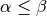
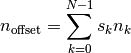
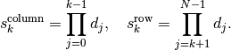

Summary

Release:0.8.0Date:juillet 01, 2011Authors:**Thomas Cokelaer**Target:developers and administratorsstatus:mature

Contents

* [Restructured Text (reST) and Sphinx CheatSheet](http://openalea.gforge.inria.fr/doc/openalea/doc/_build/html/source/sphinx/rest_syntax.html#restructured-text-rest-and-sphinx-cheatsheet)
* [Generalities](http://openalea.gforge.inria.fr/doc/openalea/doc/_build/html/source/sphinx/rest_syntax.html#generalities)
  * [Introduction](http://openalea.gforge.inria.fr/doc/openalea/doc/_build/html/source/sphinx/rest_syntax.html#introduction)
  * [Text syntax: bold, italic, verbatim and special characters `](http://openalea.gforge.inria.fr/doc/openalea/doc/_build/html/source/sphinx/rest_syntax.html#text-syntax-bold-italic-verbatim-and-special-characters)
  * [Headings](http://openalea.gforge.inria.fr/doc/openalea/doc/_build/html/source/sphinx/rest_syntax.html#headings)
  * [Directives](http://openalea.gforge.inria.fr/doc/openalea/doc/_build/html/source/sphinx/rest_syntax.html#directives)
  * [Internal and External Links](http://openalea.gforge.inria.fr/doc/openalea/doc/_build/html/source/sphinx/rest_syntax.html#internal-and-external-links)
  * [list and bullets](http://openalea.gforge.inria.fr/doc/openalea/doc/_build/html/source/sphinx/rest_syntax.html#list-and-bullets)
  * [tables](http://openalea.gforge.inria.fr/doc/openalea/doc/_build/html/source/sphinx/rest_syntax.html#tables)
  * [Include other reST files and TOC](http://openalea.gforge.inria.fr/doc/openalea/doc/_build/html/source/sphinx/rest_syntax.html#include-other-rest-files-and-toc)
  * [Comments and aliases](http://openalea.gforge.inria.fr/doc/openalea/doc/_build/html/source/sphinx/rest_syntax.html#comments-and-aliases)
* [Special directives](http://openalea.gforge.inria.fr/doc/openalea/doc/_build/html/source/sphinx/rest_syntax.html#special-directives)
  * [colored boxes: note, seealso, todo and warnings](http://openalea.gforge.inria.fr/doc/openalea/doc/_build/html/source/sphinx/rest_syntax.html#colored-boxes-note-seealso-todo-and-warnings)
  * [Inserting code and Literal blocks](http://openalea.gforge.inria.fr/doc/openalea/doc/_build/html/source/sphinx/rest_syntax.html#inserting-code-and-literal-blocks)
  * [Maths and Equations with LaTeX](http://openalea.gforge.inria.fr/doc/openalea/doc/_build/html/source/sphinx/rest_syntax.html#maths-and-equations-with-latex)
  * [Add tests with doctests](http://openalea.gforge.inria.fr/doc/openalea/doc/_build/html/source/sphinx/rest_syntax.html#add-tests-with-doctests)
  * [Auto-document your python code](http://openalea.gforge.inria.fr/doc/openalea/doc/_build/html/source/sphinx/rest_syntax.html#auto-document-your-python-code)
  * [Image directive](http://openalea.gforge.inria.fr/doc/openalea/doc/_build/html/source/sphinx/rest_syntax.html#image-directive)
  * [figure directive](http://openalea.gforge.inria.fr/doc/openalea/doc/_build/html/source/sphinx/rest_syntax.html#figure-directive)
  * [Topic directive](http://openalea.gforge.inria.fr/doc/openalea/doc/_build/html/source/sphinx/rest_syntax.html#topic-directive)
  * [Sidebar directive](http://openalea.gforge.inria.fr/doc/openalea/doc/_build/html/source/sphinx/rest_syntax.html#sidebar-directive)
  * [glossary, centered, index, download and field list](http://openalea.gforge.inria.fr/doc/openalea/doc/_build/html/source/sphinx/rest_syntax.html#glossary-centered-index-download-and-field-list)
* [Others](http://openalea.gforge.inria.fr/doc/openalea/doc/_build/html/source/sphinx/rest_syntax.html#others)
  * [Footnote](http://openalea.gforge.inria.fr/doc/openalea/doc/_build/html/source/sphinx/rest_syntax.html#footnote)
  * [Citations](http://openalea.gforge.inria.fr/doc/openalea/doc/_build/html/source/sphinx/rest_syntax.html#citations)
  * [More about aliases](http://openalea.gforge.inria.fr/doc/openalea/doc/_build/html/source/sphinx/rest_syntax.html#more-about-aliases)
  * [Cross-referencing syntax](http://openalea.gforge.inria.fr/doc/openalea/doc/_build/html/source/sphinx/rest_syntax.html#cross-referencing-syntax)
  * [Adding raw html](http://openalea.gforge.inria.fr/doc/openalea/doc/_build/html/source/sphinx/rest_syntax.html#adding-raw-html)

See also

This documentation is based based upon documentation found in:

* [Sphinx](http://sphinx.pocoo.org/rest.html)
* [Docutils](http://docutils.sourceforge.net/rst.html)

Note

Sphinx code is written in reST. Nonetheless, sphinx adds many additional directives on top of the reST syntax. Therefore sphinx code may not be fully compatible with reST.

[3.6.2\. Generalities](http://openalea.gforge.inria.fr/doc/openalea/doc/_build/html/source/sphinx/rest_syntax.html#id4)
=======================================================================================================================

[3.6.2.1\. Introduction](http://openalea.gforge.inria.fr/doc/openalea/doc/_build/html/source/sphinx/rest_syntax.html#id5)
-------------------------------------------------------------------------------------------------------------------------

reStructuredText is an easy-to-read, what-you-see-is-what-you-get plaintext markup syntax and parser system. It is useful for in-line program documentation (such as Python docstrings), for quickly creating simple web pages, and for standalone documents.

Warning

like Python, reST syntax is sensitive to indentation !

Warning

reST requires blank lines between paragraphs

[3.6.2.2\. Text syntax: bold, italic, verbatim and special characters `](http://openalea.gforge.inria.fr/doc/openalea/doc/_build/html/source/sphinx/rest_syntax.html#id6)
-------------------------------------------------------------------------------------------------------------------------------------------------------------------------

basic usage:

* use one asterisk on each side of a text you want to emphasize in *italic* and 2 asterisks in you want to make it **bold**:

      *italic*
    **bold**
* double backquotes are used to make a text verbatim. For instance, it you want to use special characters such as \*:

      This ``*`` character is not interpreted
* Finally, the single backquote is used for reST special commands (e.g., hyper links with spaces):

      This is how to create hyperlinks (see later)  `OpenAlea wiki <openalea.gforge.inria.fr>`_

  Note

  If asterisks or backquotes appear in running text and could be confused with inline markup delimiters, they have to be escaped with a backslash.

advanced usage:

Be aware of some restrictions of this markup:

* it may not be nested,
* content may not start or end with whitespace: \* text\* is wrong,
* it must be separated from surrounding text by non-word characters.

Use a backslash escaped space to work around that:

* this is a \*longish\* paragraph is correct and gives *longish*.
* this is a long\*ish\* paragraph is not interpreted as expected. You should use this is a long\\ \*ish\* paragraph to obtain long*ish* paragraph

Warning

In Python docstrings it will be necessary to escape any backslash characters so that they actually reach reStructuredText. The simplest way to do this is to use raw strings:

Python stringTypical resultr"""\\\*escape\* \\`with` "\\\\""""\*escape\* `with` "\\""""\\\\\*escape\* \\\\`with` "\\\\\\\\""""\*escape\* `with` "\\""""\\\*escape\* \\`with` "\\\\""""escape with ""

[3.6.2.3\. Headings](http://openalea.gforge.inria.fr/doc/openalea/doc/_build/html/source/sphinx/rest_syntax.html#id7)
---------------------------------------------------------------------------------------------------------------------

In order to write a title, just underline it:

    *****
    Title
    *****

    subtitle
    ########

    subsubtitle
    ***********
    and so on

Two rules:

> * use at least as many characters as the length of the title
> * characters usage is quite flexible but be consistent

Normally, there are no heading levels assigned to certain characters as the structure is determined from the succession of headings. However, for the Python documentation, this convention is used which you may want to follow :

* \# with overline, for parts
* \* with overline, for chapters
* =, for sections
* -, for subsections
* ^, for subsubsections
* “, for paragraphs

[3.6.2.4\. Directives](http://openalea.gforge.inria.fr/doc/openalea/doc/_build/html/source/sphinx/rest_syntax.html#id8)
-----------------------------------------------------------------------------------------------------------------------

reST is mainly based on *directives* that are defined as follows:

    .. <name>:: <arguments>
        :<option>: <option values>

        content

Example:

    .. image:: ../images/test.png
        :width: 200pt

Warning

note the space between the directive and its argument as well as the blank line between the option and the content

There are many directives which are extended thanks to plugin (e.g., math plugin for latex equations). Some of them are described here below.

[3.6.2.5\. Internal and External Links](http://openalea.gforge.inria.fr/doc/openalea/doc/_build/html/source/sphinx/rest_syntax.html#id9)
----------------------------------------------------------------------------------------------------------------------------------------

Internal hyperlinks: 

All titles are considered as internal hyperlinks that may be refered to using this syntax:

    `Internal and External links`_

You may also create hyperlink as follows:

    .. _begin:

And then inserting begin\_ in your text. For instance, jump to the beginning of this document [rst\_tutorial](http://openalea.gforge.inria.fr/doc/openalea/doc/_build/html/source/sphinx/rest_syntax.html#rst-tutorial)

Note

Note the underscore at the end ot the links

External links:

In order to link to external links simply use:

    `Python <http://www.python.org/>`_

that is rendered as a normal hyperlink [Python](http://www.python.org/).

Note

If you have an underscore within the label/name, you got to escape it with a ‘\\’ character.

[3.6.2.6\. list and bullets](http://openalea.gforge.inria.fr/doc/openalea/doc/_build/html/source/sphinx/rest_syntax.html#id10)
------------------------------------------------------------------------------------------------------------------------------

The following code:

    * This is a bulleted list.
    * It has two items, the second
      item uses two lines. (note the indentation)

    1. This is a numbered list.
    2. It has two items too.

    #. This is a numbered list.
    #. It has two items too.

gives:

* This is a bulleted list.
* It has two items, the second item uses two lines. (note the indentation)

1. This is a numbered list.
2. It has two items too.
3. This is a numbered list.
4. It has two items too.

Note

if two lists are separated by a blanck line only, then the two lists are not differentiated as you can see above.

[3.6.2.7\. tables](http://openalea.gforge.inria.fr/doc/openalea/doc/_build/html/source/sphinx/rest_syntax.html#id11)
--------------------------------------------------------------------------------------------------------------------

There are several ways to write tables. Use standard reStructuredText tables as explained here. They work fine in HTML output, however, there are some gotchas when using tables for LaTeX output.

simple table:

Simple tables can be written as follows:

    +---------+---------+-----------+
    | 1       |  2      |  3        |
    +---------+---------+-----------+

which gives:

1

2

3

complex table:

    +------------+------------+-----------+
    | Header 1   | Header 2   | Header 3  |
    +============+============+===========+
    | body row 1 | column 2   | column 3  |
    +------------+------------+-----------+
    | body row 2 | Cells may span columns.|
    +------------+------------+-----------+
    | body row 3 | Cells may  | - Cells   |
    +------------+ span rows. | - contain |
    | body row 4 |            | - blocks. |
    +------------+------------+-----------+

gives:

Header 1

Header 2

Header 3

body row 1

column 2

column 3

body row 2

Cells may span columns.

body row 3

Cells may span rows.

* Cells
* contain
* blocks.

body row 4

another way:

    =====  =====  ======
       Inputs     Output
    ------------  ------
      A      B    A or B
    =====  =====  ======
    False  False  False
    True   False  True
    =====  =====  ======

gives:

Inputs

Output

A

B

A or B

False

False

False

True

False

True

Note

table and latex documents are not yet compatible in sphinx, and you should therefore precede them with the a special directive (.. htmlonly::)

The previous examples work fine in HTML output, however there are some gotchas when using tables in LaTeX: the column width is hard to determine correctly automatically. For this reason, the following directive exists:

    .. tabularcolumns:: column spec

This directive gives a “column spec” for the next table occurring in the source file. It can have values like:

    |l|l|l|

which means three left-adjusted (LaTeX syntax). By default, Sphinx uses a table layout with L for every column. This code:

    .. tabularcolumns:: |l|c|p{5cm}|

    +--------------+---+-----------+
    |  simple text | 2 | 3         |
    +--------------+---+-----------+

gives

title  simple text23

[3.6.2.8\. Include other reST files and TOC](http://openalea.gforge.inria.fr/doc/openalea/doc/_build/html/source/sphinx/rest_syntax.html#id12)
----------------------------------------------------------------------------------------------------------------------------------------------

Since reST does not have facilities to interconnect several documents, or split documents into multiple output files, Sphinx uses a custom directive to add relations between the single files the documentation is made of, as well as tables of contents. The toctree directive is the central element.

    .. toctree::
        :maxdepth: 2

        intro
        chapter1
        chapter2

Globbing can be used by adding the *glob* option:

    .. toctree::
        :glob:

        intro*
        recipe/*
        *

The name of the file is used to create the title in the TOC. You may want to change this behaviour by changing the toctree as follows:

    .. toctree::
        :glob:

        intro
        Chapter1 description <chapter1>

[3.6.3\. Special directives](http://openalea.gforge.inria.fr/doc/openalea/doc/_build/html/source/sphinx/rest_syntax.html#id14)
==============================================================================================================================

[3.6.3.1\. colored boxes: note, seealso, todo and warnings](http://openalea.gforge.inria.fr/doc/openalea/doc/_build/html/source/sphinx/rest_syntax.html#id15)
-------------------------------------------------------------------------------------------------------------------------------------------------------------

There are simple directives like **seealso** that creates nice colored boxes:

See also

This is a simple **seealso** note.

created using:

    .. seealso:: This is a simple **seealso** note. Other inline directive may be included (e.g., math :math:`\alpha`) but not al of them.

You have also the **note** and **warning** directives:

Note

This is a **note** box.

Warning

note the space between the directive and the text

Todo

a todo box

There is another nice dircective with the **todo** one but it requires to add sphinx.ext.todo extension in the **conf.py** file and these two lines of code:

    [extensions]
    todo_include_todos=True

[3.6.3.2\. Inserting code and Literal blocks](http://openalea.gforge.inria.fr/doc/openalea/doc/_build/html/source/sphinx/rest_syntax.html#id16)
-----------------------------------------------------------------------------------------------------------------------------------------------

simple code:

Literal code blocks are introduced by ending a paragraph with the special marker (double coulumn) ::. The literal block must be indented (and, like all paragraphs, separated from the surrounding ones by blank lines).

The two following codes:

    This is a simple example::

        import math
        print 'import done'

and:

    This is a simple example:
    ::

        import math
        print 'import done'

gives:

This is a very simple example:

    import math
    print 'import done'

code-block:

By default the syntax of the language is Python, but you can specify the language using the **code-block** directive as follows:

    .. code-block:: html
        :linenos:

       <h1>code block example</h1>

produces

    1

    <h1>code block example</h1>

literalinclude:

Then, it is also possible to include the contents of a file as follows:

    .. literalinclude:: filename
        :linenos:
        :language: python
        :lines: 1, 3-5
        :start-after: 3
        :end-before: 5

     1
     2
     3
     4
     5
     6
     7
     8
     9
    10
    11
    12
    13
    14
    15
    16
    17
    18

    """ here is a dummy documentation"""

    import os

    def square(a):
        """short description of the function square

        longish explanation: returns the square of a: :math:`a^2`

        :param a: an input argument

        :returns: a*a
        """
        return a*a

    assert 4 == square(2)

[3.6.3.3\. Maths and Equations with LaTeX](http://openalea.gforge.inria.fr/doc/openalea/doc/_build/html/source/sphinx/rest_syntax.html#id17)
--------------------------------------------------------------------------------------------------------------------------------------------

In order to include equations or simple Latex code in the text (e.g.,  ) use the following code:

    :math:`\alpha > \beta`

Warning

The *math* markup can be used within reST files (to be parsed by Sphinx) but within your python’s docstring, the slashes need to be escaped ! :math:`\\alpha` should therefore be written :math:`\\\\alpha` or put an “r” before the docstring

Note also, that you can easily more complex mathematical expressions using the math directive as follows:

    .. math::

        n_{\mathrm{offset}} = \sum_{k=0}^{N-1} s_k n_k

It seems that there is no limitations to LaTeX usage:

[3.6.3.4\. Add tests with doctests](http://openalea.gforge.inria.fr/doc/openalea/doc/_build/html/source/sphinx/rest_syntax.html#id18)
-------------------------------------------------------------------------------------------------------------------------------------

### 3.6.3.4.1\. quickstart

you may want to include test directly within your reSt documents or docstring as follows:

    .. doctest::

        >>> import math
        >>> print math.sqrt(2.)
        1.41421356237

which will be displayed like that:

    >>> import math
    >>> print math.sqrt(2.)
    1.41421356237

and instead of compiling the HTML doc, type:

    make doctest

See ` \<<http://docs.python.org/library/doctest.html>\>`\_ for a complete description

Analysing the code above, the ‘\>\>\>’ sign means run the command that follows. If a command returns a value then the next line must contain the expected results otherwise an error occurs. This is why we put the results of square root 2 above.

### 3.6.3.4.2\. +SKIP option

Now, you may say that you do not know the expecting result or do not care about it. In such case, add this comment: **\#doctest: +SKIP**

> >>> import math
>     >>> print math.log(20.)

which will be displayed like that:

    >>> import math
    >>> math.log(20.) 

What’s happen here is that the first line is tested, the second one is ran but the validity of the result is not tested.

If you want to skip all the commands (better to use a code-block directive in such case though), then type:

    .. doctest::
        :options: +SKIP

        >>> whatever code

### 3.6.3.4.3\. testsetup

Todo

explain the testsetup

[3.6.3.5\. Auto-document your python code](http://openalea.gforge.inria.fr/doc/openalea/doc/_build/html/source/sphinx/rest_syntax.html#id19)
--------------------------------------------------------------------------------------------------------------------------------------------

Todo

more details here

Let us suppose you have a python file called *test.py* with a function called *square*

    .. module:: test
        :platform: Unix, Windows
        :synopsis: sample of documented python code

    .. autofunction:: square

Gives

*Platforms: *Unix, Windows

Using the **module** creates an index (see top right of this page)

Warning

the python code must be in the PYTHONPATH.

See also

<http://sphinx.pocoo.org/markup/desc.html>

[3.6.3.6\. Image directive](http://openalea.gforge.inria.fr/doc/openalea/doc/_build/html/source/sphinx/rest_syntax.html#id20)
-----------------------------------------------------------------------------------------------------------------------------

Use:

    .. image:: ../images/wiki_logo_openalea.png

to put an image

Note

As mentionned earlier, a directive may have options put between two columns:

    .. image:: ../images/wiki_logo_openalea.png
        :width: 200px
        :align: center
        :height: 100px
        :alt: alternate text

[3.6.3.7\. figure directive](http://openalea.gforge.inria.fr/doc/openalea/doc/_build/html/source/sphinx/rest_syntax.html#id21)
------------------------------------------------------------------------------------------------------------------------------

    .. figure:: ../images/wiki_logo_openalea.png
        :width: 200px
        :align: center
        :height: 100px
        :alt: alternate text
        :figclass: align-center

        figure are like images but with a caption

        and whatever else youwish to add

        .. code-block:: python

            import image

gives

figure are like images but with a caption

and whatever else youwish to add

    import image

[3.6.3.8\. Topic directive](http://openalea.gforge.inria.fr/doc/openalea/doc/_build/html/source/sphinx/rest_syntax.html#id22)
-----------------------------------------------------------------------------------------------------------------------------

A **Topic** directive allows to write a title and a text together within a box similarly to the **note** directive.

This code:

    .. topic:: Your Topic Title

        Subsequent indented lines comprise
        the body of the topic, and are
        interpreted as body elements.

gives

Your Topic Title

Subsequent indented lines comprise the body of the topic, and are interpreted as body elements.

[3.6.3.9\. Sidebar directive](http://openalea.gforge.inria.fr/doc/openalea/doc/_build/html/source/sphinx/rest_syntax.html#id23)
-------------------------------------------------------------------------------------------------------------------------------

It is possible to create sibar

Sidebar Title

Subsequent indented lines comprise the body of the sidebar, and are interpreted as body elements.

using the following code:

    .. sidebar:: Sidebar Title
            :subtitle: Optional Sidebar Subtitle

       Subsequent indented lines comprise
       the body of the sidebar, and are
       interpreted as body elements.

Note

sidebar appears as floating box and may not appear nicely.

[3.6.3.10\. glossary, centered, index, download and field list](http://openalea.gforge.inria.fr/doc/openalea/doc/_build/html/source/sphinx/rest_syntax.html#id24)
-----------------------------------------------------------------------------------------------------------------------------------------------------------------

Field list:

Whatever:this is handy to create new field and the following text is indented

    :Whatever: this is handy to create new field

glossary:

    .. glossary::

        apical
            at the top of the plant.

gives

apical

at the top of the plant.

centered:

    .. centered::

index:

    .. index::

download:

    :download:`download test.py <test.py>`

gives [download test.py](http://openalea.gforge.inria.fr/doc/openalea/doc/_build/html/_downloads/test1.py)

[3.6.4\. Others](http://openalea.gforge.inria.fr/doc/openalea/doc/_build/html/source/sphinx/rest_syntax.html#id25)
==================================================================================================================

[3.6.4.1\. Footnote](http://openalea.gforge.inria.fr/doc/openalea/doc/_build/html/source/sphinx/rest_syntax.html#id26)
----------------------------------------------------------------------------------------------------------------------

For footnotes, use [\#name]\_ to mark the footnote location, and add the footnote body at the bottom of the document after a “Footnotes” rubric heading, like so:

    Some text that requires a footnote [#f1]_ .

    .. rubric:: Footnotes

    .. [#f1] Text of the first footnote.

You can also explicitly number the footnotes ([1]\_) or use auto-numbered footnotes without names ([\#]\_). Here is an example [[1]](http://openalea.gforge.inria.fr/doc/openalea/doc/_build/html/source/sphinx/rest_syntax.html#footnote1).

[3.6.4.2\. Citations](http://openalea.gforge.inria.fr/doc/openalea/doc/_build/html/source/sphinx/rest_syntax.html#id27)
-----------------------------------------------------------------------------------------------------------------------

Citation references, like [[CIT2002]](http://openalea.gforge.inria.fr/doc/openalea/doc/_build/html/source/sphinx/rest_syntax.html#cit2002) may be defined at the bottom of the page:

    .. [CIT2002] A citation
              (as often used in journals).

and called as follows:

    [CIT2002]_

[3.6.4.3\. More about aliases](http://openalea.gforge.inria.fr/doc/openalea/doc/_build/html/source/sphinx/rest_syntax.html#id28)
--------------------------------------------------------------------------------------------------------------------------------

Directives can be used within aliases:

    .. |logo| image:: ../images/wiki_logo_openalea.png
        :width: 20pt
        :height: 20pt

Using this image alias, you can insert it easily in the text |logo|, like this . This is especially useful when dealing with complicated code. For instance, in order to include 2 images within a table do as follows:

    +---------+---------+-----------+
    | |logo|  | |logo|  | |longtext||
    +---------+---------+-----------+

this is a longish text to include within a table and which is longer than the width of the column.

Note

Not easy to get exactly what you want though.

[3.6.4.4\. Cross-referencing syntax](http://openalea.gforge.inria.fr/doc/openalea/doc/_build/html/source/sphinx/rest_syntax.html#id29)
--------------------------------------------------------------------------------------------------------------------------------------

Todo

to clarify

Cross-references are generated by many semantic interpreted text roles. Basically, you only need to write :role:`target`, and a link will be created to the item named target of the type indicated by role. The links’s text will be the same as target.

You may supply an explicit title and reference target, like in reST direct hyperlinks: :role:`title \<target\>` will refer to target, but the link text will be title.

Note

instead of :role:, you can use :ref:

Todo

how to use intersphinx ?

[3.6.4.5\. Adding raw html](http://openalea.gforge.inria.fr/doc/openalea/doc/_build/html/source/sphinx/rest_syntax.html#id30)
-----------------------------------------------------------------------------------------------------------------------------

Todo

check how it works

 column 1 column 1 

Footnotes

[[1]](http://openalea.gforge.inria.fr/doc/openalea/doc/_build/html/source/sphinx/rest_syntax.html#id1)this is a footnote aimed at illustrating the footnote capability.

Bibliography

[[CIT2002]](http://openalea.gforge.inria.fr/doc/openalea/doc/_build/html/source/sphinx/rest_syntax.html#id2)A citation (as often used in journals).