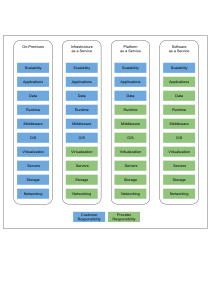
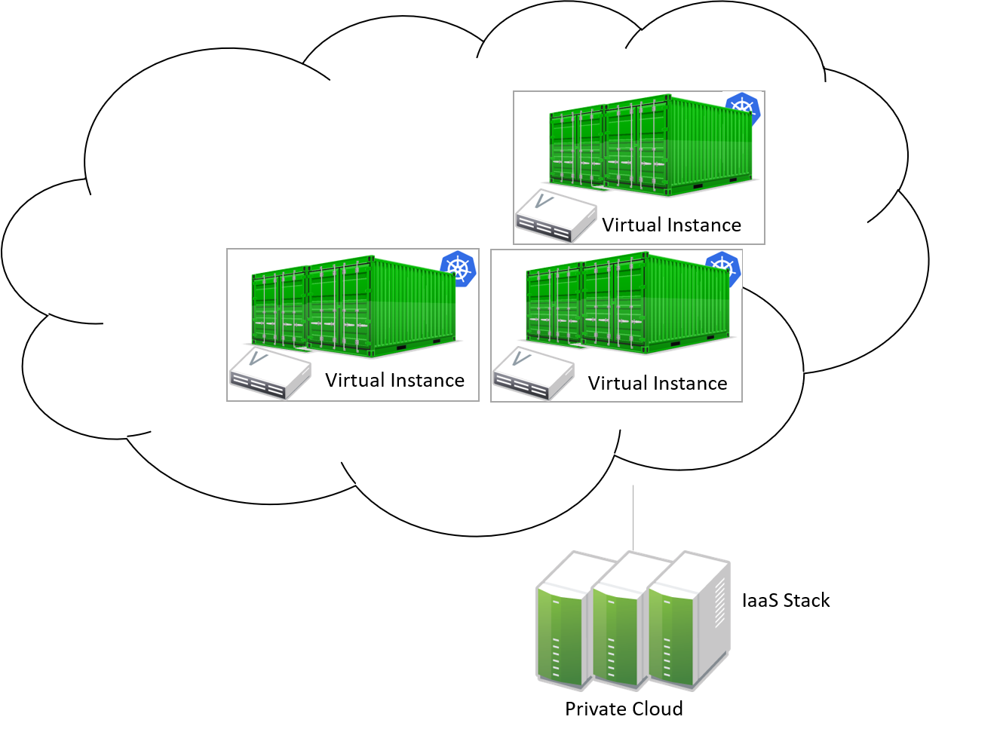
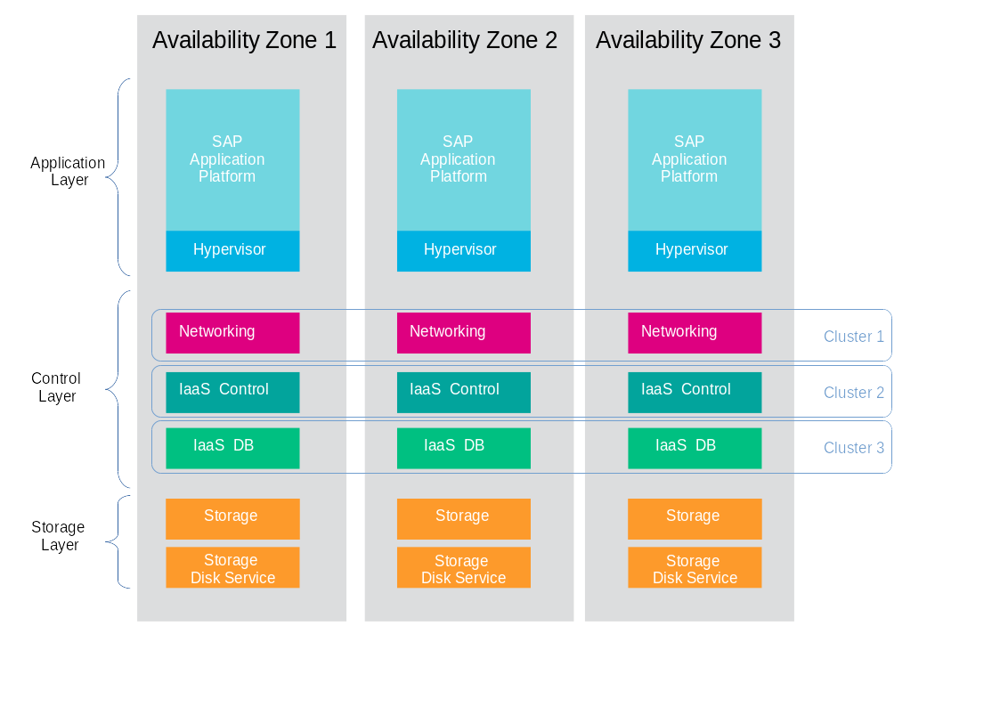
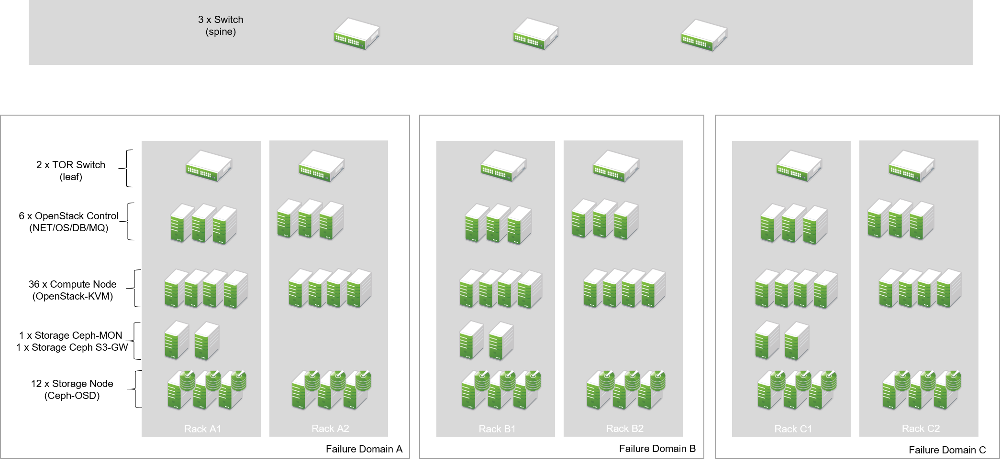
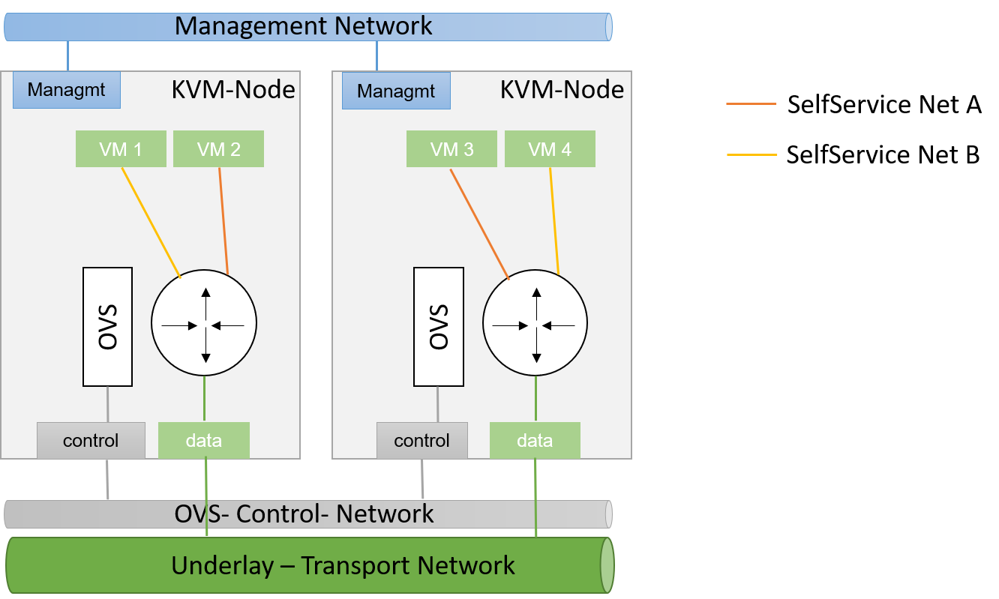
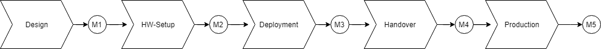

###### SUSE OpenStack Cloud, SUSE Enterprise Storage, SUSE Linux Enterprise Server

This document provides an overview of the architecture and key aspects of an Infrastructure as a Service (IaaS) platform based on SUSE products and is specifically designed and targeted for cloud native workloads running in a large environment. The architecture is based on real world implementations that have been deployed at scale with enterprise customers and utilizes best practices from these setups. 

**Disclaimer**: This document is part of the SUSE Best Practices series. All documents published in this series were contributed voluntarily by SUSE employees and by third parties. The articles are intended only to be one example of how a particular action could be taken. Also, SUSE cannot verify either that the actions described in the articles do what they claim to do or that they do not have unintended consequences. All information found in this document has been compiled with utmost attention to detail. However, this does not guarantee complete accuracy. Therefore, we need to specifically state that neither SUSE LLC, its affiliates, the authors, nor the translators may be held liable for possible errors or the consequences thereof. 

Author: Martin Gerhard Loschwitz, Journalist

Author: Thore Bahr, Presales Consultant, SUSE

Author: Cihat  Karatas, Presales Consultant, SUSE

Author: Markus  Moster, Technical Architect, SUSE

Author: Ralph Roth, Senior Solution Architect, SUSE

Author: Martin Weiss, Senior Solution Architect, SUSE

Publication Date: 2019-07-24

1 About This Document [Report Documentation Bug](https://github.com/SUSE/suse-best-practices/issues/new?title=%5Bdoc%5D%201%20%20About%20This%20Document&body=1%20%20About%20This%20Document%253A%0A%0Ahttps%253A%252F%252Fdocumentation.suse.com%252Fsbp%252Fall%252Fsingle-html%252FSBP-CloudLS-master%252F%2523_about_this_document) [\#](https://documentation.suse.com/sbp/all/single-html/SBP-CloudLS-master/#_about_this_document)
-----------------------------------------------------------------------------------------------------------------------------------------------------------------------------------------------------------------------------------------------------------------------------------------------------------------------------------------------------------------------------------------------------------------------------------------

This document describes how to design and build a large and scalable private cloud to provide **Infrastructure as a Service** (IaaS) based on open source products and open APIs. Private cloud setups are advantageous for both Internet service providers and customers, in comparison to conventional IT setups. From a customer’s point of view, running their own workload inside a public cloud allows for agility and flexibility. For service providers, public cloud setups leverage the principle of *economy of scale*. This means that even with a growing demand, it remains easy and convenient to serve customers.

Together, by means of a public cloud environment, customers and providers create an integrated and optimized enterprise and accelerate digital transformation across the business.

Large scale cloud platforms are designed and built to fulfill the requirements of a modern and future-proof data center. In such an environment, applications are created on virtual machines or container-based, highly automated and with a fast life-cycle (DevOps approach), and are not limited to specific uses cases.

This document provides an overview of the architecture and key aspects of an IaaS platform based on SUSE products. It is specifically designed and targeted for cloud native workloads running in a large environment. The architecture is based on real world implementations that have been deployed at scale with enterprise customers and utilises best practices from these setups.

### 1.1 Cloud Primer [Report Documentation Bug](https://github.com/SUSE/suse-best-practices/issues/new?title=%5Bdoc%5D%201.1%20%20Cloud%20Primer&body=1.1%20%20Cloud%20Primer%253A%0A%0Ahttps%253A%252F%252Fdocumentation.suse.com%252Fsbp%252Fall%252Fsingle-html%252FSBP-CloudLS-master%252F%2523_cloud_primer) [\#](https://documentation.suse.com/sbp/all/single-html/SBP-CloudLS-master/#_cloud_primer)

The term *Cloud* is present everywhere in the IT industry. However, it is important to define the term *Private Cloud* as it is used throughout this document.

#### 1.1.1 Cloud Computing and Conventional Setups [Report Documentation Bug](https://github.com/SUSE/suse-best-practices/issues/new?title=%5Bdoc%5D%201.1.1%20%20Cloud%20Computing%20and%20Conventional%20Setups&body=1.1.1%20%20Cloud%20Computing%20and%20Conventional%20Setups%253A%0A%0Ahttps%253A%252F%252Fdocumentation.suse.com%252Fsbp%252Fall%252Fsingle-html%252FSBP-CloudLS-master%252F%2523_cloud_computing_and_conventional_setups) [\#](https://documentation.suse.com/sbp/all/single-html/SBP-CloudLS-master/#_cloud_computing_and_conventional_setups)

Most conventional IT setups share the same basic design tenets; typically they are customer-specific. This means they were built for a certain customer and only upon said customer’s request. Conventional setups do not share resources with other setups. All resources present in a conventional IT setup are made available to the customer for whom the setup was originally created only.

Conventional IT setups come with several disadvantages for both the Internet Service Provider (ISP) and the customer. The most important aspects are listed below:

* Conventional setups come with long lead times, as they need to be planned and the required hardware must then be acquired. This can take several weeks.
* Conventional setups come with high investment costs to customers for both the development of an actual software solution and the acquisition of hardware (including infrastructure hardware such as network switches or load-balancers).
* Conventional setups tend to see service providers locking customers into a contract for several years, limiting the flexibility of the customer.
* Conventional setups have a low degree of automation. They require several manual steps to be performed both by the customer and the ISP.

The concept of *Cloud Computing* was introduced several years ago as a way to deal with the disadvantages of conventional setups. Clouds enforce a certain role shift, especially from the service provider’s point of view. Instead of serving individual customers with solutions tailor-made to their demands, a cloud setup turns the service provider into a platform provider. A cloud provider’s main responsibility is to run and maintain a platform that makes computing, storage, and network resources available to customers dynamically and on an on-demand principle.

The following list contains a number of factors that are very basic design tenets of clouds:

* Cloud environments allow for seamless scale-out of the platform. This means in case of resource shortage, it is easy for the provider to extend the amount of available resources.
* Cloud environments are based on the principle of API services and the ability to issue requests for resources to said API services using a defined and well-known protocol such as ReST. Using such APIs, services can be implemented in clouds.
* Cloud environments decouple hardware and software and use Software Defined Networking (SDN) and Software Defined Storage (SDS). Because all core functionality is written in software and exists inside the platform itself, the manual configuration of infrastructure hardware such as networking switches becomes unnecessary.
* Cloud environments allow customers to service themselves based on SDN, SDS, and the aforementioned APIs.
* Cloud environments come with a higher level of automation from both the customers' and the provider’s point of view. This saves time on tasks that, in conventional setups, need to be done manually.

Running a public cloud forces an ISP to transform their business. Rather than providing individual services to individual customers, they can use a public cloud that provides an overarching platform that customers are free to use at their own discretion.

#### 1.1.2 OpenStack as the Base for the Cloud [Report Documentation Bug](https://github.com/SUSE/suse-best-practices/issues/new?title=%5Bdoc%5D%201.1.2%20%20OpenStack%20as%20the%20Base%20for%20the%20Cloud&body=1.1.2%20%20OpenStack%20as%20the%20Base%20for%20the%20Cloud%253A%0A%0Ahttps%253A%252F%252Fdocumentation.suse.com%252Fsbp%252Fall%252Fsingle-html%252FSBP-CloudLS-master%252F%2523_openstack_as_the_base_for_the_cloud) [\#](https://documentation.suse.com/sbp/all/single-html/SBP-CloudLS-master/#_openstack_as_the_base_for_the_cloud)

By using software built for the sole purpose of running public clouds, ISPs improve the level of automation and standardization in their platform. Combined with additional tools the OpenStack cloud computing platform allows enterprises to launch a public cloud product quickly and conveniently. Over the last few years, OpenStack has become the number one open source solution to run public clouds all over the world.

Some of the key features of the OpenStack cloud computing software are as follows:

* OpenStack has a well-proven track record of being the perfect solution for large public cloud environments. Organizations such as CERN, the European Organization for Nuclear Research, or SAP use OpenStack for their cloud platforms.
* OpenStack has the principle of well-documented, standardized, open APIs at the heart of its concept. This allows users to leverage the full power of the API principle.
* OpenStack is open source software licensed under the terms of the Apache License. This effectively helps avoid vendor lock-in that comes along with most commercial products. Because COTS (Commercial off-the-shelf) hardware can be used, there is also no vendor lock-in on the hardware side.
* OpenStack does not require an ISP to trust the manufacturer of a software product blindly. Because of its nature as an open source solution, the source code is open for everybody to audit and examine.
* OpenStack is not dominated by individual vendors but by the OpenStack Foundation, of which everybody can become a member.
* OpenStack, thanks to its large user and developer community, comes with a lot of useful components and features. These components make operating the cloud and using its features a convenient task.
* OpenStack supports multi-tenant setups. This effectively allows large numbers of customers to use one and the same cloud platform.
* OpenStack is made available by its developers to users free of charge, which results in extremely low initial setup costs. Also, license fees and license renewal costs do not apply.

The SUSE OpenStack Cloud product is based on the upstream OpenStack project. It enables the operator to smoothly deal with the complexitiy of the project and control the deployment, the daily operation and the maintanace of the platform. The integrated deployment tool allows for an easy setup and deployment of the complex infrastructure. The professional support provided by SUSE ensures the provision of a stable and available platform, turning an open source project in an enterprise grade software solution.

#### 1.1.3 Scope of This Document [Report Documentation Bug](https://github.com/SUSE/suse-best-practices/issues/new?title=%5Bdoc%5D%201.1.3%20%20Scope%20of%20This%20Document&body=1.1.3%20%20Scope%20of%20This%20Document%253A%0A%0Ahttps%253A%252F%252Fdocumentation.suse.com%252Fsbp%252Fall%252Fsingle-html%252FSBP-CloudLS-master%252F%2523_scope_of_this_document) [\#](https://documentation.suse.com/sbp/all/single-html/SBP-CloudLS-master/#_scope_of_this_document)

The following paragraphs define the purpose of this document.

Based on best practices, this document describes the most basic design tenets of a cloud environment built for massive scale-out and a large target size. It does not provide specific implementation details, such as the required configuration for individual components. One objective of this document is to outline which decisions during the design phase are important for the creation of a scalable future-proof cloud architecture.

As the details for such a design depend on a lot of parameters, this document cannot provide a one-size-fits-all solution. Examples show possibilities and options, and can help you design your own solution.

As such, this document does explicitly not aim to replace any official SUSE product documentation provided at <https://documentation.suse.com/>. There are various reference documents available for SUSE OpenStack Cloud, SUSE Enterprise Storage or SUSE Linux Enterprise Server, infrastructure management solutions or patch concepts like SUSE Manager or the Subscriptions Management Tool, and SUSE Linux Enterprise Linux High Availability Extension. In addition to this guide, we recommend referring to the official documentation applicable to your respective setup.

For implementation-specific documentation, refer to the documentation at <https://documentation.suse.com/>. SUSE has provided documentation prevelant to the deployment, administration, and usage for SUSE Enterprise Storage and SUSE OpenStack Cloud.

Details specific to a particular customer, environment, or business case are determined by the customer and SUSE during a *Design and Implementation Workshop*. See also section [Section 6, “Implementation Phases”](https://documentation.suse.com/sbp/all/single-html/SBP-CloudLS-master/#Implementation-Phases). This document does not deal with specific details.

### 1.2 Target Audience [Report Documentation Bug](https://github.com/SUSE/suse-best-practices/issues/new?title=%5Bdoc%5D%201.2%20%20Target%20Audience&body=1.2%20%20Target%20Audience%253A%0A%0Ahttps%253A%252F%252Fdocumentation.suse.com%252Fsbp%252Fall%252Fsingle-html%252FSBP-CloudLS-master%252F%2523_target_audience) [\#](https://documentation.suse.com/sbp/all/single-html/SBP-CloudLS-master/#_target_audience)

The target audience of this guide are decision makers and application, cloud, and network architects. After reading this document, you should be able to understand the basic architecture of large scale clouds and how clouds can be used to solve your business challenges.

OpenStack, thanks to its versatility and flexibility, allows for all operation models. This document focuses on the provider point-of-view and explains how customers can use SUSE OpenStack Cloud to build seamlessly scalable, large cloud environments for IaaS services.

#### 1.2.1 IaaS, PaaS, Serverless: Operation Models for Applications in Clouds [Report Documentation Bug](https://github.com/SUSE/suse-best-practices/issues/new?title=%5Bdoc%5D%201.2.1%20%20IaaS%252C%20PaaS%252C%20Serverless%253A%20Operation%20Models%20for%20Applications%20in%20Clouds&body=1.2.1%20%20IaaS%252C%20PaaS%252C%20Serverless%253A%20Operation%20Models%20for%20Applications%20in%20Clouds%253A%0A%0Ahttps%253A%252F%252Fdocumentation.suse.com%252Fsbp%252Fall%252Fsingle-html%252FSBP-CloudLS-master%252F%2523_iaas_paas_serverless_operation_models_for_applications_in_clouds) [\#](https://documentation.suse.com/sbp/all/single-html/SBP-CloudLS-master/#_iaas_paas_serverless_operation_models_for_applications_in_clouds)

In cloud environments, providers typically have different offerings for different requirements on the customers' side. These are called "as-a-Service" offerings, such as Infrastructure as a Service (IaaS), Platform as a Service (PaaS) or Software as a Service (SaaS). In recent times, the term "serverless computing" is also commonly used.

All these terms describe models to operate particular environments and applications inside a cloud computing environment. They differ when it comes to defining the provider’s and the customer’s responsibilities for running the platform.

* **Infrastructure as a Service**: The provider’s sole job is to run and operate the platform to provide customers with arbitrary amounts of compute, storage, and network resources. Running and managing actual applications in the platform is the responsibility of the customer.
* **Platform as a Service**: In a PaaS setup, the provider does not only offer virtual compute, storage, and network resources, but also several integration tools to combine them properly. For example, users needing a database can acquire it with a few mouse clicks as result of a *Database as a Service* (DBaaS) offering instead of having to set up a database in a virtual machine themselves.
* **Software as a Service**: This operation model describes a design where the cloud provider takes care of running the virtual machines and the actual application for the customers (which is why this operation model resembles "managed services" from the conventional world). The user is only consuming the service and does not care about the underlying infrastructure.

###### Figure 1: IT service consumation variants [Report Documentation Bug](https://github.com/SUSE/suse-best-practices/issues/new?title=%5Bdoc%5D%20Figure%2526nbsp%253B1%253A%20%20IT%20service%20consumation%20variants%20&body=Figure%2526nbsp%253B1%253A%20%20IT%20service%20consumation%20variants%20%253A%0A%0Ahttps%253A%252F%252Fdocumentation.suse.com%252Fsbp%252Fall%252Fsingle-html%252FSBP-CloudLS-master%252F%2523id-1.2.7.4.5) [\#](https://documentation.suse.com/sbp/all/single-html/SBP-CloudLS-master/#id-1.2.7.4.5)

#### 1.2.2 Private, Public, Hybrid [Report Documentation Bug](https://github.com/SUSE/suse-best-practices/issues/new?title=%5Bdoc%5D%201.2.2%20%20Private%252C%20Public%252C%20Hybrid&body=1.2.2%20%20Private%252C%20Public%252C%20Hybrid%253A%0A%0Ahttps%253A%252F%252Fdocumentation.suse.com%252Fsbp%252Fall%252Fsingle-html%252FSBP-CloudLS-master%252F%2523_private_public_hybrid) [\#](https://documentation.suse.com/sbp/all/single-html/SBP-CloudLS-master/#_private_public_hybrid)

There are three ways for customers to consume services provided by cloud setups:

* **Private Cloud**: A private cloud is run internally by a company for own purposes only. It is not available for usage to the public.
* **Public Cloud**: A public cloud environment is run by a company to offer compute, storage, and network resources to the wide public, often giving users the opportunity to register an account themselves and start using the cloud services immediately.
* **Hybrid Cloud**: When following a hybrid cloud approach, customers use services offered by public cloud environments (such as Amazon AWS or Microsoft Azure) and services offered by an own private cloud.

The cloud setup described in this guide can serve as a public cloud or a private cloud. Hybrid considerations are, however, not within the scope of this document.

###### Figure 2: Hybrid environments combine the advantages of public and private clouds. [Report Documentation Bug](https://github.com/SUSE/suse-best-practices/issues/new?title=%5Bdoc%5D%20Figure%2526nbsp%253B2%253A%20%20Hybrid%20environments%20combine%20the%20advantages%20of%20public%20and%20private%20clouds.%20&body=Figure%2526nbsp%253B2%253A%20%20Hybrid%20environments%20combine%20the%20advantages%20of%20public%20and%20private%20clouds.%20%253A%0A%0Ahttps%253A%252F%252Fdocumentation.suse.com%252Fsbp%252Fall%252Fsingle-html%252FSBP-CloudLS-master%252F%2523id-1.2.7.5.5) [\#](https://documentation.suse.com/sbp/all/single-html/SBP-CloudLS-master/#id-1.2.7.5.5)

#### 1.2.3 Compute, Storage, Network [Report Documentation Bug](https://github.com/SUSE/suse-best-practices/issues/new?title=%5Bdoc%5D%201.2.3%20%20Compute%252C%20Storage%252C%20Network&body=1.2.3%20%20Compute%252C%20Storage%252C%20Network%253A%0A%0Ahttps%253A%252F%252Fdocumentation.suse.com%252Fsbp%252Fall%252Fsingle-html%252FSBP-CloudLS-master%252F%2523_compute_storage_network) [\#](https://documentation.suse.com/sbp/all/single-html/SBP-CloudLS-master/#_compute_storage_network)

The three main aspects of IaaS are compute, storage, and networking. These aspects deserve a separate discussion in the context of a large cloud environment. This technical guide elaborates on all factors separately in the respective chapters. The minimum viable product assumed to be the desired result is a virtual machine with attached block storage that has working connectivity to the Internet, with all of these components being provided virtualized or software-defined.

### 1.3 The Design Principles [Report Documentation Bug](https://github.com/SUSE/suse-best-practices/issues/new?title=%5Bdoc%5D%201.3%20%20The%20Design%20Principles&body=1.3%20%20The%20Design%20Principles%253A%0A%0Ahttps%253A%252F%252Fdocumentation.suse.com%252Fsbp%252Fall%252Fsingle-html%252FSBP-CloudLS-master%252F%2523_the_design_principles) [\#](https://documentation.suse.com/sbp/all/single-html/SBP-CloudLS-master/#_the_design_principles)

Although every business is unique and every customer implementation comes with different requirements, there is a small set of basic requirements that all cloud environments have in common.

To build your IaaS solution, you need at least these resources:

* Hardware (standard industry servers, Commercial off-the-shelf [COTS]) to run the cloud, control servers, admininstration servers, and host storage. Commodity hardware (one or two different types for the whole platform) is used for cost efficiency.
* Standard OSI Layer 2 network hardware
* Open source software to provide basic cloud functionality to implement the IaaS offering, including SDN, the operating system for said servers and a solution for SDS.

#### 1.3.1 Design Principles, Goals and Features [Report Documentation Bug](https://github.com/SUSE/suse-best-practices/issues/new?title=%5Bdoc%5D%201.3.1%20%20Design%20Principles%252C%20Goals%20and%20Features&body=1.3.1%20%20Design%20Principles%252C%20Goals%20and%20Features%253A%0A%0Ahttps%253A%252F%252Fdocumentation.suse.com%252Fsbp%252Fall%252Fsingle-html%252FSBP-CloudLS-master%252F%2523_design_principles_goals_and_features) [\#](https://documentation.suse.com/sbp/all/single-html/SBP-CloudLS-master/#_design_principles_goals_and_features)

The following list describes the basic design tenets that were considered while designing the highly scalable cloud that is the subject of this guide.

* Scalability: At any point in time, it must be possible to extend the cloud’s resources by adding additional nodes for compute or storage purposes.
* Resiliance: The cloud service must be robust and fault-tolerant. A concept for high availability must be in place.
* Standardization: Open standards, open source software, open APIs that are well documented and commodity hardware (COTS) allow for high flexibility and help to avoid vendor lock-in.
* The old world and the new world: The platform must be able to handle cloud-native applications and traditional or legacy workloads, with a clear focus on cloud-native applications.

Some examples for typical workloads are:

* Traditional root VMs (hosted)
* Orchestrated applications (cloud optimized)
* Cloud-native workloads, for example BOSH (to deploy a Cloud Foundry PaaS solution)
* Container-based solutions

###### Figure 3: Container-based workloads such as the SUSE CaaS Platform work perfectly on top of cloud environments [Report Documentation Bug](https://github.com/SUSE/suse-best-practices/issues/new?title=%5Bdoc%5D%20Figure%2526nbsp%253B3%253A%20%20Container-based%20workloads%20such%20as%20the%20SUSE%20CaaS%20Platform%20work%20perfectly%20on%20top%20of%20cloud%20environments%20&body=Figure%2526nbsp%253B3%253A%20%20Container-based%20workloads%20such%20as%20the%20SUSE%20CaaS%20Platform%20work%20perfectly%20on%20top%20of%20cloud%20environments%20%253A%0A%0Ahttps%253A%252F%252Fdocumentation.suse.com%252Fsbp%252Fall%252Fsingle-html%252FSBP-CloudLS-master%252F%2523id-1.2.8.5.6) [\#](https://documentation.suse.com/sbp/all/single-html/SBP-CloudLS-master/#id-1.2.8.5.6)

#### 1.3.2 Workload Types for Cloud Environments [Report Documentation Bug](https://github.com/SUSE/suse-best-practices/issues/new?title=%5Bdoc%5D%201.3.2%20%20Workload%20Types%20for%20Cloud%20Environments&body=1.3.2%20%20Workload%20Types%20for%20Cloud%20Environments%253A%0A%0Ahttps%253A%252F%252Fdocumentation.suse.com%252Fsbp%252Fall%252Fsingle-html%252FSBP-CloudLS-master%252F%2523_workload_types_for_cloud_environments) [\#](https://documentation.suse.com/sbp/all/single-html/SBP-CloudLS-master/#_workload_types_for_cloud_environments)

Cloud computing has fundamentally changed the way how applications are rolled out for production use. While conventional applications typically follow a monolithic approach, modern applications built according to agile standards are based on numerous small components, these are called "micro services". This document refers to conventional applications as "traditional" and to applications following the new paradigm as "cloud-native".

There are, however, applications or workloads that do not fit perfectly into either of these categories, effectively creating a gray area in which special requirements exist. Traditional applications (for example legacy workloads, sometimes also referred to as 'pets' or 'kitten') are for sure not to disappear anytime soon. Any IaaS platform must be able to deal with traditional **and** with cloud-native workloads. The necessity to store data permanently is one of the biggest challenges in that context.

An IaaS platform such as SUSE OpenStack Cloud is optimized for cloud-native workloads and allows these to leverage the existing functionality the best possible way. Running such cloud-native workloads on a SUSE OpenStack Cloud platform means the following for the service:

* Stateless: The service stores no local data and can be restarted at any time. All data needs to be stored externally in a data store.
* Automated: The installation of the server is automated and no manual configuration is needed.
* Scale out: More performance of the application can be achieved by starting (adding) new instances.
* Availability: The availability of a service depends on his redundancy.

Applications that do not follow the cloud-native approach work in a public cloud environment but do not leverage most of the platforms' features. SUSE OpenStack Cloud offers an option to include hypervisors also in a high-availability configuration. A failure of a hypervisor is detected and the failed instances are restarted on remaining hypervisors. This helps to operate traditional workloads in a cloud-native optimized environment.

### 1.4 Business Drivers and Use Cases [Report Documentation Bug](https://github.com/SUSE/suse-best-practices/issues/new?title=%5Bdoc%5D%201.4%20%20Business%20Drivers%20and%20Use%20Cases&body=1.4%20%20Business%20Drivers%20and%20Use%20Cases%253A%0A%0Ahttps%253A%252F%252Fdocumentation.suse.com%252Fsbp%252Fall%252Fsingle-html%252FSBP-CloudLS-master%252F%2523_business_drivers_and_use_cases) [\#](https://documentation.suse.com/sbp/all/single-html/SBP-CloudLS-master/#_business_drivers_and_use_cases)

Businesses in differing industries and application segments are enforcing the adoption of cloud principles in their environments. While the reasons for that are as diverse as the customers requirements themselves, there are a few common goals that most enterprises share. The main motivation is the need:

* For more flexibility in the own IT setup.
* For a higher level of automation.
* For competitive innovation.
* For lower times-to-market when creating new products and applications.
* For the migration of legacy application and workloads.
* To identify disposable components in the own environment.
* To accelerate the own growth and performance.
* To reduce IT costs (CAPEX/OPEX).

All these factors play a vibrant role in the decision to deliver services in a cloud-native manner and move more applications to the cloud.

### 1.5 Bimodal IT [Report Documentation Bug](https://github.com/SUSE/suse-best-practices/issues/new?title=%5Bdoc%5D%201.5%20%20Bimodal%20IT&body=1.5%20%20Bimodal%20IT%253A%0A%0Ahttps%253A%252F%252Fdocumentation.suse.com%252Fsbp%252Fall%252Fsingle-html%252FSBP-CloudLS-master%252F%2523_bimodal_it) [\#](https://documentation.suse.com/sbp/all/single-html/SBP-CloudLS-master/#_bimodal_it)

Modern IT companies have developed a way of working that allows them to be agile and quick when developing new features and yet protect existing processes and systems. This can be crucial for a company. Often, such legacy processes and systems cannot be replaced at ease or at all. By following such a model, being agile and innovative on the one hand and protecting existing and critical infrastructure at the other hand, companies can meet the needs of today’s fast-paced IT industry. This is what many refer to as "Bimodal IT".

In said scheme, Mode 1 is responsible for providing enterprise-class IT at constant speeds (traditional workloads, "legacy") and Mode 2 is to develop and deliver cloud-native applications using principles such as Continuous Integration (CI) and Continous Delivery (CD) at high velocity. Successful companies deliver both items in an optimized way. The IaaS platform outlined in this document supports companies by being a solution for both needs. The companies deploying such a solution benefit from the following:

* A highly cost-effective, rapidly responsible and elastic IT that is very well aligned with its actual businees needs to support the bimodal IT operations model.
* A large portfolio of business and IT services that effectively leverage the best features provided by the underlying IaaS solution, allowing for seamless flexibility (applications can be built exactly as necessary and run wherever they are required).
* The ability to map business processes to applications.
* The ability to innovate faster while leveraging already-existing servers and capabilities, allowing for very short times-to-market.

#### 1.5.1 Cloud Use Cases [Report Documentation Bug](https://github.com/SUSE/suse-best-practices/issues/new?title=%5Bdoc%5D%201.5.1%20%20Cloud%20Use%20Cases&body=1.5.1%20%20Cloud%20Use%20Cases%253A%0A%0Ahttps%253A%252F%252Fdocumentation.suse.com%252Fsbp%252Fall%252Fsingle-html%252FSBP-CloudLS-master%252F%2523_cloud_use_cases) [\#](https://documentation.suse.com/sbp/all/single-html/SBP-CloudLS-master/#_cloud_use_cases)

This document explains how service providers for private or public clouds build and operate a cloud designed to meet the needs of both Mode 1 and Mode 2 IT environments. Possible ways to use an environment like the one described in this document are:

* The provisioning of an IaaS layer for enterprise and cloud providers
* PaaS and SaaS offerings.
* Allowing Cloud Service Providers (CSP) the ability to use, market, and sell their own services on top of an existing IaaS layer.
* The increase of automation in their own environment based on the cloud orchestration services.
* Provisioning infrastructure for DevOps and agile environments.

Each of the mentioned scenarios however has a specific business case behind it. This means that companies need to decide on the solution they want to provide before building out. Depending on the use case, there are minimal differences that lead to great effects when the solution is in place. Even smallest design decisions directly influence how well the platform is suited for what it is expected to do. Getting help from experts on this subject is recommended.

#### 1.5.2 SLA Considerations [Report Documentation Bug](https://github.com/SUSE/suse-best-practices/issues/new?title=%5Bdoc%5D%201.5.2%20%20SLA%20Considerations&body=1.5.2%20%20SLA%20Considerations%253A%0A%0Ahttps%253A%252F%252Fdocumentation.suse.com%252Fsbp%252Fall%252Fsingle-html%252FSBP-CloudLS-master%252F%2523_sla_considerations) [\#](https://documentation.suse.com/sbp/all/single-html/SBP-CloudLS-master/#_sla_considerations)

When you plan a cloud environment and determine your use case, take into account as early as possible the Service Level Agreement (SLA) that the platform is expected to be delivered on. To define a proper SLA, the functionality of the platform must be clear and understood. The provider running the cloud also needs to define what kind of provider they want to be. As an example, all major public cloud providers clearly distinct between their work (which is providing a working platform) and anything that the customers might do on it. For the latter part of the work, the customer bears the sole responsibility.

Of course, the answer to this question also depends on the kind of cloud that is supposed to be created. Private clouds constructed for specific use cases face other requirements than large clouds made available to the public.

###### Note

A cloud takes the control services in the focus of the SLA. The running workload on top of a hypervisor is in the responsibility of the user - and mostly not part of the SLA.

2 Architecture [Report Documentation Bug](https://github.com/SUSE/suse-best-practices/issues/new?title=%5Bdoc%5D%202%20%20Architecture&body=2%20%20Architecture%253A%0A%0Ahttps%253A%252F%252Fdocumentation.suse.com%252Fsbp%252Fall%252Fsingle-html%252FSBP-CloudLS-master%252F%2523_architecture) [\#](https://documentation.suse.com/sbp/all/single-html/SBP-CloudLS-master/#_architecture)
----------------------------------------------------------------------------------------------------------------------------------------------------------------------------------------------------------------------------------------------------------------------------------------------------------------------------------------------------------------------------------------------

Getting a large-scale cloud environment right is a complex task. This chapter’s purpose is to paint the bigger picture of all the factors you need to consider. After an introduction into the principle of the economy of scale, this chapter outlines the main components of an OpenStack cloud and how these work together. A special focus is laid on designing a resilient and stable scale-out setup along with its individual layers and the needed considerations. Lastly, a typical OpenStack architecture is shown to serve as a valid example.

In general, cloud platforms have a complex design and still allow for large scalability. But what does scalability in cloud environments mean?

### 2.1 Scalability in Clouds [Report Documentation Bug](https://github.com/SUSE/suse-best-practices/issues/new?title=%5Bdoc%5D%202.1%20%20Scalability%20in%20Clouds&body=2.1%20%20Scalability%20in%20Clouds%253A%0A%0Ahttps%253A%252F%252Fdocumentation.suse.com%252Fsbp%252Fall%252Fsingle-html%252FSBP-CloudLS-master%252F%2523_scalability_in_clouds) [\#](https://documentation.suse.com/sbp/all/single-html/SBP-CloudLS-master/#_scalability_in_clouds)

Scalability is a word that most administrators are familiar with. However, a lot of different definitions of scalability exist and the word is often used in different contexts. Therefore, it is important to provide a definition of what scalability is for the purpose of this document.

When talking about processes at scale, administrators intend to extend the load that a specific setup can process by adding new hardware. The way new hardware is added depends on local conditions and can vary when looking at different setups.

Until recently, the term scalability typically was used to refer to a process called "scale-up" or "vertical scaling". This describes a process in which existing hardware is extended so that it can handle more load. Adding more RAM to an existing server, a stronger CPU to a node or additional hard disks to an existing SAN storage appliance are typical examples for scaling up. The issue with this approach is that it cannot be pursued any further because of physical limitations. As an example, the physical server’s memory banks with the biggest RAM modules may already be in use. This means you cannot expand your server’s memory anymore. It may also be impossible to replace the CPU in a server simply because for the given CPU socket, when no more powerful CPUs are available. Extending SANs can also fail as all device slots of the SAN appliance are already in use with the largest hard disks available for this model.

Not being able to scale-up a system further used to be a large issue in the past. Often, the only possibility to work around the problem was to buy completely new, more capable hardware that would be able to cope with the load present. That was an expensive and not always successful strategy.

The opposite of the process to scale-up or vertically scale is "scale-out" or "horizontal scaling". This approach is fundamentally different and assumes that there is no point in extending the existing infrastructure by replacing individual hardware components. Instead, in scale-out scenarios, the idea is to add new machines to the setup to distribute the load more evenly to more target systems within the installation. This is a superior approach to scale-up approaches because the only limiting factor is the physical space that is available in the datacenter. Thanks to dark fibre connections and other modern technologies, it is even possible to create new datacenter sites and connect those to existing sites to accommodate for seamless scale-out processes.

###### Note

Not all scalability approaches work for all environments. The ability to scale-out requires the software in use to support this operational mode. Cloud solutions, such as OpenStack, are built for scale-out environments and can scale in a horizontal manner at the core of their functionality. Legacy software, in contrast to that, may only support scale-up scenarios.

As this document is about scalability in massively scalable environments, the best scalability approach is to scale-out (horizontal scalability). Whenever "scalability" is mentioned in this document, it references to scale-out processes, unless noted differently in the respective section or paragraph.

### 2.2 Cloud Computing Primer [Report Documentation Bug](https://github.com/SUSE/suse-best-practices/issues/new?title=%5Bdoc%5D%202.2%20%20Cloud%20Computing%20Primer&body=2.2%20%20Cloud%20Computing%20Primer%253A%0A%0Ahttps%253A%252F%252Fdocumentation.suse.com%252Fsbp%252Fall%252Fsingle-html%252FSBP-CloudLS-master%252F%2523_cloud_computing_primer) [\#](https://documentation.suse.com/sbp/all/single-html/SBP-CloudLS-master/#_cloud_computing_primer)

Similar to scalability, "cloud" is also used as a technical term in an almost indefinite number of contexts. This document elaborates on the architecture of large-scale cloud environments based on SUSE OpenStack Cloud. Therefore it is appropriate to define "cloud" and "cloud software" in the context of this document.

Conventional IT setups are usually a turn-key solution delivered to the customer for a specific purpose. The customer rarely takes care of running and operating the solution themselves. Instead, the IT service provider does that for them. This is static and can be unsatisfying for the customer or the service provider.

In cloud setups, service providers become platform providers. Their main responsibility is to run a platform whose services customers can consume at their own discretion. In addition to running the platform and providing resources, these providers also need to offer a way for customers to run the services themselves. This means consuming services without having to contact the service provider each time. The hardware that is used in datacenters cannot provide what it takes to offer the described functionalities without additional software. For the purpose of this document, "cloud software" is software that creates a bridge between the platform or infrastructure, and the customers. This allows them to consume the available resources as dynamically as possible.

In summary, the following attributes can be used to define "cloud":

* Self Service portal / API access
* Network based
* Pooling of existing resources
* Consumption based metering

### 2.3 OpenStack Primer [Report Documentation Bug](https://github.com/SUSE/suse-best-practices/issues/new?title=%5Bdoc%5D%202.3%20%20OpenStack%20Primer&body=2.3%20%20OpenStack%20Primer%253A%0A%0Ahttps%253A%252F%252Fdocumentation.suse.com%252Fsbp%252Fall%252Fsingle-html%252FSBP-CloudLS-master%252F%2523_openstack_primer) [\#](https://documentation.suse.com/sbp/all/single-html/SBP-CloudLS-master/#_openstack_primer)

OpenStack is the best-known open source cloud solution currently available at the market. It is the fundamental technology for the SUSE OpenStack Cloud product and plays an important role when building a large scale-out cloud based on SUSE products. An OpenStack Cloud also consists of several and important components. The following paragraphs provide an overview of the components of an OpenStack cloud and you a quick introduction into OpenStack and how OpenStack can help you to build a scalable compute and storage platform.

#### 2.3.1 The OpenStack History [Report Documentation Bug](https://github.com/SUSE/suse-best-practices/issues/new?title=%5Bdoc%5D%202.3.1%20%20The%20OpenStack%20History&body=2.3.1%20%20The%20OpenStack%20History%253A%0A%0Ahttps%253A%252F%252Fdocumentation.suse.com%252Fsbp%252Fall%252Fsingle-html%252FSBP-CloudLS-master%252F%2523_the_openstack_history) [\#](https://documentation.suse.com/sbp/all/single-html/SBP-CloudLS-master/#_the_openstack_history)

The OpenStack project originally started as a joint venture between NASA and the American hosting provider, Rackspace. NASA controllers had found out that many of their scientists were conducting experiments for which they ordered hardware. When their experiments were finished, often the hardware would not be reused, while scientists in other departments were ordering new hardware for their respective experiments. The idea behind OpenStack was to create a tool to centrally administer an arbitrary amount of compute resources and to allow the scientists to consume these resources. Rackspace brought in the OpenStack Swift object storage service, which is explained in deeper detail in chapter 4.

In 2012, NASA withdrew from OpenStack as an active contributor. Since OpenStack’s official launch in 2010, dozens of companies have decided to adopt OpenStack, including solutions from large system vendors such as SUSE, as their primary cloud technology. Today, the project is stable and reliable, and the functionalities are constantly improved. OpenStack has become the ideal fundament when building a large scale-out environment.

At the time of writing, OpenStack consists of more than 30 services. Not all of them are required for a basic cloud implementation; the number of core services is considered to be six (and even out of those only 5 are strictly necessary). For a minimum viable cloud setup, a few additional supporting services are also required. The following paragraphs provide a more detailed description of the OpenStack base services.

#### 2.3.2 Supporting Services: RabbitMQ [Report Documentation Bug](https://github.com/SUSE/suse-best-practices/issues/new?title=%5Bdoc%5D%202.3.2%20%20Supporting%20Services%253A%20RabbitMQ&body=2.3.2%20%20Supporting%20Services%253A%20RabbitMQ%253A%0A%0Ahttps%253A%252F%252Fdocumentation.suse.com%252Fsbp%252Fall%252Fsingle-html%252FSBP-CloudLS-master%252F%2523_supporting_services_rabbitmq) [\#](https://documentation.suse.com/sbp/all/single-html/SBP-CloudLS-master/#_supporting_services_rabbitmq)

OpenStack follows a strictly decentralized approach. Most OpenStack projects (and the ones described in the following paragraphs in particular) are not made of a single service but consist of many small services that often run on different hosts. All these services require a way to exchange messages between each other. Message protocols such as the AMQP standard exist for exactly that purpose and OpenStack is deployed along with the RabbitMQ message bus. RabbitMQ is one of the oldest AMQP implementations and written in the Erlang programming language. Several tools in the OpenStack universe use RabbitMQ to send and receive messages. Every OpenStack setup needs RabbitMQ. For better performance and redundancy, large-scale environments usually have more than one RabbitMQ instance running. More details about the ideal architecture of services for RabbitMQ and other services are explained further down in this chapter.

#### 2.3.3 Supporting Services: MariaDB [Report Documentation Bug](https://github.com/SUSE/suse-best-practices/issues/new?title=%5Bdoc%5D%202.3.3%20%20Supporting%20Services%253A%20MariaDB&body=2.3.3%20%20Supporting%20Services%253A%20MariaDB%253A%0A%0Ahttps%253A%252F%252Fdocumentation.suse.com%252Fsbp%252Fall%252Fsingle-html%252FSBP-CloudLS-master%252F%2523_supporting_services_mariadb) [\#](https://documentation.suse.com/sbp/all/single-html/SBP-CloudLS-master/#_supporting_services_mariadb)

A second supporting service that is included in most OpenStack setups is MariaDB (or its predecessor MySQL). Almost all OpenStack services use MariaDB to store their internal metadata in a persistent manner. As the overall number of requests to the databases is large, like RabbitMQ, MariaDB can be rolled out in a highly available scale-out manner in cloud environments. This can, for example, happen together with the Galera Multi-master replication solution.

#### 2.3.4 Authentication & Authorization: Keystone [Report Documentation Bug](https://github.com/SUSE/suse-best-practices/issues/new?title=%5Bdoc%5D%202.3.4%20%20Authentication%20%2526amp%253B%20Authorization%253A%20Keystone&body=2.3.4%20%20Authentication%20%2526amp%253B%20Authorization%253A%20Keystone%253A%0A%0Ahttps%253A%252F%252Fdocumentation.suse.com%252Fsbp%252Fall%252Fsingle-html%252FSBP-CloudLS-master%252F%2523_authentication_authorization_keystone) [\#](https://documentation.suse.com/sbp/all/single-html/SBP-CloudLS-master/#_authentication_authorization_keystone)

Keystone is the project for the OpenStack Identity service that takes care of authenticating users by requiring them to log in to the API services and the Graphic User Interface (GUI) with a combination of a user name and a password. Keystone then determines what role a specific user has inside a project (or *tenant*). All OpenStack components associate certain roles with certain permissions. If a user has a certain role in a project, that automatically entitles them to the permissions of said role for every respective service.

Keystone is one of the few services that only comprises of one program, the Keystone API itself. It is capable of connecting to existing user directories such as LDAP or Active Directory but can also run in a stand-alone manner.

#### 2.3.5 Operating System Image Provisioning: Glance [Report Documentation Bug](https://github.com/SUSE/suse-best-practices/issues/new?title=%5Bdoc%5D%202.3.5%20%20Operating%20System%20Image%20Provisioning%253A%20Glance&body=2.3.5%20%20Operating%20System%20Image%20Provisioning%253A%20Glance%253A%0A%0Ahttps%253A%252F%252Fdocumentation.suse.com%252Fsbp%252Fall%252Fsingle-html%252FSBP-CloudLS-master%252F%2523_operating_system_image_provisioning_glance) [\#](https://documentation.suse.com/sbp/all/single-html/SBP-CloudLS-master/#_operating_system_image_provisioning_glance)

Glance is the project for the OpenStack Image service that stores and administers operating system images.

Not all customers consuming cloud services are IT professionals. They may not have the knowledge required to install an operating system in a newly created virtual machine (VM) in the cloud. And even IT professionals who are using cloud services cannot go through the entire setup process for every new VM they need to create. That would take too much time and hurt the principle of the economy of scale. But it also would be unnecessary. A virtual machine inside KVM can, if spawned in a cloud environment, can be very well controlled and is the same inside different clouds if the underlying technology is identical. It has hence become quite common for cloud provider to supply users with a set of basic operating system images compatible with a given cloud.

#### 2.3.6 Virtual Networking: Neutron [Report Documentation Bug](https://github.com/SUSE/suse-best-practices/issues/new?title=%5Bdoc%5D%202.3.6%20%20Virtual%20Networking%253A%20Neutron&body=2.3.6%20%20Virtual%20Networking%253A%20Neutron%253A%0A%0Ahttps%253A%252F%252Fdocumentation.suse.com%252Fsbp%252Fall%252Fsingle-html%252FSBP-CloudLS-master%252F%2523_virtual_networking_neutron) [\#](https://documentation.suse.com/sbp/all/single-html/SBP-CloudLS-master/#_virtual_networking_neutron)

Neutron is the project for the OpenStack Networking service that implements Software Defined Networking (SDN).

Networking is a part of modern-day clouds that shows the most obvious differences to conventional setups. Most paradigms about networking that are valid for legacy installations are not true in clouds and often not even applicable. While legacy setups use technologies such as VLAN on the hardware level, clouds use SDN and create a virtual overlay networking level where virtual customer networks reside. Customers can design their own virtual network topology according to their needs, without any interaction by the cloud provider.

Through a system of loadable plug-ins, Neutron supports a large number of SDN implementations such as Open vSwitch. Chapter 3 elaborates on networking in OpenStack and Neutron in deep detail. It explains how networks for clouds must be designed to accommodate for the requirements of large-scale cloud implementations.

#### 2.3.7 Persistent VM Block-Storage: Cinder [Report Documentation Bug](https://github.com/SUSE/suse-best-practices/issues/new?title=%5Bdoc%5D%202.3.7%20%20Persistent%20VM%20Block-Storage%253A%20Cinder&body=2.3.7%20%20Persistent%20VM%20Block-Storage%253A%20Cinder%253A%0A%0Ahttps%253A%252F%252Fdocumentation.suse.com%252Fsbp%252Fall%252Fsingle-html%252FSBP-CloudLS-master%252F%2523_persistent_vm_block_storage_cinder) [\#](https://documentation.suse.com/sbp/all/single-html/SBP-CloudLS-master/#_persistent_vm_block_storage_cinder)

Cinder is the project for the OpenStack Block Storage service that takes care of splitting storage into small pieces and making it available to VMs throughout the cloud.

Conventional setups often have a central storage appliance such as a SAN to provide storage to virtual machines through the installation. These devices come with several shortcomings and do not scale the way it is required on large-scale environments. And no matter what storage solution is in place, there still needs to be a method to semi-automatically configure the storage from within the cloud to create new volumes dynamically. After all, giving administrative rights to all users in the cloud is not recommended.

Chapter 4 elaborates on Cinder and explains in deep detail how it can be used together with the Ceph object store to provide the required storage in a scalable manner in cloud environments.

#### 2.3.8 Compute: Nova [Report Documentation Bug](https://github.com/SUSE/suse-best-practices/issues/new?title=%5Bdoc%5D%202.3.8%20%20Compute%253A%20Nova&body=2.3.8%20%20Compute%253A%20Nova%253A%0A%0Ahttps%253A%252F%252Fdocumentation.suse.com%252Fsbp%252Fall%252Fsingle-html%252FSBP-CloudLS-master%252F%2523_compute_nova) [\#](https://documentation.suse.com/sbp/all/single-html/SBP-CloudLS-master/#_compute_nova)

Nova is the project for the OpenStack Compute service that is the centralized administration of compute resources and virtual machines. Nova was originally developed by the Nebula project at NASA and from which most other projects have spawned off.

Whenever a request to start a new VM, terminate an existing VM or change a VM is issued by a user, that request hits the Nova API component first. Nova is built of almost a dozen different pieces taking care of individual tasks inside a setup. That includes tasks such as the scheduling of new VMs the most effective way (that is, answering the question "What host can and should this virtual machine be running on?") and making sure that accessing the virtual KVM console of a VM is possible.

Nova is a feature-rich component: Besides the standard hypervisor KVM, it also supports solutions such as Xen, Hyper-V by Microsoft or VMware. It has many functions that control Nova’s behaviour and is one of the most mature OpenStack components.

#### 2.3.9 A Concise GUI: Horizon [Report Documentation Bug](https://github.com/SUSE/suse-best-practices/issues/new?title=%5Bdoc%5D%202.3.9%20%20A%20Concise%20GUI%253A%20Horizon&body=2.3.9%20%20A%20Concise%20GUI%253A%20Horizon%253A%0A%0Ahttps%253A%252F%252Fdocumentation.suse.com%252Fsbp%252Fall%252Fsingle-html%252FSBP-CloudLS-master%252F%2523_a_concise_gui_horizon) [\#](https://documentation.suse.com/sbp/all/single-html/SBP-CloudLS-master/#_a_concise_gui_horizon)

Horizon is the project for the OpenStack Dashboard service that is the standard UI interface of OpenStack and allows concise graphical access to all aforementioned components.

OpenStack users may rarely ever use Horizon. Clouds function on the principle of API interfaces that commands can be sent to in a specialized format to trigger a certain action, meaning that all components in OpenStack come with an API component that accepts commands based on the ReSTful HTTP approach.

There are, however, some tasks where a graphical representation of the tasks at hand is helpful and maybe even desired. Horizon is written in Django (a Python-based HTML version) and must be combined with a WSGI server.

### 2.4 A Perfect Design for OpenStack [Report Documentation Bug](https://github.com/SUSE/suse-best-practices/issues/new?title=%5Bdoc%5D%202.4%20%20A%20Perfect%20Design%20for%20OpenStack&body=2.4%20%20A%20Perfect%20Design%20for%20OpenStack%253A%0A%0Ahttps%253A%252F%252Fdocumentation.suse.com%252Fsbp%252Fall%252Fsingle-html%252FSBP-CloudLS-master%252F%2523_a_perfect_design_for_openstack) [\#](https://documentation.suse.com/sbp/all/single-html/SBP-CloudLS-master/#_a_perfect_design_for_openstack)

To put it into a metaphor: OpenStack is like an orchestra where a whole lot of instruments need to join forces to play a symphony. That is even more true for large environments with huge numbers of participating nodes. What is a good way to structure and design such a setup? How can companies provide a platform suitable for the respective requirements in the best and most resilient manner? The following paragraphs answer these questions.

#### 2.4.1 Logical layers in Cloud environments [Report Documentation Bug](https://github.com/SUSE/suse-best-practices/issues/new?title=%5Bdoc%5D%202.4.1%20%20Logical%20layers%20in%20Cloud%20environments&body=2.4.1%20%20Logical%20layers%20in%20Cloud%20environments%253A%0A%0Ahttps%253A%252F%252Fdocumentation.suse.com%252Fsbp%252Fall%252Fsingle-html%252FSBP-CloudLS-master%252F%2523_logical_layers_in_cloud_environments) [\#](https://documentation.suse.com/sbp/all/single-html/SBP-CloudLS-master/#_logical_layers_in_cloud_environments)

To understand how to run a resilient and stable cloud environment, it is important to understand that a cloud comes with several layers. These layers are:

* **The hardware layer**: This layer contains all standard rack servers in an environment, this means devices that are not specific network devices or other devices such as storage appliances.
* **The network layer**: This layer contains all devices responsible for providing physical network connectivity inside the setup and to the outside. Switches, network cabling, upstream routers, and special devices such as VPN bridges are good examples.
* **The storage layer**: This layer represents all devices responsible for providing persistent storage inside the setup along with the software components required for that. If solutions such as Ceph are in use, the storage layer only represents the software required for SDN as the hardware is already part of the hardware layer.
* **The control layer**: This layer includes all logical components that belong to the cloud solution. All tools and programs in this layer are required for proper functionality of the system.
* **The compute layer**: This layer covers all software components on the compute nodes of a cloud environment.

A cloud can encounter different scenarios of issues that come with different severities. The two most notables categories of issues are:

* **Loss of control**: In such a scenario, existing services in the cloud continue to work as before, but it is impossible to control them via the APIs provided by the cloud. It is also impossible to start new services or to delete existing services.
* **Loss of functionality**: Here, not only is it impossible to control and steer the resources in a cloud but instead, these resources have become unavailable because of an outage.

When designing resilience and redundancy for large-scale environments, it is very important to understand these different issue categories and to understand how to avoid them.

#### 2.4.2 Brazing for Impact: Failure Domains [Report Documentation Bug](https://github.com/SUSE/suse-best-practices/issues/new?title=%5Bdoc%5D%202.4.2%20%20Brazing%20for%20Impact%253A%20Failure%20Domains&body=2.4.2%20%20Brazing%20for%20Impact%253A%20Failure%20Domains%253A%0A%0Ahttps%253A%252F%252Fdocumentation.suse.com%252Fsbp%252Fall%252Fsingle-html%252FSBP-CloudLS-master%252F%2523_brazing_for_impact_failure_domains) [\#](https://documentation.suse.com/sbp/all/single-html/SBP-CloudLS-master/#_brazing_for_impact_failure_domains)

An often discussed topic is the question of how to make a cloud environment resilient and highly available. It is very important to understand that "high availability" in the cloud context is usually not the same as high availability in the classical meaning of IT. Most administrators used to traditional IT setups typically assume that the meaning for high availability for clouds is to make every host in the cloud environment redundant. That is, however, usually not the case. Cloud environments make a few assumptions on the applications running inside of them. One assumption is that virtual setups are as automated as possible. That way, it is very easy to restart a virtual environment in case the old instance went down. Another assumption that applications running there are *cloud-native* and inherently resilient against failures of the hardware that they reside on.

Most major public cloud providers have created SLAs that sound radical from the point of view of conventional setups. Large public clouds are often distributed over several physical sites that providers call *regions*. The SLAs of such setups usually contain a statement according to which the cloud status is *up*. If a cloud is *up*, it means that customers can in any region of a setup start a virtual machine that is connected to a virtual network.

It must clearly be stated in the SLA that the provider of a cloud setup has no guarantee of the availability of all hosts in a cloud setup at any time.

The focus of availability is on the control services, which are needed to run or operate the cloud itself. OpenStack services have a stateless design and can be easily run in an active/active manner, distributed on several nodes. A cluster tool like **Pacemaker** can be used to manage the services and a load balancer in front of all and can combine the services and make them available for the users. Any workload running inside the cloud cannot be taken into account. With the feature *compute HA*, SUSE OpenStack offers an exception. However, it should be used only where it is required, because it adds complexity to the environment and makes it harder to maintain. It is recommended to create a dedicated zone of compute nodes, which provide the high availability feature.

In all scenarios, it makes sense to define failure domains and to ensure redundancy over these. Failure domains are often referred to as *availability zones*. They are similar to the aforementioned regions but usually cover a much smaller geological area.

The main idea behind a failure domain is to include every needed service into one zone. Redundancy is created by adding multiple failure domains to the design. The setup needs to make sure that a failure inside of a failure domain does not affect any service in any other failure domain. In addition, the function of the failed service must be taken over by another failure domain.

It is important that every failure domain is isolated with regard to infrastructure like power, networking, and cooling. All services (control, compute, networking and storage) need to be distributed over all failure domains. The sizing needs to take into account that even if one complete failure domain dies, enough resources need to be available to operate the cloud.

The application layer is responsible for distributing the workload over all failure domains, so that the availability of the application is ensured in case of a failure inside of one failure domain. OpenStack offers anti-affinity rules to schedule instances in different zones.

The minimum recommended amount of failure domains for large scale-out setups based on OpenStack is three. With three failure domains in place, a failure domain’s outage can easily be compensated by the remaining two. When planning for additional failure domains, it is important to keep in mind how quorum works: To have quorum, the remaining parts of a setup must have the majority of relevant nodes inside of them. For example, with three failure domains, two failure domains would still have the majority of relevant nodes in case one failure domain goes down. The majority here is defined as "50% + one full instance".

###### Figure 4: High-level architecture of failure domain setup with three nodes [Report Documentation Bug](https://github.com/SUSE/suse-best-practices/issues/new?title=%5Bdoc%5D%20Figure%2526nbsp%253B4%253A%20%20High-level%20architecture%20of%20failure%20domain%20setup%20with%20three%20nodes%20&body=Figure%2526nbsp%253B4%253A%20%20High-level%20architecture%20of%20failure%20domain%20setup%20with%20three%20nodes%20%253A%0A%0Ahttps%253A%252F%252Fdocumentation.suse.com%252Fsbp%252Fall%252Fsingle-html%252FSBP-CloudLS-master%252F%2523id-1.3.7.4.11) [\#](https://documentation.suse.com/sbp/all/single-html/SBP-CloudLS-master/#id-1.3.7.4.11)

#### 2.4.3 The Control Layer [Report Documentation Bug](https://github.com/SUSE/suse-best-practices/issues/new?title=%5Bdoc%5D%202.4.3%20%20The%20Control%20Layer&body=2.4.3%20%20The%20Control%20Layer%253A%0A%0Ahttps%253A%252F%252Fdocumentation.suse.com%252Fsbp%252Fall%252Fsingle-html%252FSBP-CloudLS-master%252F%2523_the_control_layer) [\#](https://documentation.suse.com/sbp/all/single-html/SBP-CloudLS-master/#_the_control_layer)

The control layer covers all components that ensure functionality and the ability to control the cloud. All components of this layer must be present and distributed evenly across the available failure domains, namely:

* **MariaDB**: An instance of MariaDB should be running in every failure domain of the setup. As MariaDB clustering does not support a multi-master scenario out of the box, the Galera clustering solution can be used to ensure that all MariaDB nodes in all failure domains are fully functional MariaDB instances, allowing for write and read access. All three MariaDB instances form one database cluster in a scenario with three availability zones. If one zone fails, the other two MariaDB instances still function.
* **RabbitMQ**: RabbitMQ instances should also be present in all failure domains of the installation. The built-in clustering functionality of RabbitMQ can be used to achieve this goal and to create a RabbitMQ cluster that resembles the MariaDB cluster described before.
* **Load balancing**: All OpenStack services that users and other components themselves are using are HTTP(S) interfaces based on the ReST principle. In large environments, they are subject to a lot of load. In large-scale setups, it is required to use load balancers in front of the API instances to distribute the incoming requests evenly. This holds also true for MySQL (RabbitMQ however has a built-in cluster functionality and is an exception from the rule).
* **OpenStack services**: All OpenStack components and the programs that belong to them with the exception of `nova-compute` and `neutron-l3-agent` which must be running on dedicated hosts (controller nodes) in all failure domains. Powerful machines are used to run these on the same hosts together with MariaDB and RabbitMQ. As OpenStack is made for scale-out scenarios, there is no issue resulting from running these components many times simultaneously.

#### 2.4.4 The Network Layer [Report Documentation Bug](https://github.com/SUSE/suse-best-practices/issues/new?title=%5Bdoc%5D%202.4.4%20%20The%20Network%20Layer&body=2.4.4%20%20The%20Network%20Layer%253A%0A%0Ahttps%253A%252F%252Fdocumentation.suse.com%252Fsbp%252Fall%252Fsingle-html%252FSBP-CloudLS-master%252F%2523_the_network_layer) [\#](https://documentation.suse.com/sbp/all/single-html/SBP-CloudLS-master/#_the_network_layer)

The physical network is expected to be built so that it interconnects the different failure domains of the setup and all nodes redundantly. The external uplink is also required to be redundant. A separate node in every failure domain should act as a network node for Neutron. A network node ensures the cloud’s external connectivity by running the `neutron-l3-agent` API extension of Neutron.

In many setups, the dedicated network nodes also run the DHCP agent for Open vSwitch. Note that this is a possible and a valid configuration but not under all circumstances necessary.

OpenStack enriches the existing Open vSwitch functionality with a feature usually called *Distributed Virtual Routing* (DVR). In setups using DVR, external network connectivity is moved from the dedicated network nodes to the compute node. Each compute node runs a routing service, which are needed by the local instances. This helps in two cases:

* Scale-out: Adding new compute nodes also adds new network capabilities.
* Failure: A failure of a compute node only effects the routing of local instances.

The routing service is independent from the central networking nodes.

Further details on the individual components of the networking layer and the way OpenStack deals with networking are available in chapter 3 of this document.

#### 2.4.5 The Storage Layer [Report Documentation Bug](https://github.com/SUSE/suse-best-practices/issues/new?title=%5Bdoc%5D%202.4.5%20%20The%20Storage%20Layer&body=2.4.5%20%20The%20Storage%20Layer%253A%0A%0Ahttps%253A%252F%252Fdocumentation.suse.com%252Fsbp%252Fall%252Fsingle-html%252FSBP-CloudLS-master%252F%2523_the_storage_layer) [\#](https://documentation.suse.com/sbp/all/single-html/SBP-CloudLS-master/#_the_storage_layer)

Storage is a complex topic in large-scale environments. Chapter 4 deals with all relevant aspects of it and explains how a Software Defined Storage (SDS) solution such as Ceph can easily satisfy a scalable setup’s need for redundant storage.

When using an SDS solution, the components must be distributed across all failure domains so that every domain has a working storage cluster. Three nodes per domain are the bare minimum. In the example of Ceph, the CRUSH hashing algorithm must also be configured so that it stores replicas of all data in all failure domains for every write process.

Should the Ceph Object Gateway be in use to provide for S3/Swift storage via a ReSTful interface, that service must be evenly available in all failure domains as well. It is necessary to include these servers in the loadbalancer setup that is in place for making the API services redundant and resilient.

#### 2.4.6 The Compute Layer [Report Documentation Bug](https://github.com/SUSE/suse-best-practices/issues/new?title=%5Bdoc%5D%202.4.6%20%20The%20Compute%20Layer&body=2.4.6%20%20The%20Compute%20Layer%253A%0A%0Ahttps%253A%252F%252Fdocumentation.suse.com%252Fsbp%252Fall%252Fsingle-html%252FSBP-CloudLS-master%252F%2523_the_compute_layer) [\#](https://documentation.suse.com/sbp/all/single-html/SBP-CloudLS-master/#_the_compute_layer)

When designing a scalable OpenStack Setup, the Compute layer plays an important role. While for the control services no massive scaling is expected, the compute layer is mostly effected by the ongoing request of more resources.

The most important factor is to scale-out the failure domains equally. When the setup is extended, comparable amounts of nodes should be added to all failure domains to ensure that the setup remains balanced.

When acquiring hardware for the compute layer, there is one factor that many administrators do not consider although they should: the required ratio of RAM and CPU cores for the expected workload. To explain the relevance of this, think of this example: If a server has 256 gigabytes of RAM and 16 CPU cores that split into 32 threads with hyper-threading enabled, a possible RAM-CPU-ratio for the host is 32 VMs with one vCPU and 8 gigabytes of RAM. One could also create 16 VMs with 16 gigabytes and two vCPUs or 8 VMs with 32 gigabytes of RAM and 4 vCPUs. The latter is a fairly common virtual hardware layout (this is called a *flavor*) example for a general purpose VM in cloud environments.

Some workloads may be CPU-intense without the need for much RAM or may require lots of RAM but hardly CPU power. In those cases, users would likely want to use different flavors such as 4 CPU cores and 256 Gigabytes of RAM or 16 CPU cores and 16 gigabytes of RAM. The issue with those is that if one VM with 4 CPU cores but 256 gigabytes of RAM or 16 CPU cores and 16 gigabytes of RAM runs on a server, the remaining resources on said machine are hardly useful for any other task as they blend together and may remain unused completely.

Cloud providers need to consider the workload of a future setup in the best possible way and plan compute nodes according to these requirements. If the setup to be created is a public cloud, pre-defined flavors should indicate to customers to the desired patterns of usage. If customers do insist on particular flavors, the cloud provider must take the hardware that remains unused in their calculation. If the usage pattern is hard to predict, a mixture of different hardware kinds likely make the most sense. It should be noted that from the operational point of view, the same hardware class is used. This helps to reduce the effort in maintenance and spare parts.

OpenStack comes with several functions such as host aggregates to make maintaining such platforms convenient and easy. The ratio of CPU and RAM is generally considered 1:4 in the following examples.

### 2.5 Reference Architecture [Report Documentation Bug](https://github.com/SUSE/suse-best-practices/issues/new?title=%5Bdoc%5D%202.5%20%20Reference%20Architecture&body=2.5%20%20Reference%20Architecture%253A%0A%0Ahttps%253A%252F%252Fdocumentation.suse.com%252Fsbp%252Fall%252Fsingle-html%252FSBP-CloudLS-master%252F%2523Reference-Architecture) [\#](https://documentation.suse.com/sbp/all/single-html/SBP-CloudLS-master/#Reference-Architecture)

The following paragraphs describe a basic design reference architecture for a large-scale SUSE OpenStack Cloud based on OpenStack and Ceph.

###### Figure 5: High-level Reference Architecure of a large-scale deployment with 108 Compute Nodes and 36 Storage Nodes [Report Documentation Bug](https://github.com/SUSE/suse-best-practices/issues/new?title=%5Bdoc%5D%20Figure%2526nbsp%253B5%253A%20%20High-level%20Reference%20Architecure%20of%20a%20large-scale%20deployment%20with%20108%20Compute%20Nodes%20and%2036%20Storage%20Nodes%20&body=Figure%2526nbsp%253B5%253A%20%20High-level%20Reference%20Architecure%20of%20a%20large-scale%20deployment%20with%20108%20Compute%20Nodes%20and%2036%20Storage%20Nodes%20%253A%0A%0Ahttps%253A%252F%252Fdocumentation.suse.com%252Fsbp%252Fall%252Fsingle-html%252FSBP-CloudLS-master%252F%2523id-1.3.8.3) [\#](https://documentation.suse.com/sbp/all/single-html/SBP-CloudLS-master/#id-1.3.8.3)

#### 2.5.1 Basic Requirements [Report Documentation Bug](https://github.com/SUSE/suse-best-practices/issues/new?title=%5Bdoc%5D%202.5.1%20%20Basic%20Requirements&body=2.5.1%20%20Basic%20Requirements%253A%0A%0Ahttps%253A%252F%252Fdocumentation.suse.com%252Fsbp%252Fall%252Fsingle-html%252FSBP-CloudLS-master%252F%2523_basic_requirements) [\#](https://documentation.suse.com/sbp/all/single-html/SBP-CloudLS-master/#_basic_requirements)

To build a basic setup for a large-scale cloud with SUSE components, the following criteria must be fulfilled:

* Three failure domains (at least in different fire protection zones in the same datacenter, although different datacenters would be better) that are connected redundantly and independently from each other to power and networking must be available.
* OSI level 2 network hardware, spawning over the three failure domains to ensure connectivity. For reasons of latency and timing, the maximum distance between the three failure domains should not exceed ten kilometers.
* SUSE OpenStack Cloud must be deployed across all failure domains.
* SUSE Enterprise Storage must be deployed across all failure domains.
* SUSE Manager or a Subscription Management Tool (SMT) instance must be installed to mirror all the required software repositories (including all software channels and patches). This provides the setup with the latest features, enhancements, and security patches.
* Adequate system management tools (as explained in chapter 5) must be in place and working to guarantee efficient maintainability and to ensure compliance and consistency.

#### 2.5.2 SUSE OpenStack Cloud roles [Report Documentation Bug](https://github.com/SUSE/suse-best-practices/issues/new?title=%5Bdoc%5D%202.5.2%20%20SUSE%20OpenStack%20Cloud%20roles&body=2.5.2%20%20SUSE%20OpenStack%20Cloud%20roles%253A%0A%0Ahttps%253A%252F%252Fdocumentation.suse.com%252Fsbp%252Fall%252Fsingle-html%252FSBP-CloudLS-master%252F%2523_suse_openstack_cloud_roles) [\#](https://documentation.suse.com/sbp/all/single-html/SBP-CloudLS-master/#_suse_openstack_cloud_roles)

SUSE OpenStack Cloud functions based on roles. By assigning a host a certain role, it automatically also has certain software and tasks installed and assigned to it. Four major roles exist:

* **Administration Server**: The administration server contains the deployment nodes for SUSE OpenStack Cloud and SUSE Enterprise Storage. It is fundamental to the deployment and management of all nodes and services as it hosts the required tools. The administration servers can also be a KVM virtual machine. The administration services do not need to be redundant. A working backup and restore process is sufficient to ensure the operation. The virtualization of the nodes makes it easy to create snapshots and use them as a backup scenario.
* **Controller Node Clusters**: These run the control layers of the cloud. SUSE OpenStack Cloud can distribute several OpenStack services onto as many servers as the administrator sees fit. There must be one Controller Node Cluster per failure domain.
* **Compute Nodes**: As many compute nodes as necessary must be present; how many depends on the expected workload. All compute nodes must be distributed over the different failure domains.
* **Storage Nodes**: Every failure domain must have a storage available. This example assumes that SUSE Enterprise Storage is used for this purpose. The minimum required number of storage nodes per failure domain is 3.
* **Management Nodes**: To run additional services such as Prometheus (a time-series database for monitoring, alerting and trending) and the ELK stack (ElasticSearch, LogStash, Kibana - a log collection and index engine), further hardware is required. At least three machines per failure domain should be made available for this purpose.
* **Load Balancers**: In the central network that uplinks to the setup, a load balancer must be installed — this can either be an appliance or a Linux server running Nginx, HAProxy, or other load balancing software. The load balancer must be configured in a highly available manner as loss of functionality on this level of the setup would make the complete setup unreachable.

The following picture shows a minimal implementation of this reference architecture for large-scale cloud environments. It is the ideal start for a Proof of Concept (PoC) setup or a test environment. For the final setup, remember to have dedicated control clusters in all failure domains. Note that this is in contrast to what the diagram shows.

### 2.6 SUSE OpenStack Cloud and SUSE Enterprise Storage [Report Documentation Bug](https://github.com/SUSE/suse-best-practices/issues/new?title=%5Bdoc%5D%202.6%20%20SUSE%20OpenStack%20Cloud%20and%20SUSE%20Enterprise%20Storage&body=2.6%20%20SUSE%20OpenStack%20Cloud%20and%20SUSE%20Enterprise%20Storage%253A%0A%0Ahttps%253A%252F%252Fdocumentation.suse.com%252Fsbp%252Fall%252Fsingle-html%252FSBP-CloudLS-master%252F%2523_suse_openstack_cloud_and_suse_enterprise_storage) [\#](https://documentation.suse.com/sbp/all/single-html/SBP-CloudLS-master/#_suse_openstack_cloud_and_suse_enterprise_storage)

The basic services of an IaaS Cloud offers Compute, Networking, and Storage services. SUSE OpenStack Cloud is the base for the Compute and Networking services. For the storage, it is recommended to use a software defined solution and in most cases, a Ceph-based solution is used. SUSE Enterprise Storage is such a Ceph-based distribution and fits perfectly to SUSE OpenStack Cloud.

Both products team up perfectly to build a large-scale OpenStack platform. Certain basic design tenets such as the distribution over multiple failure domains are integral design aspects of these solutions and implicitly included. Both products not only help you to set up OpenStack but also to run it in an effective and efficient way.

3 Networking [Report Documentation Bug](https://github.com/SUSE/suse-best-practices/issues/new?title=%5Bdoc%5D%203%20%20Networking&body=3%20%20Networking%253A%0A%0Ahttps%253A%252F%252Fdocumentation.suse.com%252Fsbp%252Fall%252Fsingle-html%252FSBP-CloudLS-master%252F%2523_networking) [\#](https://documentation.suse.com/sbp/all/single-html/SBP-CloudLS-master/#_networking)
------------------------------------------------------------------------------------------------------------------------------------------------------------------------------------------------------------------------------------------------------------------------------------------------------------------------------------------------------------------------------------

Cloud environments and large-scale clouds come with requirements for physical and virtual networking that are fundamentally different from conventional setups. This chapter compares in detail network requirements in conventional setups and large-scale clouds and elaborates on the major differences. It shows how Software Defined Networking (SDN) is used to provide scalable and reliable networking for large-scale clouds and what technologies are available in OpenStack to implement proper SDN.

### 3.1 Networking in Conventional Setups [Report Documentation Bug](https://github.com/SUSE/suse-best-practices/issues/new?title=%5Bdoc%5D%203.1%20%20Networking%20in%20Conventional%20Setups&body=3.1%20%20Networking%20in%20Conventional%20Setups%253A%0A%0Ahttps%253A%252F%252Fdocumentation.suse.com%252Fsbp%252Fall%252Fsingle-html%252FSBP-CloudLS-master%252F%2523_networking_in_conventional_setups) [\#](https://documentation.suse.com/sbp/all/single-html/SBP-CloudLS-master/#_networking_in_conventional_setups)

For a modern computing installation in a data center, networking is as important as other services and components, such as storage or the compute facilities. Conventional setups share several design aspects for networking and have similarities in how networking adds to the overall value of the setup.

#### 3.1.1 Cloud Computing Versus Conventional Setups [Report Documentation Bug](https://github.com/SUSE/suse-best-practices/issues/new?title=%5Bdoc%5D%203.1.1%20%20Cloud%20Computing%20Versus%20Conventional%20Setups&body=3.1.1%20%20Cloud%20Computing%20Versus%20Conventional%20Setups%253A%0A%0Ahttps%253A%252F%252Fdocumentation.suse.com%252Fsbp%252Fall%252Fsingle-html%252FSBP-CloudLS-master%252F%2523_cloud_computing_versus_conventional_setups) [\#](https://documentation.suse.com/sbp/all/single-html/SBP-CloudLS-master/#_cloud_computing_versus_conventional_setups)

Three design aspects are typical for networking in conventional setups:

* **No need for scalability**: In conventional setups, the maximum size of the setup is determined from the start of the project. Networking capabilities, such as the overall required amount of switch ports, can be planned right in the beginning. This ensures the capabilities are sufficient for the largest size the setup can scale to. Scalability is not a typical design requirement in conventional setups, giving the network a very static look and feel. Conventional setups also do not grow to sizes that cannot be handled using COTS networking hardware. Even if several hundreds of ports are required, standard 48-port switches work well and allow for a standard tree or star-based network layout.
* **Individual networks for individual customers**: Conventional setups are planned per customer. As a consequence, the network infrastructure that is specific for a certain setup belongs to that customer and is not shared with other customers. This means multi-tenancy is not a design tenet of networking in conventional setups. Additionally, in conventional setups, network maintenance is provided by the ISP for the customer. This gives the ISP the full control over all configuration aspects of the network.
* **VLANs and other switch features are used**: In setups where clients that belong to different customers share common networking segments, the management functionalities of switches are extensively used. One example are VLANs. This is a technology to logically shield traffic from other traffic on a switch, which must be configured in the management interface of each particular network device that is supposed to know about them.

The following explains why network design tenets of conventional setups do not work well in cloud computing environments:

* **Need for scalability**: It is impossible to predict the final size of a cloud computing environment right from the start. The setup can consist of hundreds or thousands of nodes that all need to be able to communicate properly with each other. OpenStack is designed for seamless and almost unlimited growth of the cloud platform. The networking infrastructure in place must be able to cope with this scalability. This affects the physical and the logical setup. Star of tree-based layouts may not work well for clouds because they limit the available bandwidth to individual ports. In addition, the logical separation into VLANs can become a problem because a setup may run out of VLAN IDs.
* **Individual configuration and shared network segments everywhere**: To reach the target of seamless and limitless scalability, clouds do not dedicate specific hardware to individual customers. All network elements and segments are shared amongst all customers in the setup, making it impossible to establish customer-specific setups and configurations on individual devices. Every attempt to do so violates the principle of scalability, which makes this approach in clouds impossible to follow. In contrast, users must have the ability to determine the topology of their virtual networks completely at their own discretion. The cloud solution in place must ensure that the desired configuration is implemented physically and logically in a safe manner and independently from other customers.
* **No customer specific configuration on hardware**: Individual switches must not contain user-specific configuration data. This would not only violate the principle of scalability, but also make it impossible for customers to service themselves when becoming a new customer in a cloud computing environment. However, the ability to serve themselves is a major difference when it comes to clouds and conventional setups. User-specific settings on switches and other network devices can only be enabled using an administrator account. A cloud provider though does not want to give administrator access to all networking devices to all customers in their cloud. As a consequence, features such as VLANs that require network hardware reconfiguration cannot be used in clouds. However, the functionality they provide is still required.

### 3.2 Networking in Cloud Environments [Report Documentation Bug](https://github.com/SUSE/suse-best-practices/issues/new?title=%5Bdoc%5D%203.2%20%20Networking%20in%20Cloud%20Environments&body=3.2%20%20Networking%20in%20Cloud%20Environments%253A%0A%0Ahttps%253A%252F%252Fdocumentation.suse.com%252Fsbp%252Fall%252Fsingle-html%252FSBP-CloudLS-master%252F%2523_networking_in_cloud_environments) [\#](https://documentation.suse.com/sbp/all/single-html/SBP-CloudLS-master/#_networking_in_cloud_environments)

To understand how functionality provided by network devices in conventional setups can be provided in cloud environments, it is important to understand how modern switches work. They are built up of three major components:

* **Data plane**: The data plane is the component of a switch that forwards packets from one of its ports to another. It does not perform any qualification of traffic but simply forwards and redirects packets according to the original requests.
* **Control plane**: The control plane performs packet qualification and establishes the policies required for features such as VLANs. It holds all rule sets configured by the author and influences the forwarding of packets in the data plane.
* **Management plane**: The management plane provides all the functions used to control and monitor networking devices. For the purpose of this document, it is considered a subset of the control plane and not mentioned separately.

###### Figure 6: Traffic Layers in Cloud Networks [Report Documentation Bug](https://github.com/SUSE/suse-best-practices/issues/new?title=%5Bdoc%5D%20Figure%2526nbsp%253B6%253A%20%20Traffic%20Layers%20in%20Cloud%20Networks%20&body=Figure%2526nbsp%253B6%253A%20%20Traffic%20Layers%20in%20Cloud%20Networks%20%253A%0A%0Ahttps%253A%252F%252Fdocumentation.suse.com%252Fsbp%252Fall%252Fsingle-html%252FSBP-CloudLS-master%252F%2523id-1.4.4.4) [\#](https://documentation.suse.com/sbp/all/single-html/SBP-CloudLS-master/#id-1.4.4.4)

#### 3.2.1 Special Requirements in Clouds [Report Documentation Bug](https://github.com/SUSE/suse-best-practices/issues/new?title=%5Bdoc%5D%203.2.1%20%20Special%20Requirements%20in%20Clouds&body=3.2.1%20%20Special%20Requirements%20in%20Clouds%253A%0A%0Ahttps%253A%252F%252Fdocumentation.suse.com%252Fsbp%252Fall%252Fsingle-html%252FSBP-CloudLS-master%252F%2523_special_requirements_in_clouds) [\#](https://documentation.suse.com/sbp/all/single-html/SBP-CloudLS-master/#_special_requirements_in_clouds)

In cloud environments, the control plane of networking devices cannot be used in the same ways as in conventional setups. The reason is that this would break the principle of scalability and the users' ability to service themselves in using cloud resources. The features provided by control planes, such as the segregation of traffic belonging to different customers are also necessary in cloud environments and must be present.

To combine the best of both worlds, cloud setups use a concept that is referred to as *decoupling*: The data plane functionality of switches is retained and used, while the control plane functionality is moved from individual switches onto a software layer that can be centrally configured from within a cloud computing environment. As the control plane functionality is implemented in standard software after the decoupling has taken place, such setups are called *Software Defined Networking*.

### 3.3 Software Defined Networking Primer [Report Documentation Bug](https://github.com/SUSE/suse-best-practices/issues/new?title=%5Bdoc%5D%203.3%20%20Software%20Defined%20Networking%20Primer&body=3.3%20%20Software%20Defined%20Networking%20Primer%253A%0A%0Ahttps%253A%252F%252Fdocumentation.suse.com%252Fsbp%252Fall%252Fsingle-html%252FSBP-CloudLS-master%252F%2523_software_defined_networking_primer) [\#](https://documentation.suse.com/sbp/all/single-html/SBP-CloudLS-master/#_software_defined_networking_primer)

Like conventional network setups, setups leveraging SDN functionality split into multiple physical and logical layers. The most important layer is the physical layer representing the data plane. Without this functionality, networks inside clouds or in any other kind of setup would not work. The important difference between conventional setups and SDN-based setups is that in SDN-based setups, the data plane of switches is the only actively used core functionality. Switches in clouds only forward packets from one port to another. Their built-in control plane is unused.

In SDN-based setups, a new, virtual control plane is established as a central and integral component of the cloud computing setup. This comes with advantages; functionality decentrally provided by individual switches in standard setups is now provided by a single, central instance holding valid configuration data for the entire environment. Being an integral part of the cloud, the control plane configuration can be edited directly in the cloud software without the need to log in to individual network devices and change their local configuration.

The control plane of individual switches is replaced with many virtual control planes (this means *virtual switches*) present on every single host that is part of the setup. As all hosts receive their configuration from the same central configuration database, the correct setup for each particular host is applied directly there. Functionality that would be provided by the control plane of network switches is provided by combining several logical technologies directly on the hosts.

This layout comes with one main advantage: Customers running services and VMs in the cloud have the option to design the network topology in their area of the cloud completely at their will. They are free to implement any network configuration. And they control the configuration of their virtual networks using the same Cloud APIs that they use to control all other services. As customer networks in clouds are virtual networks and shielded from each other, they cannot accidentally collide with each other. It also is impossible for attackers to sniff traffic from other networks.

#### 3.3.1 Basic Design Tenets of SDN Environments [Report Documentation Bug](https://github.com/SUSE/suse-best-practices/issues/new?title=%5Bdoc%5D%203.3.1%20%20Basic%20Design%20Tenets%20of%20SDN%20Environments&body=3.3.1%20%20Basic%20Design%20Tenets%20of%20SDN%20Environments%253A%0A%0Ahttps%253A%252F%252Fdocumentation.suse.com%252Fsbp%252Fall%252Fsingle-html%252FSBP-CloudLS-master%252F%2523_basic_design_tenets_of_sdn_environments) [\#](https://documentation.suse.com/sbp/all/single-html/SBP-CloudLS-master/#_basic_design_tenets_of_sdn_environments)

To understand how SDN in cloud environments works down to the individual port of a switch that a server is connected to, it is important to know that cloud setups distinguish between different kinds of network traffic.

* **Management traffic**: This traffic type is used by the components of the cloud software such as OpenStack to communicate with each other. As cloud solutions are built in a modular manner, different components need to talk to each other. Usually a cloud environment has a *management network* that serves exactly this purpose. The management network is also called *underlay* network. Virtual machines running in the cloud by different customers are logically split from this network and do not have direct access to it.
* **Customer traffic**: This traffic type denotes the payload traffic produced by paying customers in the cloud. As the networks used for this kind of traffic in clouds do not physically exist (in the form of a VLAN configuration on some network device), these networks are referred to as *virtual*. Traffic floating in these virtual networks splits into two different sub-types: **Internal** traffic is traffic inside a virtual network, it remains in the network but may cross host borders (for example the traffic from two VMs in the same virtual network running on different hosts). In contrast to that, **external** traffic is traffic coming from a virtual network and targeting a different network, either in the same cloud or in the Internet. As this network layer uses the underlay for the physical exchange of data, it is called *overlay*.

#### 3.3.2 Encapsulation in SDN Environments [Report Documentation Bug](https://github.com/SUSE/suse-best-practices/issues/new?title=%5Bdoc%5D%203.3.2%20%20Encapsulation%20in%20SDN%20Environments&body=3.3.2%20%20Encapsulation%20in%20SDN%20Environments%253A%0A%0Ahttps%253A%252F%252Fdocumentation.suse.com%252Fsbp%252Fall%252Fsingle-html%252FSBP-CloudLS-master%252F%2523_encapsulation_in_sdn_environments) [\#](https://documentation.suse.com/sbp/all/single-html/SBP-CloudLS-master/#_encapsulation_in_sdn_environments)

At a certain point in time, even the traffic passing between virtual machines in virtual networks must cross the physical borders between two systems. Virtual traffic usually uses the management network, but to ensure that management traffic of the platform and traffic from virtual networks do not mix up, all available SDN solutions use some sort of encapsulation. VxLAN and GRE tunnels are the most common choices (both terms refer to specific technologies). Both technologies allow for the assignment of certain IT tags to individual network packets. Traffic can easily be identified as originating from a specific network.

On hosts with SDN setups, software such as Open vSwitch is employed to create a virtual local switch that can handle the virtual networking IDs. Virtual machines that are started on a host and associated with a specific virtual network by user request have a direct connection to the virtual switch on the host. That way, the virtual switch on the source host and the virtual switch on the target host can reliably identify the virtual network that said traffic belongs to and only forward the packets to virtual ports on the virtual switches authorized to see it. This principle re-implements the VLAN functionality of conventional switches in virtual networks in the cloud and ensures the true separation of traffic between customers and even virtual networks within the same customer environment. In contrast to conventional setups, the settings can be modified from within the cloud environment directly. Logging in to the management interfaces of switches is no longer necessary.

#### 3.3.3 Local Traffic in SDN Environments [Report Documentation Bug](https://github.com/SUSE/suse-best-practices/issues/new?title=%5Bdoc%5D%203.3.3%20%20Local%20Traffic%20in%20SDN%20Environments&body=3.3.3%20%20Local%20Traffic%20in%20SDN%20Environments%253A%0A%0Ahttps%253A%252F%252Fdocumentation.suse.com%252Fsbp%252Fall%252Fsingle-html%252FSBP-CloudLS-master%252F%2523_local_traffic_in_sdn_environments) [\#](https://documentation.suse.com/sbp/all/single-html/SBP-CloudLS-master/#_local_traffic_in_sdn_environments)

When encapsulation is set up on the host level, newly started VMs are automatically connected to virtual networks if the VM spawn request contains according instructions. When the VM has a working IP address, it can communicate with other VMs in the same virtual network.

One characteristic of cloud environments is to not use static local IP addresses in virtual networks. Instead, cloud VMs are expected to use DHCP to acquire their local IP address at boot time. The cloud solution in turn is responsible for running a DHCP server that assigns a pre-determined IP to a cloud VM when the according DHCP request is received. The cloud software also takes care of IP address management (*IPAM*) of local IPs. This is the source for IP information in the DHCP server run by the cloud environment.

#### 3.3.4 External Traffic in SDN Environments [Report Documentation Bug](https://github.com/SUSE/suse-best-practices/issues/new?title=%5Bdoc%5D%203.3.4%20%20External%20Traffic%20in%20SDN%20Environments&body=3.3.4%20%20External%20Traffic%20in%20SDN%20Environments%253A%0A%0Ahttps%253A%252F%252Fdocumentation.suse.com%252Fsbp%252Fall%252Fsingle-html%252FSBP-CloudLS-master%252F%2523_external_traffic_in_sdn_environments) [\#](https://documentation.suse.com/sbp/all/single-html/SBP-CloudLS-master/#_external_traffic_in_sdn_environments)

The ability to exchange traffic securely between virtual machines inside a cloud is important, but just as important is the ability to communicate with the outer world. To ensure this works, there needs to be a device operating as gateway between the virtual networks and external networks. All currently available cloud solutions support such a functionality. Usually the hosts assuring the traffic flow are called *gateway nodes* or *networking nodes*. Networking nodes do not need to be distinct servers. The role of gateway nodes can also be assigned to other existing machines. Gateway nodes are shared networking components; they have connections to a physical network and many virtual networks. As they use the same encapsulation technology as compute nodes when VMs exchange traffic, data separation on network nodes is ensured.

Internet nodes also ensure that individual VMs run by customers can be directly reached from the Internet. The static assignment of external IPs to individual VMs does not work in clouds. This approach would not only break the principle of scalability, it would also break the idea of the consumption-based payment model of most clouds, and the principle of the customers to service themselves properly. Instead of statically assigning external IPs to virtual machines, customers must have the ability to decide at any point in time whether one of their VMs requires an external IP address or not. To reach this goal, IP addresses must be managed by the cloud platform itself. Most clouds do that by combining several technologies available in the Linux kernel to map an official IP address to the local IP of a VM in the cloud (*Floating-IP*).

#### 3.3.5 SDN Summary [Report Documentation Bug](https://github.com/SUSE/suse-best-practices/issues/new?title=%5Bdoc%5D%203.3.5%20%20SDN%20Summary&body=3.3.5%20%20SDN%20Summary%253A%0A%0Ahttps%253A%252F%252Fdocumentation.suse.com%252Fsbp%252Fall%252Fsingle-html%252FSBP-CloudLS-master%252F%2523_sdn_summary) [\#](https://documentation.suse.com/sbp/all/single-html/SBP-CloudLS-master/#_sdn_summary)

SDN is of crucial importance in cloud setups. It ensures you do not need to rely on static configuration facilities. By turning switches into mere packet-forwarding devices and moving the control facility into the cloud, SDN allows you to create truly integrated multi-tenant setups featuring all functions expected in modern setups.

Several SDN implementations are available on the market and considered production ready. The most prominent one is *Open vSwitch*. Many solutions such as *Midonet* by Midokura are based on Open vSwitch. Others are independent developments such as the *Tungsten Fabric* distribution owned by Juniper.

### 3.4 Software Defined Networking in OpenStack [Report Documentation Bug](https://github.com/SUSE/suse-best-practices/issues/new?title=%5Bdoc%5D%203.4%20%20Software%20Defined%20Networking%20in%20OpenStack&body=3.4%20%20Software%20Defined%20Networking%20in%20OpenStack%253A%0A%0Ahttps%253A%252F%252Fdocumentation.suse.com%252Fsbp%252Fall%252Fsingle-html%252FSBP-CloudLS-master%252F%2523_software_defined_networking_in_openstack) [\#](https://documentation.suse.com/sbp/all/single-html/SBP-CloudLS-master/#_software_defined_networking_in_openstack)

OpenStack leverages the advantages of SDN. SDN functionality is provided by *neutron*, the Networking service of OpenStack.

#### 3.4.1 Neutron Primer [Report Documentation Bug](https://github.com/SUSE/suse-best-practices/issues/new?title=%5Bdoc%5D%203.4.1%20%20Neutron%20Primer&body=3.4.1%20%20Neutron%20Primer%253A%0A%0Ahttps%253A%252F%252Fdocumentation.suse.com%252Fsbp%252Fall%252Fsingle-html%252FSBP-CloudLS-master%252F%2523_neutron_primer) [\#](https://documentation.suse.com/sbp/all/single-html/SBP-CloudLS-master/#_neutron_primer)

Neutron is a service that offers a ReSTful API and a plugin mechanism that allows to load plugins for a large number of SDN implementations. In certain setups, SDN solutions can be combined. However, combining SDN solutions is a complex task and should be accompanied by expert support.

In neutron, many plugins to enable certain SDN implementations are available. The standard solution is Open vSwitch which can be easily combined with neutron and is well supported by SUSE OpenStack Cloud. Other neutron plug-ins exist for solutions such as Tungsten Fabric or Midonet by Midokura. Some commercial SDN implementations can also be combined with SUSE OpenStack Cloud.

For the purpose of this document is it assumed that Open vSwitch-based SDN is used.

Like all OpenStack components, neutron has a decentralized design. This is necessary as the correct functioning of SDN in an OpenStack cloud requires multiple components on different target systems to work together properly. As an example, when a host boots up, the virtual switch for SDN on it must be configured at boot time. When a new VM is started on said host, a virtual port on the local virtual switch must be created and tagged with the correct settings for VxLAN or GRE. The VM needs the network information (IP, DNS, Routing) and additional metadata to configure itself.

OpenStack neutron follows an agent-based architecture. Beside a central API service, which is running on the control nodes, several L2 and L3 agents are running on the network or compute nodes.

#### 3.4.2 SDN Architecture in OpenStack Clouds [Report Documentation Bug](https://github.com/SUSE/suse-best-practices/issues/new?title=%5Bdoc%5D%203.4.2%20%20SDN%20Architecture%20in%20OpenStack%20Clouds&body=3.4.2%20%20SDN%20Architecture%20in%20OpenStack%20Clouds%253A%0A%0Ahttps%253A%252F%252Fdocumentation.suse.com%252Fsbp%252Fall%252Fsingle-html%252FSBP-CloudLS-master%252F%2523_sdn_architecture_in_openstack_clouds) [\#](https://documentation.suse.com/sbp/all/single-html/SBP-CloudLS-master/#_sdn_architecture_in_openstack_clouds)

Building SDN for OpenStack environments follows the basic design tenets laid out earlier in this chapter. A typical SDN environment deployed as part of SUSE OpenStack Cloud uses Open vSwitch to create the virtual or *overlay* network segment and VxLAN or GRE encapsulation to encapsulate traffic on the *underlay* level of the physical network, acting as management network.

As Open vSwitch is the default SDN solution for neutron, SUSE OpenStack Cloud guarantees and leverages an efficient integration between neutron and Open vSwitch.

When combining OpenStack and Open vSwitch, networking functionality in large-scale environments is split across several nodes. Several networking nodes must be available and connected to a powerful upstream link. The minimum number of networking nodes is three but may be much higher depending on the setup’s load. The upstream link is used to accommodate the environment’s traffic needs and should include a buffer to guarantee the option to upgrade the link at a later point in time.

API services should run behind a load balancer to accommodate for high amounts of incoming requests. It is recommended to have at least three load balancers.

All networking nodes should be running an instance of the neutron DHCP agent to ensure that the customer’s VMs receive replies to their DHCP requests.

The SUSE OpenStack Cloud offering comes pre-equipped for this SDN setup and enables the facilitation of such configurations.

#### 3.4.3 OpenStack SDN Summary [Report Documentation Bug](https://github.com/SUSE/suse-best-practices/issues/new?title=%5Bdoc%5D%203.4.3%20%20OpenStack%20SDN%20Summary&body=3.4.3%20%20OpenStack%20SDN%20Summary%253A%0A%0Ahttps%253A%252F%252Fdocumentation.suse.com%252Fsbp%252Fall%252Fsingle-html%252FSBP-CloudLS-master%252F%2523_openstack_sdn_summary) [\#](https://documentation.suse.com/sbp/all/single-html/SBP-CloudLS-master/#_openstack_sdn_summary)

The combination of Open vSwitch and OpenStack neutron provides a well-functioning implementation of SDN in a cloud computing environment. Open vSwitch has been improved recently, making it more stable and resilient than it used to be a few years ago. Customers starting to look into OpenStack are recommended to test the Open vSwitch approach first before resorting to other solutions.

However, depending on the setup, Open vSwitch may not be the best fit for that respective setup. One weak point in the Open vSwitch design is that Open vSwitch does not have a central location for all virtual networks and virtual machines in the setup.

While this technical approach is not an issue in medium-sized environments, it can become a problem in large clouds because of the overhead traffic generated by virtual machines trying to find each other. Standard protocols such as *ARP* come into use for this purpose and generate a lot of additional traffic in Open vSwitch setups.

If Open vSwitch is not the best SDN solution for a given use case, there are several alternatives available. Most of the alternatives based on Open vSwitch avoid the issues described above by extending Open vSwitch with a central location for network and VM information.

Using Open vSwitch traffic flows in these setups, traffic is manipulated to ensure overhead traffic is avoided. A solution that uses such manipulation strategies helps to reduce the SDN-induced overhead. Other solutions such as Tungsten Fabric follow design principles that are fundamentally different from Open vSwitch.

Finding the right SDN implementation involves proper planning and depends on the requirements on-site. Trusting a proven solution helps to proceed faster and build a resilient setup. With Open vSwitch, OpenStack provides a scalable and proven implementation, which can create a large scale-out architecture.

### 3.5 Physical Networks in Large-Scale Environments [Report Documentation Bug](https://github.com/SUSE/suse-best-practices/issues/new?title=%5Bdoc%5D%203.5%20%20Physical%20Networks%20in%20Large-Scale%20Environments&body=3.5%20%20Physical%20Networks%20in%20Large-Scale%20Environments%253A%0A%0Ahttps%253A%252F%252Fdocumentation.suse.com%252Fsbp%252Fall%252Fsingle-html%252FSBP-CloudLS-master%252F%2523_physical_networks_in_large_scale_environments) [\#](https://documentation.suse.com/sbp/all/single-html/SBP-CloudLS-master/#_physical_networks_in_large_scale_environments)

Conventional network designs such as star or tree-based approaches are not an ideal solution for scale-out environments. This is because the highest switch level is congested at some point and it is not possible to connect additional switches to the highest level of the switching hierarchy. High availability on the physical level is a concern too. Every server consumes two network ports on the local network infrastructure to connect to two separate switches. This further increases the amount of required ports and switch interconnects.

Such issues can be worked around at the cost of making the setup more expensive and complex. One approach is *Layer-3 routing*: In such a scenario, the Internet routing protocol *BGP* is used for routing traffic even between the local nodes of the installation. Every node turns into a small router that knows the exact network paths to all other servers. The advantage of such setups is that logical borders of individual networks no longer matter. At any time, the network can be extended by new switches plugged in anywhere in the setup. If the highest level of such *leaf-spine architectures* has no port available for new switches, a new and higher level of additional core switches can be installed at any time thanks to BGP.

While SDN is necessary on the level of networking inside cloud environments, ISPs setting up a cloud need to carefully decide whether they want to run a platform with 200 to 600 hosts or more. Only considerably high target node numbers justify a layer-3-based setup as explained. In addition, such BGP-based setups are very specific to a customer’s setup and cannot be implemented using standard tools and products. Request expert support at an early stage to ensure the SDN implementation does not put your entire project at risk.

4 Storage [Report Documentation Bug](https://github.com/SUSE/suse-best-practices/issues/new?title=%5Bdoc%5D%204%20%20Storage&body=4%20%20Storage%253A%0A%0Ahttps%253A%252F%252Fdocumentation.suse.com%252Fsbp%252Fall%252Fsingle-html%252FSBP-CloudLS-master%252F%2523_storage) [\#](https://documentation.suse.com/sbp/all/single-html/SBP-CloudLS-master/#_storage)
---------------------------------------------------------------------------------------------------------------------------------------------------------------------------------------------------------------------------------------------------------------------------------------------------------------------------------------------------------------------

A working implementation for the storage of customer payload data is crucially important to any setup present in modern IT. This chapter elaborates on the relevance of storage and a typical implementation in conventional setups. It explains how storage requirements are different in scalable platforms and clouds and why conventional approaches are not suitable. Finally, it details what object storage is, how Ceph works and how SUSE Enterprise Storage based on Ceph is an ideal storage solution for highly scalable environments such as OpenStack.

### 4.1 Storage in Conventional Setups [Report Documentation Bug](https://github.com/SUSE/suse-best-practices/issues/new?title=%5Bdoc%5D%204.1%20%20Storage%20in%20Conventional%20Setups&body=4.1%20%20Storage%20in%20Conventional%20Setups%253A%0A%0Ahttps%253A%252F%252Fdocumentation.suse.com%252Fsbp%252Fall%252Fsingle-html%252FSBP-CloudLS-master%252F%2523_storage_in_conventional_setups) [\#](https://documentation.suse.com/sbp/all/single-html/SBP-CloudLS-master/#_storage_in_conventional_setups)

The need for resilient and robust storage is nothing new. Every IT administrator is familiar with storage solutions such as SAN appliances provided by vendors such as EMC, Dell or HP. For many years and good reasons, these solutions were considered state-of-the-art when it came to storing data in IT setups. Said solutions combine easy-to-use GUIs and management interfaces with a solid technical performance. They come, however, at a high cost. Nevertheless, SAN appliances have been around for a long time and continue to be successful.

#### 4.1.1 SAN-Based Storage Architectures [Report Documentation Bug](https://github.com/SUSE/suse-best-practices/issues/new?title=%5Bdoc%5D%204.1.1%20%20SAN-Based%20Storage%20Architectures&body=4.1.1%20%20SAN-Based%20Storage%20Architectures%253A%0A%0Ahttps%253A%252F%252Fdocumentation.suse.com%252Fsbp%252Fall%252Fsingle-html%252FSBP-CloudLS-master%252F%2523_san_based_storage_architectures) [\#](https://documentation.suse.com/sbp/all/single-html/SBP-CloudLS-master/#_san_based_storage_architectures)

SAN storage appliances are a central component of conventional setups. Although they are very important for the functionality of the environment, SAN storages often are not designed redundantly. This is because redundant SANs require the device to be available twice, which would double the costs for the setup. Most SAN storages use technologies such as RAID to ensure internal redundancy. In case of a hardware device damage or the loss of an entire data center site because of a network outage or a catastrophe, the data stored on the SAN becomes unavailable.

As SAN storages act as central data shelf in their setups, the surrounding IT systems need a way to connect to them. This is done using either the Fibre Channel protocol or Ethernet in combination with protocols such as iSCSI. While a single SAN instance may feature a lot of disk space (several terabytes), it is cut into small slices using the supplied SAN management software. These slices are made available to the consuming systems, which use them either via iSCSI and the network connection available or by connecting to them via special Fibre Channel HBAs. The storage volume that becomes available on the host is then consumed by services such as KVM or Xen or for the use with a standard, POSIX-compliant, file system.

When connected via Fibre Channel, SAN storage devices deliver high performance levels in comparison to network-connected solutions. This comes with the disadvantage of having to maintain a second, independent network infrastructure which adds administrative overhead to the setup.

#### 4.1.2 Problems of SAN-Based Storage [Report Documentation Bug](https://github.com/SUSE/suse-best-practices/issues/new?title=%5Bdoc%5D%204.1.2%20%20Problems%20of%20SAN-Based%20Storage&body=4.1.2%20%20Problems%20of%20SAN-Based%20Storage%253A%0A%0Ahttps%253A%252F%252Fdocumentation.suse.com%252Fsbp%252Fall%252Fsingle-html%252FSBP-CloudLS-master%252F%2523_problems_of_san_based_storage) [\#](https://documentation.suse.com/sbp/all/single-html/SBP-CloudLS-master/#_problems_of_san_based_storage)

SAN-based storages come with several problems, some of which have already been mentioned in this chapter. The biggest challenges are explained below:

* **Very high Total Cost of Ownership (TCO)**: Most SAN storages are provided by commercial vendors and come with the risk of **vendor lock-in**. This means that replacements, spare parts, extensions, and add-ons must be bought from the original vendor. The supplied hardware is usually standard COTS hardware with modified firmware provided at a price twice as high as the original part would be on the free market. Redundancy is also hard to achieve because it would double the high costs of SAN devices.
* **Lack of scalability**: SAN storages are limited in the overall amount of hard disks that fit in. When a device is used to capacity and no more extension chassis can be connected, the only way to add more storage is to add larger disks, or to install a second independent SAN. The latter approach eliminates the advantage of having a single point of administration and is not recommended. From a cloud perspective, the scalability of SAN devices is not sufficient as seamless scalability is required.
* **Lack of proper connectivity**: While it is good to have Fibre Channel in small and medium-sized setups, it does not work at scale in clouds. As the number of target nodes in clouds can easily reach hundreds or even thousands, creating a shadow Fibre Channel infrastructure becomes next to impossible.

### 4.2 Proprietary Scale Out Storage Solutions [Report Documentation Bug](https://github.com/SUSE/suse-best-practices/issues/new?title=%5Bdoc%5D%204.2%20%20Proprietary%20Scale%20Out%20Storage%20Solutions&body=4.2%20%20Proprietary%20Scale%20Out%20Storage%20Solutions%253A%0A%0Ahttps%253A%252F%252Fdocumentation.suse.com%252Fsbp%252Fall%252Fsingle-html%252FSBP-CloudLS-master%252F%2523_proprietary_scale_out_storage_solutions) [\#](https://documentation.suse.com/sbp/all/single-html/SBP-CloudLS-master/#_proprietary_scale_out_storage_solutions)

When cloud environments started to become more widespread, the vendors of SAN storage solutions came up with new products and solutions. These were supposed to accommodate the need for resilient and scalable storage. Some well-known vendors started to offer similar, hardware-centric solutions. Others decided to provide proprietary and commercial software solutions that would allow to for high scalability on standard hardware. Many of these products have already disappeared while other solutions have turned out to be long-lasting.

#### 4.2.1 Issues and Limitations [Report Documentation Bug](https://github.com/SUSE/suse-best-practices/issues/new?title=%5Bdoc%5D%204.2.1%20%20Issues%20and%20Limitations&body=4.2.1%20%20Issues%20and%20Limitations%253A%0A%0Ahttps%253A%252F%252Fdocumentation.suse.com%252Fsbp%252Fall%252Fsingle-html%252FSBP-CloudLS-master%252F%2523_issues_and_limitations) [\#](https://documentation.suse.com/sbp/all/single-html/SBP-CloudLS-master/#_issues_and_limitations)

Many commercial scale out storage solutions come with the following limitations and problems:

* **The need for special hardware**: While some solutions for scale out storage allow to use COTS hardware, many commercial variants require special hardware that needs to be bought from the vendor who delivers the storage solution. This fosters the vendor lock-in effect and increases the TCO of the storage solution.
* **A lock-in effect for commercial software**: When customers decide to buy a proprietary storage solution from a certain vendor, they buy a *black box* that does not provide access to the source code of the solution. This is a notable risk as scalable platforms are not expected to reach an EOL status, meaning constant hardware updates are necessary. If the vendor of the storage solution decides to discontinue the product, it may be impossible to install it on new hardware. The same concerns hold true for scenarios in which the vendor discontinues the product altogether. In such cases, the customer either must have a contract that grants them access to the source code, or they must migrate to another platform. Both approaches involve substantial efforts and bigger investments.
* **Support from one company only**: Another threat of the vendor lock-in effect is that support for a solution is delivered by the same vendor. This implicates that support contracts come at a high price, further increasing the TCO of the storage solution. It also means that, in case of emergencies, the ISP cannot debug their platform themselves, because they are dependent on the solution provider.

### 4.3 Storage Requirements in Scale-Out Environments [Report Documentation Bug](https://github.com/SUSE/suse-best-practices/issues/new?title=%5Bdoc%5D%204.3%20%20Storage%20Requirements%20in%20Scale-Out%20Environments&body=4.3%20%20Storage%20Requirements%20in%20Scale-Out%20Environments%253A%0A%0Ahttps%253A%252F%252Fdocumentation.suse.com%252Fsbp%252Fall%252Fsingle-html%252FSBP-CloudLS-master%252F%2523_storage_requirements_in_scale_out_environments) [\#](https://documentation.suse.com/sbp/all/single-html/SBP-CloudLS-master/#_storage_requirements_in_scale_out_environments)

Conventional storage approaches such as SANs or commercial scale-out solutions do not fit very well into the principle of scale and cloud setups. To identify the ideal solution for a setup’s storage needs, it is useful to define the basic features the storage solution of the setup should have.

#### 4.3.1 Required Storage Types [Report Documentation Bug](https://github.com/SUSE/suse-best-practices/issues/new?title=%5Bdoc%5D%204.3.1%20%20Required%20Storage%20Types&body=4.3.1%20%20Required%20Storage%20Types%253A%0A%0Ahttps%253A%252F%252Fdocumentation.suse.com%252Fsbp%252Fall%252Fsingle-html%252FSBP-CloudLS-master%252F%2523_required_storage_types) [\#](https://documentation.suse.com/sbp/all/single-html/SBP-CloudLS-master/#_required_storage_types)

Clouds require two different kinds of storage types: One is for data payload resulting from virtual machines, the other is related to the storage of asset data such as video files and images.

When talking about storing data in clouds, terms such as *persistent* and *ephemeral* are often used. It is important to understand what these terms mean to measure their effect on the functionality of a cloud. *Ephemeral* storage refers to the volatile storage space that a VM in a cloud computing environment has for its main system disk. As VMs in the cloud are expected to be reproducible at any time by means of automation and orchestration, there is no point in storing the main system installation on a persistent storage volume.

In contrast to that, *persistent* storage in clouds denominates the kind of storage that is maintained independently from virtual machines but can be attached to arbitrary VMs at any point in time. When running a database such as MariaDB in a cloud, the data belonging to the database reside on a persistent and permanent volume provided as a block device. Following this architecture, the virtual machine running MariaDB could easily be replaced while holding exactly the same data. The volume would simply be moved to the new VM.

Persistent storage is where typical storage solutions come in; the need for ephemeral VM storage is served using the local space on the compute nodes.

In addition to these two storage types, clouds offer an object storage service that allows for access via the ReSTful protocol, which is based on HTTP(S). Amazon S3 is the best-known type of implementation for such a service. Users upload their asset data using the ReST protocol and can access them later from anywhere in the world.

This kind of storage is often used as replacement for central asset stores based on technologies such as NFS. Instead of all servers running a certain application to access asset data from shared media such as NFS, media is centrally accessed from a central asset store. This is more performing than using the full set of POSIX metrics available in standard file systems and even more so given that object stores can easily be combined with Content Delivery Networks (CDNs) for effective caching.

#### 4.3.2 Constant Scalability [Report Documentation Bug](https://github.com/SUSE/suse-best-practices/issues/new?title=%5Bdoc%5D%204.3.2%20%20Constant%20Scalability&body=4.3.2%20%20Constant%20Scalability%253A%0A%0Ahttps%253A%252F%252Fdocumentation.suse.com%252Fsbp%252Fall%252Fsingle-html%252FSBP-CloudLS-master%252F%2523_constant_scalability) [\#](https://documentation.suse.com/sbp/all/single-html/SBP-CloudLS-master/#_constant_scalability)

Solutions such as SUSE OpenStack Cloud allow for growth and scalability with regard to computing. The storage solution for the platform is expected to provide the same functionality when it comes to storing data.

#### 4.3.3 COTS Hardware [Report Documentation Bug](https://github.com/SUSE/suse-best-practices/issues/new?title=%5Bdoc%5D%204.3.3%20%20COTS%20Hardware&body=4.3.3%20%20COTS%20Hardware%253A%0A%0Ahttps%253A%252F%252Fdocumentation.suse.com%252Fsbp%252Fall%252Fsingle-html%252FSBP-CloudLS-master%252F%2523_cots_hardware) [\#](https://documentation.suse.com/sbp/all/single-html/SBP-CloudLS-master/#_cots_hardware)

A successful cloud setup will grow over the years, no matter whether its storage solution is open source software or a proprietary product. Very likely, after the cloud environment is in use for several years, the same hardware that was bought for the original setup will not be available anymore. Hence, the hardware used for cloud storage must be as generic as possible. It is recommended to use standard server systems based on common chips (such as Intel or AMD systems) for which replacements are available in the future. Another advantage of using COTS hardware is that it is cheaper than specialized hardware for proprietary solutions, as one can choose from a variety of suppliers and negotiate prices. This also facilitates the use of the same hardware class for compute and storage servers in different configurations.

#### 4.3.4 Open Technology [Report Documentation Bug](https://github.com/SUSE/suse-best-practices/issues/new?title=%5Bdoc%5D%204.3.4%20%20Open%20Technology&body=4.3.4%20%20Open%20Technology%253A%0A%0Ahttps%253A%252F%252Fdocumentation.suse.com%252Fsbp%252Fall%252Fsingle-html%252FSBP-CloudLS-master%252F%2523_open_technology) [\#](https://documentation.suse.com/sbp/all/single-html/SBP-CloudLS-master/#_open_technology)

Data belonging to the customer’s setup should not be controlled by a commercial provider and a proprietary product. Open source software avoids vendor lock-in and makes it possible to understand, operate, and maintain a platform even if the original supplier of the solution has lost interest in developing it further or does not exist anymore. In addition, open technology helps to keep the costs for support low. ISPs have the choice between a large number of providers offering support for a certain product. The more a solution is deployed, the smaller is the probability that it disappears from the market.

#### 4.3.5 Single Point of Administration [Report Documentation Bug](https://github.com/SUSE/suse-best-practices/issues/new?title=%5Bdoc%5D%204.3.5%20%20Single%20Point%20of%20Administration&body=4.3.5%20%20Single%20Point%20of%20Administration%253A%0A%0Ahttps%253A%252F%252Fdocumentation.suse.com%252Fsbp%252Fall%252Fsingle-html%252FSBP-CloudLS-master%252F%2523_single_point_of_administration) [\#](https://documentation.suse.com/sbp/all/single-html/SBP-CloudLS-master/#_single_point_of_administration)

Supplying large cloud environments with random amounts of storage is not complicated. A very complex task is, however, to provide a storage solution that has only a single point of administration. The following example might help for clearer understanding: Connecting dozens or hundreds of JBOD chassis throughout the setup randomly to individual servers can accommodate the need for disk space. Such a setup can hardly be characterized as a maintainable environment. This means that a storage solution for a cloud setup does not only must allow for an arbitrary amount of storage devices, it also must provide a central and single point of administration.

#### 4.3.6 Integration into an Existing Cloud [Report Documentation Bug](https://github.com/SUSE/suse-best-practices/issues/new?title=%5Bdoc%5D%204.3.6%20%20Integration%20into%20an%20Existing%20Cloud&body=4.3.6%20%20Integration%20into%20an%20Existing%20Cloud%253A%0A%0Ahttps%253A%252F%252Fdocumentation.suse.com%252Fsbp%252Fall%252Fsingle-html%252FSBP-CloudLS-master%252F%2523_integration_into_an_existing_cloud) [\#](https://documentation.suse.com/sbp/all/single-html/SBP-CloudLS-master/#_integration_into_an_existing_cloud)

In clouds, large storage setups for scale-out data is provided as one logical instance that is cut into small pieces which are assigned to services such as VMs. Using a consumption-based payment model, users must have the opportunity to create new storage devices and assign them to their accounts in the cloud at any time and at their discretion. To make this work, the storage must provide a proper interface for the cloud platform to connect to. Both services must be tightly integrated to provide a maximum of comfort for every customer in the setup.

### 4.4 The Perfect Alternative: Object Storage [Report Documentation Bug](https://github.com/SUSE/suse-best-practices/issues/new?title=%5Bdoc%5D%204.4%20%20The%20Perfect%20Alternative%253A%20Object%20Storage&body=4.4%20%20The%20Perfect%20Alternative%253A%20Object%20Storage%253A%0A%0Ahttps%253A%252F%252Fdocumentation.suse.com%252Fsbp%252Fall%252Fsingle-html%252FSBP-CloudLS-master%252F%2523_the_perfect_alternative_object_storage) [\#](https://documentation.suse.com/sbp/all/single-html/SBP-CloudLS-master/#_the_perfect_alternative_object_storage)

A more recent approach to scalable storage for cloud environments is Ceph. Ceph is an object storage and allows for storage environments to be build spanning across thousands of servers and millions of individual storage devices. This makes storage setups in sizes of several petabytes a reality. The following chapter explains the issue of building highly scalable storages and how Ceph works around these issues. After a short introduction of Ceph, this chapter focuses on how Ceph, as part of SUSE Enterprise Storage, and SUSE OpenStack Cloud make up the perfect combination for compute and storage needs in large scale environments.

#### 4.4.1 An Introduction to Object Storage [Report Documentation Bug](https://github.com/SUSE/suse-best-practices/issues/new?title=%5Bdoc%5D%204.4.1%20%20An%20Introduction%20to%20Object%20Storage&body=4.4.1%20%20An%20Introduction%20to%20Object%20Storage%253A%0A%0Ahttps%253A%252F%252Fdocumentation.suse.com%252Fsbp%252Fall%252Fsingle-html%252FSBP-CloudLS-master%252F%2523_an_introduction_to_object_storage) [\#](https://documentation.suse.com/sbp/all/single-html/SBP-CloudLS-master/#_an_introduction_to_object_storage)

All storage devices found in modern electrical devices are called *block storage* devices because they are organized internally based on *blocks*. A block is a chunk of data that must be read from the device and written to the device completely in case of a failure. This holds true for expensive flash-based SSDs for servers and for the average USB memory stick.

Standard block devices do not provide any mechanism to write data onto or read data from them in any structured manner. This means it is possible to write a certain piece of information onto a block on an SSD or a hard disk. To find said information later, one must read the device’s entire content and then filter the data that is being looked for. This is not practicable in the daily work as this approach leads to poor performance.

To work around the deficiencies of block-based storage devices, file systems are needed. A file system’s responsibility is to add a structure to a storage device. This means the file system controls how data is stored and retrieved. Without a file system, information placed in a storage medium would be one large body. By separating the stored data into pieces and giving each piece a name, the information is isolated and easily identified. Most users are familiar with the concept of file systems. Windows file systems include NTFS and FAT32 while in Linux, Ext4, XFS, and btrfs are widespread. File systems have continuously improved during the last 15 years. Today, they are a given when it comes to the proper use of storage devices.

However, most file systems come with one big disadvantage: They assume a tight bonding between the physical device and the file system on top of it. That is why scaling out a storage based on block storage devices is a technical challenge. It is not possible to take an already existing file system, split it into numerous strips, and distribute these over multiple physical devices (which could be located in several different servers). This would corrupt the file systems and make them unusable.

This is where object storage solutions come in. Object storages consider all pieces of information stored in them to be binary data. At any point in time binary data can be split randomly and put together again later as long as both processes happen in the correct order. Based on this concept, object storages add an intermediate layer between the physical storage devices on the one hand and the data on the other. This is called the *object layer*. Following this principle, the amount of storage devices supported in the background is limited only by physical factors such as the available space in a data center. In contrast, the logical object storage layer can scale to almost any size; a few theoretic limitations exist when setups grow to sizes of several hundreds of millions of disks.

One of the most prominent solutions in terms of object storages is Ceph. Originally started off as a part of a research grant from the US Department of Energy in cooperation with several research laboratories, Ceph has quickly evolved to a valuable open source storage solution that is backing many of the largest cloud implementations throughout the world.

### 4.5 An Introduction to Ceph [Report Documentation Bug](https://github.com/SUSE/suse-best-practices/issues/new?title=%5Bdoc%5D%204.5%20%20An%20Introduction%20to%20Ceph&body=4.5%20%20An%20Introduction%20to%20Ceph%253A%0A%0Ahttps%253A%252F%252Fdocumentation.suse.com%252Fsbp%252Fall%252Fsingle-html%252FSBP-CloudLS-master%252F%2523_an_introduction_to_ceph) [\#](https://documentation.suse.com/sbp/all/single-html/SBP-CloudLS-master/#_an_introduction_to_ceph)

Ceph is a perfect example for the concept of object storages. As described in the previous paragraph, it considers any kind of data uploaded into it a binary object. It splits these objects into many smaller objects (the default size per object is four megabytes) and distributes these objects onto numerous hard disks in its back-end. To better understand this process, the next paragraphs give an overview of how Ceph works. Because of its modular structure, understanding the basic design of Ceph is easy.

The purpose of the Ceph development was to create a scalable platform to replace shared storage solutions such as NFS. Originally, Ceph was planned as a POSIX-compatible file system backed by an object storage. Said object storage was *RADOS*, which stands for **Reliable Autonomous Distributed Object Store**. When first released, for Ceph storage the name RADOS was used while the term *Ceph* was used for the POSIX-compatible file system on top of RADOS. Later, the object storage got renamed to Ceph and the file system to CephFS.

To understand what RADOS means, it helps to analyze the name. *Object Store* characterizes the kind of storage that RADOS provides, it is an object storage considering all uploaded data to be binary objects. *Distributed* means that RADOS can spread individual binary objects over an almost endless amount of storage devices in its back-end. These storage devices may be distributed across different servers, different zones in a data center or different physical locations. *Autonomous* means that RADOS is taking care itself of its health and the integrity of the stored data. If a storage device fails, it is ensured that no data loss occurs from this event. *Reliable* points out that RADOS has built-in replication and redundancy and is also capable to re-enforce replication policies in case of hardware failures without manual intervention.

#### 4.5.1 The Ceph Storage Back-End [Report Documentation Bug](https://github.com/SUSE/suse-best-practices/issues/new?title=%5Bdoc%5D%204.5.1%20%20The%20Ceph%20Storage%20Back-End&body=4.5.1%20%20The%20Ceph%20Storage%20Back-End%253A%0A%0Ahttps%253A%252F%252Fdocumentation.suse.com%252Fsbp%252Fall%252Fsingle-html%252FSBP-CloudLS-master%252F%2523_the_ceph_storage_back_end) [\#](https://documentation.suse.com/sbp/all/single-html/SBP-CloudLS-master/#_the_ceph_storage_back_end)

The Ceph object storage is built of three different services that together provide the desired functionality: *OSD*, *MON*, and *MDS*.

OSD is the acronym for *Object Storage Device*. OSDs are the data silos in Ceph. Any block device can act as an OSD for the Ceph object storage. OSDs can appear in almost any scheme in a platform. They can be distributed over as many servers as the administrator sees fit in the same room of a data center, in different rooms of the data center, or in locally different data centers. OSDs are responsible for serving clients who want to write or read a specific binary object. They also take care of the internal replication of binary objects. When an OSD receives a new binary object, it automatically copies said object to as many OSDs as the replication policy requires. For replication, a distinct network connection for all nodes participating in a Ceph cluster should be established. This helps to ensure that the common management network connection between nodes does not suffer from congestion because of Ceph traffic.

MON is the acronym for *Monitoring Server*. As for Ceph, MONs act as a kind of accountant. They maintain lists of all MON servers, MDSes, and OSDs available in the cluster and are responsible for distributing these to all clients (whereas, from the MON perspective, OSDs and MDSes are also clients). In addition, MONs enforce quota in Ceph clusters. If a Ceph cluster gets split into two partitions, MONs ensure that only the part of the cluster with the majority of MON servers continues to function. The other partition ceases operations until the cluster is fully restored. MONs are crucial component of Ceph setups. However, they are not involved in the data exchange between clients and the OSDs. More details about how Ceph clients store data in the cluster can be found further down in this chapter.

MDS stands for *Metadata Server*. MDSes are required for CephFS, the Ceph-backed file system. They supply POSIX-compatible meta data for clients accessing the file system. As CephFS is not used in large cloud environments, this document does not elaborate further on MSDs.

Ceph’s scalability features result from the fact that at any point in time, new OSDs, MDSes, or MONs can be added to the cluster even during the normal operations procedures. This allows Ceph to scale up to almost no limits.

#### 4.5.2 How Data Storage in Ceph Works: CRUSH [Report Documentation Bug](https://github.com/SUSE/suse-best-practices/issues/new?title=%5Bdoc%5D%204.5.2%20%20How%20Data%20Storage%20in%20Ceph%20Works%253A%20CRUSH&body=4.5.2%20%20How%20Data%20Storage%20in%20Ceph%20Works%253A%20CRUSH%253A%0A%0Ahttps%253A%252F%252Fdocumentation.suse.com%252Fsbp%252Fall%252Fsingle-html%252FSBP-CloudLS-master%252F%2523_how_data_storage_in_ceph_works_crush) [\#](https://documentation.suse.com/sbp/all/single-html/SBP-CloudLS-master/#_how_data_storage_in_ceph_works_crush)

To better understand why Ceph is an ideal solution for scalable storage, the next paragraphs detail how data storage in Ceph works. Ceph clients are initially configured with the addresses of at least one working MON server in the Ceph setup. When they have successfully set up a connection to a working MON, they receive current copies of the MON and the OSD map from said MON. From that moment, they ignore their static configuration and receive information on MONs and OSDs from the MON servers in the list they have just received. This is part of the self-healing features of Ceph. Even if the MON server that a client has configured fails, the client still knows all other valid MON servers as long as it has a working MON map. For production setups, at least three MONs are required. It is recommended to use uneven numbers of MON servers as in purely mathematical terms the availability of these is better. The same is valid for OSDs. OSDs in a production setup should be distributed over at least three distinct hosts. If factors such as fire protection areas play a role, they must also be considered when acquiring hardware for a new Ceph deployment.

When it is requested to store a certain file in Ceph, a client equipped with a valid MON and a valid OSD map splits said file into binary objects first, with a size of four megabytes each if the original file is not smaller. The client then performs a mathematical calculation based on the *CRUSH* algorithm, which stands for *Controlled Replication Under Scalable Hashing*. CRUSH is the algorithm at the heart of Ceph and its main function; it is a *pseudo-random* hash algorithm that determines which OSDs receive certain binary objects. The term *Pseudo-random* is used to describe CRUSH because it produces random results where individual binary objects need to be put. However, the result for a certain calculation is always the same as long as the overall layout of the cluster does not change (this means as long as no OSDs fail or new OSDs are added).

When the client has done the CRUSH calculation for a certain binary object, it performs the actual upload. The receiving OSD notices that a new binary object has arrived and performs the same calculation using CRUSH to determine where to put the replicas of this object. When all replicas have been created, the sending client receives a confirmation for the successful completion of the write operation. This means the data is safely stored in Ceph.

If a node of a Ceph cluster containing OSDs fails, all other OSDs will notice this after a short time as all OSDs perform regular health checks for all other OSDs. When MONs receive enough messages on a certain OSD having failed, or many OSDs in the case of the outage of a whole server, they mark the OSD as "down" in the OSD map and force all clients in the cluster to request an update of their local OSD map copy. After a user-defined timeout, the OSDs are marked as "out" and Ceph-internal recovery processes start automatically.

Note that CRUSH is not a closed mechanism that is residing at the core of Ceph and cannot be influenced. A configuration file called *CRUSH map* exists that is maintained by the MONs. In the map, the administrator can influence the CRUSH behaviour and make it follow certain replication rules with regard to data center rooms, fire protection areas, or even different data centers. Special tools in SUSE Enterprise Storage make edits and having influence on the CRUSH map easy and concise.

#### 4.5.3 Ceph Front-Ends: CephFS, RBD [Report Documentation Bug](https://github.com/SUSE/suse-best-practices/issues/new?title=%5Bdoc%5D%204.5.3%20%20Ceph%20Front-Ends%253A%20CephFS%252C%20RBD&body=4.5.3%20%20Ceph%20Front-Ends%253A%20CephFS%252C%20RBD%253A%0A%0Ahttps%253A%252F%252Fdocumentation.suse.com%252Fsbp%252Fall%252Fsingle-html%252FSBP-CloudLS-master%252F%2523_ceph_front_ends_cephfs_rbd) [\#](https://documentation.suse.com/sbp/all/single-html/SBP-CloudLS-master/#_ceph_front_ends_cephfs_rbd)

Most front-ends available to Ceph have been mentioned in the previous paragraphs. CephFS is the original front-end but not commonly used in large-scale and cloud environments. Widely spread, however, is the use of Ceph’s *RBD* front-end. RBD stands for *RADOS Block Device* and describes a way to access a Ceph object store through a block device layer.

The Linux kernel itself contains an RBD kernel module that connects to a running Ceph cluster and sets up a local block device that writes into Ceph in its back-end. Based on the RADOS programming library (**librados**), there is also a native storage driver available for Qemu, the emulator that is used with KVM on Linux systems. KVM can directly use RBD volumes as backing devices for virtual machines without having to use the RBD kernel driver. This allows for enhanced performance.

#### 4.5.4 Ceph Front-Ends: Amazon S3 and OpenStack Swift [Report Documentation Bug](https://github.com/SUSE/suse-best-practices/issues/new?title=%5Bdoc%5D%204.5.4%20%20Ceph%20Front-Ends%253A%20Amazon%20S3%20and%20OpenStack%20Swift&body=4.5.4%20%20Ceph%20Front-Ends%253A%20Amazon%20S3%20and%20OpenStack%20Swift%253A%0A%0Ahttps%253A%252F%252Fdocumentation.suse.com%252Fsbp%252Fall%252Fsingle-html%252FSBP-CloudLS-master%252F%2523_ceph_front_ends_amazon_s3_and_openstack_swift) [\#](https://documentation.suse.com/sbp/all/single-html/SBP-CloudLS-master/#_ceph_front_ends_amazon_s3_and_openstack_swift)

The third Ceph front-end refers to the other type of storage that clouds are expected to provide, which is object storage via a ReSTful protocol. Amazon Simple Storage Service (Amazon S3) is the most common service of its kind. OpenStack also has a solution for storing objects and making them accessible via an HTTPs protocol named *OpenStack swift*. The protocol of swift is valuable and in several cases superior to Amazon S3\. In addition, swift and its protocol are open source software, while Amazon S3 is a proprietary protocol made available by Amazon.

The fundamental idea of Ceph as an object storage is to store arbitrary files as binary objects. The only missing component, if access should happen via Amazon S3 or swift, is a protocol bridge between Ceph and the HTTP(S) clients. *Ceph Object Gateway*, also known as RADOS Gateway or RGW, fulfills this task. It is a translation layer that can communicate with Ceph in its back-end and with clients by using a reverse-engineered version of the Amazon S3 protocol or of swift.

Using the Ceph Object Gateway, it becomes possible to run a local clone of Amazon S3 in the customer’s data center. That way, Ceph can provide for the second type of cloud-based data storage perfectly well. And as Ceph conforms to the swift protocol, there is no need to roll out swift as a service, which makes maintaining the platform convenient.

#### 4.5.5 Ceph and OpenStack: A Perfect Combination [Report Documentation Bug](https://github.com/SUSE/suse-best-practices/issues/new?title=%5Bdoc%5D%204.5.5%20%20Ceph%20and%20OpenStack%253A%20A%20Perfect%20Combination&body=4.5.5%20%20Ceph%20and%20OpenStack%253A%20A%20Perfect%20Combination%253A%0A%0Ahttps%253A%252F%252Fdocumentation.suse.com%252Fsbp%252Fall%252Fsingle-html%252FSBP-CloudLS-master%252F%2523_ceph_and_openstack_a_perfect_combination) [\#](https://documentation.suse.com/sbp/all/single-html/SBP-CloudLS-master/#_ceph_and_openstack_a_perfect_combination)

Customers looking into building a large-scale cloud environment in most cases face the question of building resilient and scalable storage. SUSE Enterprise Storage, which is based on Ceph and supports features such as *Erasure Coding*, allows companies to leverage Ceph’s advantages the best possible way. OpenStack and Ceph are a perfect combination as they became widely used at the same time, and as several features of Ceph and OpenStack were developed for the other solution respectively.

The core service for running, administering, and distributing persistent storage devices in OpenStack is *OpenStack Cinder*. The RBD back-end for cinder was one of the very first Cinder back-ends that could be used in production already several years ago. Since then, a lot of development and enhancements were done for cinder, making the RBD back-ends even more stable and resilient. Using Ceph as a back-end storage for cinder to supply virtual machines in OpenStack with persistent volumes is concise and works reliably.

*OpenStack Glance* has a working back-end for Ceph as well. Glance takes the responsibility for storing image data used by newly created VMs and can easily put these image data into Ceph.

*OpenStack Manila* provides shared storage for virtual machines in clouds. CephFS, the POSIX-compatible file system in Ceph, can act here as back-end for manila.

Finally, Ceph with the Ceph Object Gateway can act as a drop-in replacement for swift, the ReSTful object storage for asset data. The Ceph Object Gateway even supports authentication using the OpenStack Identity service *keystone*, so that administering the users allowed to access Ceph’s Swift back-end happens using the OpenStack tools.

Combining the Ceph-based offering SUSE Enterprise Storage and SUSE OpenStack Cloud allows for the creation of a highly scalable computing platform with highly scalable storage attached to its back-end. This is a very powerful and stable solution for large-scale cloud environments.

#### 4.5.6 Disaster Recovery and Off-Site Replication [Report Documentation Bug](https://github.com/SUSE/suse-best-practices/issues/new?title=%5Bdoc%5D%204.5.6%20%20Disaster%20Recovery%20and%20Off-Site%20Replication&body=4.5.6%20%20Disaster%20Recovery%20and%20Off-Site%20Replication%253A%0A%0Ahttps%253A%252F%252Fdocumentation.suse.com%252Fsbp%252Fall%252Fsingle-html%252FSBP-CloudLS-master%252F%2523_disaster_recovery_and_off_site_replication) [\#](https://documentation.suse.com/sbp/all/single-html/SBP-CloudLS-master/#_disaster_recovery_and_off_site_replication)

As Ceph clusters can reach sizes of several terabytes or petabyte and topics such as backup, restore, and disaster recovery are complex. Backing up a storage device of several petabytes requires a second storage just as large as the original one. Many ISPs do not want to go that way for financial reasons. Instead, they offload the responsibility of backing up relevant data to their customers.

The same holds true for disaster recovery and off-site replication. While it may be tempting to split a Ceph cluster onto multiple sites at first sight, this approach is not recommended. To guarantee disaster recovery qualities, CRUSH needs to ensure that at least one copy of all objects is existing on both sites at any time. This practice, however, adds the latency between the data centers as latency to every write process that happens in the cloud. To circumvent this issue, Ceph supports certain disaster recovery strategies using replication on the level of the Ceph Object Gateway.

5 Operating a Cloud [Report Documentation Bug](https://github.com/SUSE/suse-best-practices/issues/new?title=%5Bdoc%5D%205%20%20Operating%20a%20Cloud&body=5%20%20Operating%20a%20Cloud%253A%0A%0Ahttps%253A%252F%252Fdocumentation.suse.com%252Fsbp%252Fall%252Fsingle-html%252FSBP-CloudLS-master%252F%2523_operating_a_cloud) [\#](https://documentation.suse.com/sbp/all/single-html/SBP-CloudLS-master/#_operating_a_cloud)
-------------------------------------------------------------------------------------------------------------------------------------------------------------------------------------------------------------------------------------------------------------------------------------------------------------------------------------------------------------------------------------------------------------------------------

Setting up a highly scalable cloud environment is a demanding task. But it is equally important to run it effectively and to maintain it in a way that allows the provider to benefit from the economy of scale. *Economy of scale* is a term often used to describe a major benefit that results from running a cloud. If all processes are standardized and automated properly, adding more nodes to the installation is easy and can be done without a lot of effort. The goal is to get all required functionality in place right from the start and then profit from it whilst the cloud can be scaled.

This chapter focuses on the most important aspects of running and maintaining a large scale cloud environment. It covers the major tasks of the operational everyday’s business: system maintenance, monitoring, and log files.

### 5.1 Maintaining Hundreds of Hosts [Report Documentation Bug](https://github.com/SUSE/suse-best-practices/issues/new?title=%5Bdoc%5D%205.1%20%20Maintaining%20Hundreds%20of%20Hosts&body=5.1%20%20Maintaining%20Hundreds%20of%20Hosts%253A%0A%0Ahttps%253A%252F%252Fdocumentation.suse.com%252Fsbp%252Fall%252Fsingle-html%252FSBP-CloudLS-master%252F%2523_maintaining_hundreds_of_hosts) [\#](https://documentation.suse.com/sbp/all/single-html/SBP-CloudLS-master/#_maintaining_hundreds_of_hosts)

Automation is no new trend in IT. Until 10 years ago, many companies ignored the need for automation because they had simply not been used to the concept. But solutions such as Puppet, Salt, and Ansible have made clear that automation is the key to maintaining the own infrastructure more effectively and cheaper. It is no longer recommended to pay for highly skilled engineers and architects to perform tasks that can be automated. Automation frees up skilled personnel to focus on developing new product features and technologies.

Automation is essential for a successful cloud implementation. In this case, what is true for small and conventional setups is even more true for a typical cloud environment that consists of dozens, hundreds or thousands of nodes.

#### 5.1.1 Automation Is Key [Report Documentation Bug](https://github.com/SUSE/suse-best-practices/issues/new?title=%5Bdoc%5D%205.1.1%20%20Automation%20Is%20Key&body=5.1.1%20%20Automation%20Is%20Key%253A%0A%0Ahttps%253A%252F%252Fdocumentation.suse.com%252Fsbp%252Fall%252Fsingle-html%252FSBP-CloudLS-master%252F%2523_automation_is_key) [\#](https://documentation.suse.com/sbp/all/single-html/SBP-CloudLS-master/#_automation_is_key)

One of the central design targets of clouds is the ability to scale out. This is from particular importance for public cloud environments. At any point in time, a new customer can show up and request to get a higher amount of resources. Even if the cloud provider manages to provide resources to a customer because of the resource buffer they had planned for the platform (usually 25-30% of the total resources available), they still need to scale out quickly to re-create new buffer and to allow for further growth.

If performed manually, adding dozens or hundreds of nodes in parallel to a setup can be a tedious task. However, it can also be a quite convenient task that does not involve a lot of human intervention.

In cloud environments, the entire lifecycle of physical machines must be automated as much as possible. This means that automation technologies must be in place long before the Linux operating system is installed on the target system. The only manual part in the process of adding new nodes should be the physical installation of a machine in the rack. All the other tasks should be included in an automated process.

First, the machine boots into a network-based tool to inventory and prepare the system. Then, an automated installation of the operating system is performed. Finally, required software along with the necessary configuration is installed on the machine via automation tools such as Salt or Ansible.

SUSE OpenStack Cloud comes with tools that allow administrators to capitalize on an automated work stream, supporting features such as the automation of the following:

* Discovery of (new) hardware
* Installation of an operating system
* Management of system and application configuration
* Maintenance of installed software (Updates / Upgrades)

#### 5.1.2 A Working Maintenance Concept [Report Documentation Bug](https://github.com/SUSE/suse-best-practices/issues/new?title=%5Bdoc%5D%205.1.2%20%20A%20Working%20Maintenance%20Concept&body=5.1.2%20%20A%20Working%20Maintenance%20Concept%253A%0A%0Ahttps%253A%252F%252Fdocumentation.suse.com%252Fsbp%252Fall%252Fsingle-html%252FSBP-CloudLS-master%252F%2523_a_working_maintenance_concept) [\#](https://documentation.suse.com/sbp/all/single-html/SBP-CloudLS-master/#_a_working_maintenance_concept)

Getting systems up is not the only relevant task. Having a complete and well-designed maintenance scheme in place is just as important. One big challenge are security updates. Many security updates require the installation of new packages on the affected systems. Some updates require a new version of the Linux kernel which results in the affected servers to be rebooted. Rebooting hundreds or thousands of servers in a coordinated and controlled manner is a complex task. For this purpose, SUSE OpenStack Cloud offers tools that not only support the installation of updates in a centralized way but also perform complete reboots of the environment.

In a working maintenance concept, the central system management service takes on the key role. It ensures a stable and controlled software distribution, the staging of updates, and the automatic roll-out of patches and configurations. SUSE Manager offers all these functionalities and helps with compliance features like the *CVE search* to handle a large number of Linux nodes.

A working maintenance concept for clouds also needs to define several processes specific to the setup in question. Processes are usually highly adapted to the environment where they are used, including factors such as the company running the setup.

#### 5.1.3 Some Approaches Will Fail [Report Documentation Bug](https://github.com/SUSE/suse-best-practices/issues/new?title=%5Bdoc%5D%205.1.3%20%20Some%20Approaches%20Will%20Fail&body=5.1.3%20%20Some%20Approaches%20Will%20Fail%253A%0A%0Ahttps%253A%252F%252Fdocumentation.suse.com%252Fsbp%252Fall%252Fsingle-html%252FSBP-CloudLS-master%252F%2523_some_approaches_will_fail) [\#](https://documentation.suse.com/sbp/all/single-html/SBP-CloudLS-master/#_some_approaches_will_fail)

Because of the specific functionalities shipped with SUSE OpenStack Cloud and SUSE Enterprise Storage, most work related to installing and maintaining the platform is done in an automated manner. Administrators need to make sure though that they do not make void some of these functionalities by design decisions related to their scale-out cloud projects.

One regular issue, for example, is local storage in virtual machines inside the cloud. As explained in the storage chapter, the local storage of virtual machines in clouds is called *ephemeral* storage. On the systems, the *temporary* local storage devices of VMs are usually local images residing on a storage device inside the host where the VM is running. This is often a fast Solid State Drive (SSD). That is why, from the user perspective, running production workload based on ephemeral storage is tempting. It features much higher IOPS values and notably less latency than network-connected storage such as Ceph volumes. The issue with local storage in individual nodes of the setup is that they are not redundant and not replicated somewhere. Cloud providers cannot make guarantees on the availability of the ephemeral disks of individual VMs.

A conclusive example for why using local, ephemeral storage in VMs is not an option is a cloud-wide reboot of all servers because of necessary security updates. The large cloud providers can reboot their machines and assume that applications deployed on top of the cloud are designed in a redundant way. Companies serving customers with less modern applications might choose a compromise and migrate the individual VMs away from physical servers that are about to be rebooted. But this live migration can only be done successfully if the VM’s data reside on volumes that can easily be detached from one host and attached to another. VMs using ephemeral storage only cannot be migrated. At worst, they make it even impossible to reboot individual physical servers. This heavily violates the principle of the economy of scale.

It is important to ensure that ephemeral storage is not abused by users for purposes it does not fit for, and to ensure that useful alternatives such as highly-performing Ceph storage are available.

Companies planning to set up a cloud need to determine their target architecture carefully, including their requirements for storage. Implementations with mixtures of local and shared ephemeral storage are, while technically possible, a complex matter and need thorough consideration. Getting support from knowledgeable experts on the matter is recommended.

### 5.2 Monitoring OpenStack Environments [Report Documentation Bug](https://github.com/SUSE/suse-best-practices/issues/new?title=%5Bdoc%5D%205.2%20%20Monitoring%20OpenStack%20Environments&body=5.2%20%20Monitoring%20OpenStack%20Environments%253A%0A%0Ahttps%253A%252F%252Fdocumentation.suse.com%252Fsbp%252Fall%252Fsingle-html%252FSBP-CloudLS-master%252F%2523_monitoring_openstack_environments) [\#](https://documentation.suse.com/sbp/all/single-html/SBP-CloudLS-master/#_monitoring_openstack_environments)

When SUSE OpenStack Cloud and SUSE Enterprise Storage are up and running, it is important to monitor both solutions properly. Efficient monitoring is the only way to ensure that faults and issues are detected immediately and can be handled appropriate.

When talking about *monitoring*, administrators used to conventional setups will think of well-known and conventional monitoring tools such as Nagios or Zabbix. These tools are excellent choices for event-based monitoring in conventional setups, as they reliably identify failure events and trigger alarms.

Most of these tools, however, are not state-of-the-art anymore. In addition, event-based monitoring is not the only kind of surveillance required in a cloud. Another very important requirement in clouds is the ability to have an overview of the current load, the historical load and the likely development of load in the nearer future. This functionality is called *trending* and requires the collection of respective metric values from all nodes in the cloud.

Solutions suitable for monitoring cloud environments and recording the metric values required for trending are referred to as *Monitoring, Alerting, Trending* (MAT).

#### 5.2.1 VMs and the Platform Itself [Report Documentation Bug](https://github.com/SUSE/suse-best-practices/issues/new?title=%5Bdoc%5D%205.2.1%20%20VMs%20and%20the%20Platform%20Itself&body=5.2.1%20%20VMs%20and%20the%20Platform%20Itself%253A%0A%0Ahttps%253A%252F%252Fdocumentation.suse.com%252Fsbp%252Fall%252Fsingle-html%252FSBP-CloudLS-master%252F%2523_vms_and_the_platform_itself) [\#](https://documentation.suse.com/sbp/all/single-html/SBP-CloudLS-master/#_vms_and_the_platform_itself)

When the subject is *Monitoring the cloud*, a clear distinction must be made between monitoring individual VMs in the cloud and monitoring the underlying infrastructure of the cloud. Many public cloud providers do not care about the status of their customers' VMs. But they offer a software service which their cloud customers can configure to monitor their VMs and other services. This additional service is called *Monitoring as a Service*. OpenStack offers a solution for it, which is discussed further down in this chapter.

In contrast to monitoring the VMs stands the necessity to monitor all components that form the physical and the logical infrastructure of the cloud. Besides OpenStack and Ceph, all accompanying services such as RabbitMQ, MariaDB, and all devices for network infrastructure and for power supply must be monitored.

The following paragraphs describe solutions for both the monitoring of VMs in the cloud and the monitoring of the cloud itself.

#### 5.2.2 Disadvantages of Conventional Tools in Cloud Environments [Report Documentation Bug](https://github.com/SUSE/suse-best-practices/issues/new?title=%5Bdoc%5D%205.2.2%20%20Disadvantages%20of%20Conventional%20Tools%20in%20Cloud%20Environments&body=5.2.2%20%20Disadvantages%20of%20Conventional%20Tools%20in%20Cloud%20Environments%253A%0A%0Ahttps%253A%252F%252Fdocumentation.suse.com%252Fsbp%252Fall%252Fsingle-html%252FSBP-CloudLS-master%252F%2523_disadvantages_of_conventional_tools_in_cloud_environments) [\#](https://documentation.suse.com/sbp/all/single-html/SBP-CloudLS-master/#_disadvantages_of_conventional_tools_in_cloud_environments)

Prior to this, however, it is necessary to explain the differences between cloud monitoring tools and conventional solutions such as Nagios or Zabbix. As mentioned before, trending is an important aspect of keeping control of the platform. Conventional solutions often provide features for trending. Nagios for example offers PNP4Nagios, Zabbix also comes with built-in trending capabilities. Most of these solutions suffer from an inherent design flaw; they store trending data in relational databases such as MariaDB or PostgreSQL. However, this represents a serious performance bottleneck. The data model of said databases does not match the format of metric data required for cloud trending.

The example below explains what this means in detail.

An administrator wants to know how the usage of virtual CPUs has developed in a specific platform during the last year. The monitoring solution has recorded the required data and stored all values in MariaDB. But to generate a concise and understandable outcome in the form of a graphic, the monitoring software needs to run an utterly large MariaDB query that reads individual lines from those tables in MariaDB that hold the data. All collected data is then drawn into a graphic and displayed to the user.

The database query is very resource-intensive, and the example above covers only the *read* aspect of trending. The *write* aspect is even worse. If every system has 200 metric values that the administrator wants to fetch every 15 seconds, they can end up with hundreds of thousands of SQL queries per minute, depending on the overall amount of nodes in the setup. Such a load quickly brings every MariaDB instance to its limits. Even if the MariaDB instance survives the load, the generation of the graphic and trending in general are slow and tedious.

#### 5.2.3 An Introduction to Monitoring, Alerting and Trending [Report Documentation Bug](https://github.com/SUSE/suse-best-practices/issues/new?title=%5Bdoc%5D%205.2.3%20%20An%20Introduction%20to%20Monitoring%252C%20Alerting%20and%20Trending&body=5.2.3%20%20An%20Introduction%20to%20Monitoring%252C%20Alerting%20and%20Trending%253A%0A%0Ahttps%253A%252F%252Fdocumentation.suse.com%252Fsbp%252Fall%252Fsingle-html%252FSBP-CloudLS-master%252F%2523_an_introduction_to_monitoring_alerting_and_trending) [\#](https://documentation.suse.com/sbp/all/single-html/SBP-CloudLS-master/#_an_introduction_to_monitoring_alerting_and_trending)

Modern solutions for Monitoring, Alerting and Trending (MAT) also use databases to store data, but in contrast to conventional solutions they do not use relational databases such as MariaDB. Instead, they use Time Series Databases (TSDB), which operate completely different. TSDBs are not based upon tables and rows but align all data on a single root element which is the timeline itself. Queries like the one mentioned previously are very easy to serve that way. Because data is stored in the database in the same format that it is supposed to be displayed in, gathering metric data on a certain time period from TSDBs is easy and convenient from both the administrator’s and database’s point of view.

One advantage of this kind of trending is that also basic monitoring can be done using the same technology. Metrics can almost arbitrarily be defined in modern TSDB implementations as long as they can be expressed in a numeric value. For example, one metric could be "number of Apache Web server processes in operation on a host". If said number falls below the desired value, the TSDB triggers an alarm. It is important to understand that, while metric-based monitoring can by done by all TSDB implementations, event-based alerting is not available in every TSDB implementation. Further down in this chapter it is explained why that is not necessarily a disadvantage in massive scale-out setups.

#### 5.2.4 Variant 1: Monasca [Report Documentation Bug](https://github.com/SUSE/suse-best-practices/issues/new?title=%5Bdoc%5D%205.2.4%20%20Variant%201%253A%20Monasca&body=5.2.4%20%20Variant%201%253A%20Monasca%253A%0A%0Ahttps%253A%252F%252Fdocumentation.suse.com%252Fsbp%252Fall%252Fsingle-html%252FSBP-CloudLS-master%252F%2523_variant_1_monasca) [\#](https://documentation.suse.com/sbp/all/single-html/SBP-CloudLS-master/#_variant_1_monasca)

Monasca is OpenStack’s solution for both *Monitoring as a Service* and the monitoring of the OpenStack platform itself. Monasca is an official OpenStack service and supported by SUSE OpenStack Cloud. Monasca consists of many components that work hand in hand to ensure an efficient and smooth-running monitoring solution.

Several components such as the *Kafka* stream processing engine play a role in the Monasca monitoring environment. The persistent storage of data for long-term trending is done using a TSDB and follows modern standards. The *monasca-agent* component collects every metric available on the target systems (physical machines or VMs) and transports it back to the central Monasca engine.

As an OpenStack service, Monasca is deeply integrated with all other OpenStack services. It uses Keystone for authentication and works well with the other OpenStack components. Monasca can also be accessed using Grafana, the leading open source solution for visualizing trending data.

#### 5.2.5 Variant 2: Prometheus and Its Components [Report Documentation Bug](https://github.com/SUSE/suse-best-practices/issues/new?title=%5Bdoc%5D%205.2.5%20%20Variant%202%253A%20Prometheus%20and%20Its%20Components&body=5.2.5%20%20Variant%202%253A%20Prometheus%20and%20Its%20Components%253A%0A%0Ahttps%253A%252F%252Fdocumentation.suse.com%252Fsbp%252Fall%252Fsingle-html%252FSBP-CloudLS-master%252F%2523_variant_2_prometheus_and_its_components) [\#](https://documentation.suse.com/sbp/all/single-html/SBP-CloudLS-master/#_variant_2_prometheus_and_its_components)

If Monascana is not the ideal solution for a particular setup, a good alternative is Prometheus. It features a TSDB that comes with several additional components to allow for a smooth monitoring experience. Prometheus itself is the core of the environment and takes care of storing collected metrics from the individual physical hosts in the cloud.

Prometheus comes with a separate program to collect metric data on the target systems, the so called Prometheus *Node Exporter*. *Exporter* is a synonym for *agent* in the Prometheus universe because the exporters act like agents. They communicate with Prometheus via a standardized API. Because Prometheus is, like Monasca, open source software, that API is openly checkable and fully documented. Consequently, a lot of open source projects are defining interfaces for metric data aggregation in their applications or provide separate exporters for their programs that can be combined with Prometheus. In this regard, Prometheus can be considered more versatile than Monasca, which is very much OpenStack-specific.

Prometheus also comes with an AlertManager that generates alerts based on pre-defined rules. For these rules, Prometheus developers have invented a new query language that is similar to but not identical with SQL.

The previously mentioned Grafana visualization solution for metric data has a back-end driver for Prometheus and can connect to it natively. The same holds for Ceph, which offers a Prometheus-compatible interface that the solution can read Ceph metric data from without using any additional exporter, because Ceph has a Prometheus metric data exporter built-in.

Lastly, Prometheus can easily be combined with all the tools in the *TICK* stack created by InfluxDB. This is especially helpful for the storage of trending-data on a long-term base (this means several years of all kinds of historical metric data). InfluxDB is better suited for this task than Prometheus. Combining both solutions allow administrators to get the best from both worlds.

#### 5.2.6 Monasca or Prometheus: There Is Choice [Report Documentation Bug](https://github.com/SUSE/suse-best-practices/issues/new?title=%5Bdoc%5D%205.2.6%20%20Monasca%20or%20Prometheus%253A%20There%20Is%20Choice&body=5.2.6%20%20Monasca%20or%20Prometheus%253A%20There%20Is%20Choice%253A%0A%0Ahttps%253A%252F%252Fdocumentation.suse.com%252Fsbp%252Fall%252Fsingle-html%252FSBP-CloudLS-master%252F%2523_monasca_or_prometheus_there_is_choice) [\#](https://documentation.suse.com/sbp/all/single-html/SBP-CloudLS-master/#_monasca_or_prometheus_there_is_choice)

Monasca and Prometheus are only two examples for the many options to properly monitor an OpenStack installation. If you have a time series-based monitoring solution in place, it is possible to extend the solution to support OpenStack. An important question is whether you want to monitor the OpenStack setup only or also VMs running on it. If you want to monitor both, Monasca is likely the best choice. If flexibility, in respect of the collection of metrics is relevant, Prometheus offers more options than Monasca, which is precisely tailored to the OpenStack use case.

Whatever solution you choose, it is important to understand that large scale environments need monitoring, alerting and trending. Solutions that administrators are used to for historical reasons might not be suitable for this purpose.

### 5.3 Knowing What Is Going On: Logging [Report Documentation Bug](https://github.com/SUSE/suse-best-practices/issues/new?title=%5Bdoc%5D%205.3%20%20Knowing%20What%20Is%20Going%20On%253A%20Logging&body=5.3%20%20Knowing%20What%20Is%20Going%20On%253A%20Logging%253A%0A%0Ahttps%253A%252F%252Fdocumentation.suse.com%252Fsbp%252Fall%252Fsingle-html%252FSBP-CloudLS-master%252F%2523_knowing_what_is_going_on_logging) [\#](https://documentation.suse.com/sbp/all/single-html/SBP-CloudLS-master/#_knowing_what_is_going_on_logging)

Many MAT solutions are good for trending-based metric types but not for event-based alerting. That is because a scale-out environment can produce a much higher number of alerts a conventional monitoring solution can handle.

#### 5.3.1 The Need for Centralized Logging [Report Documentation Bug](https://github.com/SUSE/suse-best-practices/issues/new?title=%5Bdoc%5D%205.3.1%20%20The%20Need%20for%20Centralized%20Logging&body=5.3.1%20%20The%20Need%20for%20Centralized%20Logging%253A%0A%0Ahttps%253A%252F%252Fdocumentation.suse.com%252Fsbp%252Fall%252Fsingle-html%252FSBP-CloudLS-master%252F%2523_the_need_for_centralized_logging) [\#](https://documentation.suse.com/sbp/all/single-html/SBP-CloudLS-master/#_the_need_for_centralized_logging)

Large environments must have a central solution for logging in place. When debugging an issue under stress, an administrator cannot login to dozens or hundreds of servers and search the local logs on these machines for certain indicators. Instead, administrators need a solution that aggregates relevant logs from all machines and makes them available through an indexed, searchable database.

#### 5.3.2 How Monitoring & Logging Go Hand in Hand [Report Documentation Bug](https://github.com/SUSE/suse-best-practices/issues/new?title=%5Bdoc%5D%205.3.2%20%20How%20Monitoring%20%2526amp%253B%20Logging%20Go%20Hand%20in%20Hand&body=5.3.2%20%20How%20Monitoring%20%2526amp%253B%20Logging%20Go%20Hand%20in%20Hand%253A%0A%0Ahttps%253A%252F%252Fdocumentation.suse.com%252Fsbp%252Fall%252Fsingle-html%252FSBP-CloudLS-master%252F%2523_how_monitoring_logging_go_hand_in_hand) [\#](https://documentation.suse.com/sbp/all/single-html/SBP-CloudLS-master/#_how_monitoring_logging_go_hand_in_hand)

Having a solution for centralized logging in place makes monitoring events by means of a TSDB easier. When a valid metric is defined for a certain event, and when that event triggers an alert in the monitoring system, the administrator can log in to the centralized log aggregation system and examine the logs of the affected system. Tedious SSH jumping is not necessary anymore.

#### 5.3.3 Variant 1: ELK [Report Documentation Bug](https://github.com/SUSE/suse-best-practices/issues/new?title=%5Bdoc%5D%205.3.3%20%20Variant%201%253A%20ELK&body=5.3.3%20%20Variant%201%253A%20ELK%253A%0A%0Ahttps%253A%252F%252Fdocumentation.suse.com%252Fsbp%252Fall%252Fsingle-html%252FSBP-CloudLS-master%252F%2523_variant_1_elk) [\#](https://documentation.suse.com/sbp/all/single-html/SBP-CloudLS-master/#_variant_1_elk)

A variant to create centralized logging based on open source software is the *ELK* stack. ELK is an acronym for *ElasticSearch*, *Logstash* and *Kibana* and refers to three components that are deployed together. ElasticSearch is the indexing and search engine that received log entries from systems. Logstash collects the log files from the target systems and sends them to ElasticSearch. Kibana is a concise and easy-to-use interface to Logstash and ElasticSearch and allows for web-based access.

Although these three components are not always combined, the acronym *ELK* has become an established term for this solution. Sometimes, for example the Logstash component is replaced by *Fluentd* or other tools for log aggregation. The excellent versatility of this solution is one of its biggest advantages.

When using Monasca for MAT, ELK is recommended for logging. Monasca integrates well with ELK and you can combine these two tools to get an efficient solution.

#### 5.3.4 Variant 2: Splunk [Report Documentation Bug](https://github.com/SUSE/suse-best-practices/issues/new?title=%5Bdoc%5D%205.3.4%20%20Variant%202%253A%20Splunk&body=5.3.4%20%20Variant%202%253A%20Splunk%253A%0A%0Ahttps%253A%252F%252Fdocumentation.suse.com%252Fsbp%252Fall%252Fsingle-html%252FSBP-CloudLS-master%252F%2523_variant_2_splunk) [\#](https://documentation.suse.com/sbp/all/single-html/SBP-CloudLS-master/#_variant_2_splunk)

A commercial alternative to the ELK stack is *Splunk*. It is recognized by system administrators for its simple setup and usability. It can easily be extended with new features, and there is an entire ecosystem for the solution, boosted by the company behind Splunk.

The disadvantage is that Splunk has a charging model based on the amount of transferred log files. As OpenStack tends to generate a lot of logs, in large scale environments, the amount of logs in these setups is very high. Splunk licenses become a relevant cost factor in budget plannings. A huge advantage however is that administrators get a well-working solution for large scale environments.

6 Implementation Phases [Report Documentation Bug](https://github.com/SUSE/suse-best-practices/issues/new?title=%5Bdoc%5D%206%20%20Implementation%20Phases&body=6%20%20Implementation%20Phases%253A%0A%0Ahttps%253A%252F%252Fdocumentation.suse.com%252Fsbp%252Fall%252Fsingle-html%252FSBP-CloudLS-master%252F%2523Implementation-Phases) [\#](https://documentation.suse.com/sbp/all/single-html/SBP-CloudLS-master/#Implementation-Phases)
---------------------------------------------------------------------------------------------------------------------------------------------------------------------------------------------------------------------------------------------------------------------------------------------------------------------------------------------------------------------------------------------------------------------------------------------

###### Figure 7: Implentation Phases with milestones of a deployment [Report Documentation Bug](https://github.com/SUSE/suse-best-practices/issues/new?title=%5Bdoc%5D%20Figure%2526nbsp%253B7%253A%20%20Implentation%20Phases%20with%20milestones%20of%20a%20deployment%20&body=Figure%2526nbsp%253B7%253A%20%20Implentation%20Phases%20with%20milestones%20of%20a%20deployment%20%253A%0A%0Ahttps%253A%252F%252Fdocumentation.suse.com%252Fsbp%252Fall%252Fsingle-html%252FSBP-CloudLS-master%252F%2523id-1.7.2) [\#](https://documentation.suse.com/sbp/all/single-html/SBP-CloudLS-master/#id-1.7.2)

### 6.1 Start & Design [Report Documentation Bug](https://github.com/SUSE/suse-best-practices/issues/new?title=%5Bdoc%5D%206.1%20%20Start%20%2526amp%253B%20Design&body=6.1%20%20Start%20%2526amp%253B%20Design%253A%0A%0Ahttps%253A%252F%252Fdocumentation.suse.com%252Fsbp%252Fall%252Fsingle-html%252FSBP-CloudLS-master%252F%2523_start_design) [\#](https://documentation.suse.com/sbp/all/single-html/SBP-CloudLS-master/#_start_design)

To start your cloud project, organize a design workshop where all central questions are discussed and answered. The topics mentioned in chapter 1 must be clarified in this design workshop. If they are not answered properly, the entire project might be at risk.

A workshop with SUSE experts takes two to three days and preferably takes place at the customer’s site. The list of participants should include experts and architects from all departments involved in the operation and maintenance of your future cloud environment. This is to ensure proper know-how is taken in consideration for the design. This should also include members from the datacenter operations, network operations and storage teams, and from any application team that runs software in the cloud.

The most important aspects to be discussed during the design workshop are:

* Specific business drivers: Why is the customer looking into building a cloud and what challenge do they want to tackle?
* Use cases for the cloud: What workloads are running in the cloud environment and what is the best technical implementation for them?
* Implementation: How many environments are required? Is one environment enough, or are different environments needed, such as a production, staging, QA, development, or test and trial environment?
* Expectations: What are the expectations with regard to the performance of the cloud in terms of capacity, bandwidth, and latency?
* General conditions: Are there any specific in-house regulations in place that impact the implementation of a cloud? What are the physical conditions?
* Responsibilities: Who drives the project at both ends? Who are the experts in charge, who communicates to whom during the implementation? Are there any forseeable bottlenecks or issues?

#### 6.1.1 Environment Types [Report Documentation Bug](https://github.com/SUSE/suse-best-practices/issues/new?title=%5Bdoc%5D%206.1.1%20%20Environment%20Types&body=6.1.1%20%20Environment%20Types%253A%0A%0Ahttps%253A%252F%252Fdocumentation.suse.com%252Fsbp%252Fall%252Fsingle-html%252FSBP-CloudLS-master%252F%2523_environment_types) [\#](https://documentation.suse.com/sbp/all/single-html/SBP-CloudLS-master/#_environment_types)

One important question to clarify is how many OpenStack cloud environments a customer needs and what purpose they are serving. A production setup must meet requirements different from a QA or development environment.

Environments tailored for development are used to:

* Test new software functionality
* Test configuration changes
* Test patches
* Test temporary product fixes (PTF)
* Test upgrade procedures
* Troubleshoot an issue
* Training and sandbox purposes

In contrast to a production environment, a development environment only requires the basic OpenStack services and is easier to set up and maintain. It is also less complex and better to adapt.

A QA environment, however, with the purpose to test changes before merging them into the production platform, must be as close to the production environment as possible. It has the same level of complexity and the same operational constraints.

#### 6.1.2 The Design Workshop [Report Documentation Bug](https://github.com/SUSE/suse-best-practices/issues/new?title=%5Bdoc%5D%206.1.2%20%20The%20Design%20Workshop&body=6.1.2%20%20The%20Design%20Workshop%253A%0A%0Ahttps%253A%252F%252Fdocumentation.suse.com%252Fsbp%252Fall%252Fsingle-html%252FSBP-CloudLS-master%252F%2523_the_design_workshop) [\#](https://documentation.suse.com/sbp/all/single-html/SBP-CloudLS-master/#_the_design_workshop)

Designing the solution is the most challenging part. In previous chapters, the sizing (number of servers), failure domains and clusters, networking functionality, and key aspects of the SUSE OpenStack Cloud and SUSE Enterprise Storage products have been discussed. During the design phase of the setup, all these factors are combined with the results of the workshop to create a full picture of what the future cloud environment will look like.

In cooperation with the customer, the consultants draft a design document for the setup and take all mentioned factors into consideration. They explain how SUSE products such as SUSE Linux Enterprise, SUSE OpenStack Cloud, SUSE Enterprise Storage, SUSE Manager, and others help the customer to build a cloud fast and effectively. The design document contains all relevant information including:

* **Which OpenStack services are to be used?** What components in addition to the basic components are available and are useful in the environment? What about additions such as OpenStack Monasca?
* **How does the design of the network for the cloud look like?** What SDN solution is used? What are the local requirements? How does the physical layout of the network look like? What is the target size and can the network handle that size? If not, how does it need to be changed? Are there any possible showstoppers included in the design such as firewalls? How does the cloud integrate into the existing structure for (external) networking?
* **What network services are required and how will they be rolled out in the future cloud?** What protocols must be supported? Examples include DNS, DHCP, TFTP, PXE and many more.
* **How is encryption inside the cloud handled?** When is communication with the outside handled? Who can organize possibly required certificates for SSL-based connections?
* **What does the operations concept looks like and what tools are being used to implement the concept?** Is SUSE Manager used? How are patches handled?
* **What licenses and external products must be acquired?** Who is in charge of acquiring those and until when does it happen?
* **How experienced is the staff with regard to cloud computing and the economy of scale in general?** Is the staff experienced in operating an OpenStack cloud environment in particular? Is training necessary?

###### Warning

Moving to the cloud is an organizational change. Staffing is a critical component of a successful cloud deployment. Ensure your staff is technically and mentally trained and prepared for the new environment.

#### 6.1.3 CPU and RAM Ratio [Report Documentation Bug](https://github.com/SUSE/suse-best-practices/issues/new?title=%5Bdoc%5D%206.1.3%20%20CPU%20and%20RAM%20Ratio&body=6.1.3%20%20CPU%20and%20RAM%20Ratio%253A%0A%0Ahttps%253A%252F%252Fdocumentation.suse.com%252Fsbp%252Fall%252Fsingle-html%252FSBP-CloudLS-master%252F%2523_cpu_and_ram_ratio) [\#](https://documentation.suse.com/sbp/all/single-html/SBP-CloudLS-master/#_cpu_and_ram_ratio)

During the workshop, a technical requirement document is developed. This document formally defines the type and amount of hardware required for the cloud environment. Sizing the hardware correctly before ordering it according to section [Section 2.4.6, “The Compute Layer”](https://documentation.suse.com/sbp/all/single-html/SBP-CloudLS-master/#CPU-and-RAM-Ratio) eliminates several problems that could otherwise arise during the progress of the project.

#### 6.1.4 Persistent Versus Ephemeral Storage Sizing Rules [Report Documentation Bug](https://github.com/SUSE/suse-best-practices/issues/new?title=%5Bdoc%5D%206.1.4%20%20Persistent%20Versus%20Ephemeral%20Storage%20Sizing%20Rules&body=6.1.4%20%20Persistent%20Versus%20Ephemeral%20Storage%20Sizing%20Rules%253A%0A%0Ahttps%253A%252F%252Fdocumentation.suse.com%252Fsbp%252Fall%252Fsingle-html%252FSBP-CloudLS-master%252F%2523_persistent_versus_ephemeral_storage_sizing_rules) [\#](https://documentation.suse.com/sbp/all/single-html/SBP-CloudLS-master/#_persistent_versus_ephemeral_storage_sizing_rules)

The difference between persistent and ephemeral storage is important when sizing the hardware. To understand why ephemeral storage is an intricate issue, refer to section [Section 4.3.1, “Required Storage Types”](https://documentation.suse.com/sbp/all/single-html/SBP-CloudLS-master/#Ephemeral-and-Persistent-Storage) and section [Section 5.1.3, “Some Approaches Will Fail”](https://documentation.suse.com/sbp/all/single-html/SBP-CloudLS-master/#Ephemeral-Issues) in chapters 2 and 5.

The sizing for ephemeral storage and persistent storage (which means the storage available in your Ceph cluster) needs to be determined. It is important to *not* mix up ephemeral disks and persistent block storage in this context. In addition to the ephemeral disk, which is automatically provided for almost every started VM, storage for Ceph or any other storage solution must be included in the planning.

To calculate the minimum disk space needed on a compute node, you need to determine the highest disk-space-to-RAM ratio from your flavors.

In the following example:

* Flavor small: 2 GB RAM, 100 GB ephemeral disk ⇒ 50 GB disk / 1 GB RAM
* Flavor large: 8 GB RAM, 200 GB ephemeral disk ⇒ 25 GB disk / 1 GB RAM

50 GB disk / 1 GB RAM is the ratio that matters. If you multiply that value by the amount of RAM in gigabytes available on a compute node, you get the minimum disk space required by ephemeral disks. Pad that value with sufficient space for the root disks plus a buffer to leave some space for flavors with a higher disk-space-to-RAM ratio in the future.

After the number of required servers (see section [Section 2.5, “Reference Architecture”](https://documentation.suse.com/sbp/all/single-html/SBP-CloudLS-master/#Reference-Architecture)) is known, it is easy to calculate the required network ports and design the network switch layout.

#### 6.1.5 Compatibility with SUSE Linux Enterprise [Report Documentation Bug](https://github.com/SUSE/suse-best-practices/issues/new?title=%5Bdoc%5D%206.1.5%20%20Compatibility%20with%20SUSE%20Linux%20Enterprise&body=6.1.5%20%20Compatibility%20with%20SUSE%20Linux%20Enterprise%253A%0A%0Ahttps%253A%252F%252Fdocumentation.suse.com%252Fsbp%252Fall%252Fsingle-html%252FSBP-CloudLS-master%252F%2523_compatibility_with_suse_linux_enterprise) [\#](https://documentation.suse.com/sbp/all/single-html/SBP-CloudLS-master/#_compatibility_with_suse_linux_enterprise)

During the workshop, SUSE experts ensure that the hardware specified in the list of materials is compatible with the SUSE Linux Enterprise platform as the foundation of SUSE OpenStack Cloud and SUSE Enterprise Storage.

More details can be found in the SUSE OpenStack 8 Deployment Guide in the [Hardware Requirements](https://documentation.suse.com/soc/8/html/suse-openstack-cloud-crowbar-all/cha-depl-req.html#sec-depl-req-hardware) section.

### 6.2 Bill Of Material [Report Documentation Bug](https://github.com/SUSE/suse-best-practices/issues/new?title=%5Bdoc%5D%206.2%20%20Bill%20Of%20Material&body=6.2%20%20Bill%20Of%20Material%253A%0A%0Ahttps%253A%252F%252Fdocumentation.suse.com%252Fsbp%252Fall%252Fsingle-html%252FSBP-CloudLS-master%252F%2523_bill_of_material) [\#](https://documentation.suse.com/sbp/all/single-html/SBP-CloudLS-master/#_bill_of_material)

Based on the results of the workshop, a list of required hardware and software components and professional services is compiled. On the basis of this list, quotes from vendors and suppliers are requested. After having received the quotes, the solution can be calculated, and the total cost for setting up the cloud environment can be clarified.

At this stage of the project, management approval is required to determine whether the project is pursued further or not. It is also possible to re-design parts of the solution to decrease its price at the cost of having less functionality or less capacity available in the setup.

### 6.3 Hardware Setup [Report Documentation Bug](https://github.com/SUSE/suse-best-practices/issues/new?title=%5Bdoc%5D%206.3%20%20Hardware%20Setup&body=6.3%20%20Hardware%20Setup%253A%0A%0Ahttps%253A%252F%252Fdocumentation.suse.com%252Fsbp%252Fall%252Fsingle-html%252FSBP-CloudLS-master%252F%2523_hardware_setup) [\#](https://documentation.suse.com/sbp/all/single-html/SBP-CloudLS-master/#_hardware_setup)

After the project gets formal management approval, the next logical step is the acquisition of the required components. When hardware, software and professional services are delivered, the cloud environment can be built.

At this stage, customers deploying a SUSE OpenStack Cloud solution receive a short technical document detailing how to prepare the implementation. This not only includes the configuration information for the individual nodes of the setup to ensure a smooth installation of the SUSE OpenStack Cloud and SUSE Enterprise Storage components, but also information about any other required component such as autoYaST for the automated deployment of physical servers.

The technical document also contains relevant information for staff from other departments such as datacenter operations or network operations.

Finally, the server hardware must be set up in the datacenter and installed with the operating system.

### 6.4 Deployment [Report Documentation Bug](https://github.com/SUSE/suse-best-practices/issues/new?title=%5Bdoc%5D%206.4%20%20Deployment&body=6.4%20%20Deployment%253A%0A%0Ahttps%253A%252F%252Fdocumentation.suse.com%252Fsbp%252Fall%252Fsingle-html%252FSBP-CloudLS-master%252F%2523_deployment) [\#](https://documentation.suse.com/sbp/all/single-html/SBP-CloudLS-master/#_deployment)

Using the determined solution for the roll-out of the cloud, the roll-out is in accordance with the governing factors laid out in the scope of work definition created together during the design workshop. At this stage of the project, SUSE architects support the customer (even on-site) to ensure a quick and good progress of the installation of your future setup. SUSE supports the customer to make sure to perform the setup in the right order so that the deployment tools, such as AutoYaST, are functional from the start and the time required for the deployment of your cloud is as small as possible.

### 6.5 Handover [Report Documentation Bug](https://github.com/SUSE/suse-best-practices/issues/new?title=%5Bdoc%5D%206.5%20%20Handover&body=6.5%20%20Handover%253A%0A%0Ahttps%253A%252F%252Fdocumentation.suse.com%252Fsbp%252Fall%252Fsingle-html%252FSBP-CloudLS-master%252F%2523_handover) [\#](https://documentation.suse.com/sbp/all/single-html/SBP-CloudLS-master/#_handover)

When all components are rolled out as required, formal tests are completed. As SUSE provides many acceptance tests to choose from, the tests are based on a catalogue of standard tests. If all tests are completed successfully, the formal handover of the setup takes place and the responsibility for the installation is tranferred to the customer.

Depending on the support level included with the subcription for the solution, you can open support requests and clarify your questions throughout the validity of your subscription.

### 6.6 Production [Report Documentation Bug](https://github.com/SUSE/suse-best-practices/issues/new?title=%5Bdoc%5D%206.6%20%20Production&body=6.6%20%20Production%253A%0A%0Ahttps%253A%252F%252Fdocumentation.suse.com%252Fsbp%252Fall%252Fsingle-html%252FSBP-CloudLS-master%252F%2523_production) [\#](https://documentation.suse.com/sbp/all/single-html/SBP-CloudLS-master/#_production)

After any additional testing is complete, the setup goes into production mode and starts to actively serve customers.

### 6.7 Summary [Report Documentation Bug](https://github.com/SUSE/suse-best-practices/issues/new?title=%5Bdoc%5D%206.7%20%20Summary&body=6.7%20%20Summary%253A%0A%0Ahttps%253A%252F%252Fdocumentation.suse.com%252Fsbp%252Fall%252Fsingle-html%252FSBP-CloudLS-master%252F%2523_summary) [\#](https://documentation.suse.com/sbp/all/single-html/SBP-CloudLS-master/#_summary)

To successfully build up a large scale cloud environment, you should consider a few factors. Some of them are listed below:

* **Use Open Standards**: Rely on Open Standards and avoid getting locked-in to a specific vendor. Both objectives are achieved when using open source software.
* **Automate**: Anything in cloud setups that can be automated should be automated. This allows your staff to focus on relevant work, such as developing new features or helping improve the environment.
* **Scale out — but do it!**: The ability to scale out is a key requirement. Providers mostly scale out when they see the need to remain competitive. Some companies however do not use the scale-out capabilities for financial reasons, facing several setbacks.
* **Get help**: Building a large scale cloud environment is an intricate and difficult task, you need to find the right partners in time and work together with them to turn the project into a guaranteed success.

7 SUSE and the Cloud [Report Documentation Bug](https://github.com/SUSE/suse-best-practices/issues/new?title=%5Bdoc%5D%207%20%20SUSE%20and%20the%20Cloud&body=7%20%20SUSE%20and%20the%20Cloud%253A%0A%0Ahttps%253A%252F%252Fdocumentation.suse.com%252Fsbp%252Fall%252Fsingle-html%252FSBP-CloudLS-master%252F%2523_suse_and_the_cloud) [\#](https://documentation.suse.com/sbp/all/single-html/SBP-CloudLS-master/#_suse_and_the_cloud)
----------------------------------------------------------------------------------------------------------------------------------------------------------------------------------------------------------------------------------------------------------------------------------------------------------------------------------------------------------------------------------------------------------------------------------------

SUSE is a very active member of the OpenStack Community and has a long track record of participating in the OpenStack development.

The company also has a proven history of implementing cloud setups in customer organizations. From small local installations to large public scale-out environments and complex scenarios, SUSE consultants, support engineers and developers are prepared to help customers.

In addition, SUSE provides several Linux-based products that customers can use to bootstrap their cloud project quickly, efficiently and reliably.

### 7.1 SUSE Linux Enterprise Server [Report Documentation Bug](https://github.com/SUSE/suse-best-practices/issues/new?title=%5Bdoc%5D%207.1%20%20SUSE%20Linux%20Enterprise%20Server&body=7.1%20%20SUSE%20Linux%20Enterprise%20Server%253A%0A%0Ahttps%253A%252F%252Fdocumentation.suse.com%252Fsbp%252Fall%252Fsingle-html%252FSBP-CloudLS-master%252F%2523_suse_linux_enterprise_server) [\#](https://documentation.suse.com/sbp/all/single-html/SBP-CloudLS-master/#_suse_linux_enterprise_server)

SUSE Linux Enterprise Server is the Linux distribution tailored specifically to the requirements of enterprise workloads. It is a multi-modal operating system that paves the way for IT transformation in the software-defined era. This modern operating system makes traditional IT infrastructure efficient and provides an engaging platform for developers. As a result, you can easily deploy and transition business-critical workloads across on-premise and public cloud environments.

SUSE Linux Enterprise Server shares a *common code base* with all other products that are based on the SUSE Linux Enterprise platform. This means the versions, and thereby the source code, of all core packages of the SUSE Linux Enterprise product family are the same — from the desktop to the mainframe. The toolchain is the same across the supported hardware architectures. The common code base guarantees that the product and its look-and-feel is consistent. The latest software enhancements, bug fixes and security patches are delivered as regular updates via the SUSE Customer Center, so you have the newest functionality and the best hardware support.

### 7.2 SUSE OpenStack Cloud [Report Documentation Bug](https://github.com/SUSE/suse-best-practices/issues/new?title=%5Bdoc%5D%207.2%20%20SUSE%20OpenStack%20Cloud&body=7.2%20%20SUSE%20OpenStack%20Cloud%253A%0A%0Ahttps%253A%252F%252Fdocumentation.suse.com%252Fsbp%252Fall%252Fsingle-html%252FSBP-CloudLS-master%252F%2523_suse_openstack_cloud) [\#](https://documentation.suse.com/sbp/all/single-html/SBP-CloudLS-master/#_suse_openstack_cloud)

SUSE OpenStack Cloud is the open source cloud solution of choice maintained by SUSE and designed for enterprises. It contains all standard OpenStack services and tools to allow for an easy installation and seamless maintenance of clouds of any size. Thanks to SUSE’s long-term experience with OpenStack technologies, it also comes with a generic configuration yet prepared for most use cases.

SUSE OpenStack Cloud provides a Software-Defined Infrastructure-as-a-Service (IaaS) for your data center. It lets you set up your own cloud environment in a very short time, with access to pools of IT resources to quickly deploy and run applications. This gives you the flexibility to respond quickly and easily to new demands, providing the ideal platform for increased innovation, while helping you to control and reduce costs.

### 7.3 SUSE OpenStack Cloud Monitoring [Report Documentation Bug](https://github.com/SUSE/suse-best-practices/issues/new?title=%5Bdoc%5D%207.3%20%20SUSE%20OpenStack%20Cloud%20Monitoring&body=7.3%20%20SUSE%20OpenStack%20Cloud%20Monitoring%253A%0A%0Ahttps%253A%252F%252Fdocumentation.suse.com%252Fsbp%252Fall%252Fsingle-html%252FSBP-CloudLS-master%252F%2523_suse_openstack_cloud_monitoring) [\#](https://documentation.suse.com/sbp/all/single-html/SBP-CloudLS-master/#_suse_openstack_cloud_monitoring)

SUSE OpenStack Cloud Monitoring is a fully-scalable enterprise-grade solution that makes it simple to monitor and manage the health and performance of OpenStack cloud environments and workloads. It is based on the OpenStack project Monasca and provided as an add-on product. When combined with SUSE OpenStack Cloud, it is the ideal way to monitor OpenStack clouds of any size.

### 7.4 SUSE Enterprise Storage [Report Documentation Bug](https://github.com/SUSE/suse-best-practices/issues/new?title=%5Bdoc%5D%207.4%20%20SUSE%20Enterprise%20Storage&body=7.4%20%20SUSE%20Enterprise%20Storage%253A%0A%0Ahttps%253A%252F%252Fdocumentation.suse.com%252Fsbp%252Fall%252Fsingle-html%252FSBP-CloudLS-master%252F%2523_suse_enterprise_storage) [\#](https://documentation.suse.com/sbp/all/single-html/SBP-CloudLS-master/#_suse_enterprise_storage)

SUSE Enterprise Storage is the Software Defined Storage offering from SUSE based on the Ceph object store solution. It allows for the creation of large-scale storage environments that are an ideal fit when looking for storage in the cloud. In addition to Ceph itself, SUSE Enterprise Storage contains several tools and helpers to allow for a seamless installation and effective maintenance.

### 7.5 SUSE Support [Report Documentation Bug](https://github.com/SUSE/suse-best-practices/issues/new?title=%5Bdoc%5D%207.5%20%20SUSE%20Support&body=7.5%20%20SUSE%20Support%253A%0A%0Ahttps%253A%252F%252Fdocumentation.suse.com%252Fsbp%252Fall%252Fsingle-html%252FSBP-CloudLS-master%252F%2523_suse_support) [\#](https://documentation.suse.com/sbp/all/single-html/SBP-CloudLS-master/#_suse_support)

Just as important as having a stable and extensible environment is to get quick and efficient help in case something goes wrong. At SUSE, we know our products, solutions and the underlying open source technology inside out.

Whether you are implementing open source solutions for the first time or expanding your IT infrastructure to meet the needs of the digital economy, SUSE Support is your key to success. Our holistic approach to support ensures that you get the most from your software solutions. Backed by SUSE Support means your solutions are tested, secured, and validated. Support from SUSE is available for all SUSE products with a valid subscription.

### 7.6 SUSE Training & Consulting [Report Documentation Bug](https://github.com/SUSE/suse-best-practices/issues/new?title=%5Bdoc%5D%207.6%20%20SUSE%20Training%20%2526amp%253B%20Consulting&body=7.6%20%20SUSE%20Training%20%2526amp%253B%20Consulting%253A%0A%0Ahttps%253A%252F%252Fdocumentation.suse.com%252Fsbp%252Fall%252Fsingle-html%252FSBP-CloudLS-master%252F%2523_suse_training_consulting) [\#](https://documentation.suse.com/sbp/all/single-html/SBP-CloudLS-master/#_suse_training_consulting)

Knowledge is the key to successfully building and running large-scale environments. SUSE has excellent experts on all matters related to highly scalable environments. And to make sure that you can smoothly run and maintain the platform that you have set up together with our experts, SUSE offers training courses for all SUSE products and their underlying technologies.

### 7.7 SUSE Select Services [Report Documentation Bug](https://github.com/SUSE/suse-best-practices/issues/new?title=%5Bdoc%5D%207.7%20%20SUSE%20Select%20Services&body=7.7%20%20SUSE%20Select%20Services%253A%0A%0Ahttps%253A%252F%252Fdocumentation.suse.com%252Fsbp%252Fall%252Fsingle-html%252FSBP-CloudLS-master%252F%2523_suse_select_services) [\#](https://documentation.suse.com/sbp/all/single-html/SBP-CloudLS-master/#_suse_select_services)

A special, fixed-priced service offering for SUSE OpenStack Cloud and SUSE Enterprise Storage are the SUSE Select Services. This offering is designed provide SUSE customers with cost -effective and flexible implementation, consulting, premium support and knowledge transfer to jump-start the implementation of these key components of a software-defined infrastructure. SUSE Select Services are available in three tiers, giving you the flexibility to choose the level of service that best meets your business needs. They provide extraordinary value, built-in flexibility and are designed to develop a true trusted relationship with an expert who is dedicated to the success of your business.

### 7.8 Get in touch! [Report Documentation Bug](https://github.com/SUSE/suse-best-practices/issues/new?title=%5Bdoc%5D%207.8%20%20Get%20in%20touch!&body=7.8%20%20Get%20in%20touch!%253A%0A%0Ahttps%253A%252F%252Fdocumentation.suse.com%252Fsbp%252Fall%252Fsingle-html%252FSBP-CloudLS-master%252F%2523_get_in_touch) [\#](https://documentation.suse.com/sbp/all/single-html/SBP-CloudLS-master/#_get_in_touch)

If you are interested in SUSE products and solutions, get in touch with the SUSE pre-sales engineers. Together with you, they will find out how to help you the best possible way — to ensure your project turns into a ringing success.

8 Legal Notice [Report Documentation Bug](https://github.com/SUSE/suse-best-practices/issues/new?title=%5Bdoc%5D%208%20%20Legal%20Notice&body=8%20%20Legal%20Notice%253A%0A%0Ahttps%253A%252F%252Fdocumentation.suse.com%252Fsbp%252Fall%252Fsingle-html%252FSBP-CloudLS-master%252F%2523_legal_notice) [\#](https://documentation.suse.com/sbp/all/single-html/SBP-CloudLS-master/#_legal_notice)
--------------------------------------------------------------------------------------------------------------------------------------------------------------------------------------------------------------------------------------------------------------------------------------------------------------------------------------------------------------------------------------------------

Copyright © 2006–2021 SUSE LLC and contributors. All rights reserved.

Permission is granted to copy, distribute and/or modify this document under the terms of the GNU Free Documentation License, Version 1.2 or (at your option) version 1.3; with the Invariant Section being this copyright notice and license. A copy of the license version 1.2 is included in the section entitled "GNU Free Documentation License".

SUSE, the SUSE logo and YaST are registered trademarks of SUSE LLC in the United States and other countries. For SUSE trademarks, see <https://www.suse.com/company/legal/>.

Linux is a registered trademark of Linus Torvalds. All other names or trademarks mentioned in this document may be trademarks or registered trademarks of their respective owners.

This article is part of a series of documents called "SUSE Best Practices". The individual documents in the series were contributed voluntarily by SUSE’s employees and by third parties. The articles are intended only to be one example of how a particular action could be taken.

Also, SUSE cannot verify either that the actions described in the articles do what they claim to do or that they don’t have unintended consequences.

All information found in this article has been compiled with utmost attention to detail. However, this does not guarantee complete accuracy. Therefore, we need to specifically state that neither SUSE LLC, its affiliates, the authors, nor the translators may be held liable for possible errors or the consequences thereof. Below we draw your attention to the license under which the articles are published.

9 GNU Free Documentation License [Report Documentation Bug](https://github.com/SUSE/suse-best-practices/issues/new?title=%5Bdoc%5D%209%20%20GNU%20Free%20Documentation%20License&body=9%20%20GNU%20Free%20Documentation%20License%253A%0A%0Ahttps%253A%252F%252Fdocumentation.suse.com%252Fsbp%252Fall%252Fsingle-html%252FSBP-CloudLS-master%252F%2523_gnu_free_documentation_license) [\#](https://documentation.suse.com/sbp/all/single-html/SBP-CloudLS-master/#_gnu_free_documentation_license)
----------------------------------------------------------------------------------------------------------------------------------------------------------------------------------------------------------------------------------------------------------------------------------------------------------------------------------------------------------------------------------------------------------------------------------------------------------------------------------------------------

Copyright © 2000, 2001, 2002 Free Software Foundation, Inc. 51 Franklin St, Fifth Floor, Boston, MA 02110-1301 USA. Everyone is permitted to copy and distribute verbatim copies of this license document, but changing it is not allowed.

### 0\. PREAMBLE[Report Documentation Bug](https://github.com/SUSE/suse-best-practices/issues/new?title=%5Bdoc%5D%20%20&body=%20%253A%0A%0Ahttps%253A%252F%252Fdocumentation.suse.com%252Fsbp%252Fall%252Fsingle-html%252FSBP-CloudLS-master%252F%2523_0_preamble) [\#](https://documentation.suse.com/sbp/all/single-html/SBP-CloudLS-master/#_0_preamble)

The purpose of this License is to make a manual, textbook, or other functional and useful document "free" in the sense of freedom: to assure everyone the effective freedom to copy and redistribute it, with or without modifying it, either commercially or noncommercially. Secondarily, this License preserves for the author and publisher a way to get credit for their work, while not being considered responsible for modifications made by others.

This License is a kind of "copyleft", which means that derivative works of the document must themselves be free in the same sense. It complements the GNU General Public License, which is a copyleft license designed for free software.

We have designed this License in order to use it for manuals for free software, because free software needs free documentation: a free program should come with manuals providing the same freedoms that the software does. But this License is not limited to software manuals; it can be used for any textual work, regardless of subject matter or whether it is published as a printed book. We recommend this License principally for works whose purpose is instruction or reference.

### 1\. APPLICABILITY AND DEFINITIONS[Report Documentation Bug](https://github.com/SUSE/suse-best-practices/issues/new?title=%5Bdoc%5D%20%20&body=%20%253A%0A%0Ahttps%253A%252F%252Fdocumentation.suse.com%252Fsbp%252Fall%252Fsingle-html%252FSBP-CloudLS-master%252F%2523_1_applicability_and_definitions) [\#](https://documentation.suse.com/sbp/all/single-html/SBP-CloudLS-master/#_1_applicability_and_definitions)

This License applies to any manual or other work, in any medium, that contains a notice placed by the copyright holder saying it can be distributed under the terms of this License. Such a notice grants a world-wide, royalty-free license, unlimited in duration, to use that work under the conditions stated herein. The "Document", below, refers to any such manual or work. Any member of the public is a licensee, and is addressed as "you". You accept the license if you copy, modify or distribute the work in a way requiring permission under copyright law.

A "Modified Version" of the Document means any work containing the Document or a portion of it, either copied verbatim, or with modifications and/or translated into another language.

A "Secondary Section" is a named appendix or a front-matter section of the Document that deals exclusively with the relationship of the publishers or authors of the Document to the Document’s overall subject (or to related matters) and contains nothing that could fall directly within that overall subject. (Thus, if the Document is in part a textbook of mathematics, a Secondary Section may not explain any mathematics.) The relationship could be a matter of historical connection with the subject or with related matters, or of legal, commercial, philosophical, ethical or political position regarding them.

The "Invariant Sections" are certain Secondary Sections whose titles are designated, as being those of Invariant Sections, in the notice that says that the Document is released under this License. If a section does not fit the above definition of Secondary then it is not allowed to be designated as Invariant. The Document may contain zero Invariant Sections. If the Document does not identify any Invariant Sections then there are none.

The "Cover Texts" are certain short passages of text that are listed, as Front-Cover Texts or Back-Cover Texts, in the notice that says that the Document is released under this License. A Front-Cover Text may be at most 5 words, and a Back-Cover Text may be at most 25 words.

A "Transparent" copy of the Document means a machine-readable copy, represented in a format whose specification is available to the general public, that is suitable for revising the document straightforwardly with generic text editors or (for images composed of pixels) generic paint programs or (for drawings) some widely available drawing editor, and that is suitable for input to text formatters or for automatic translation to a variety of formats suitable for input to text formatters. A copy made in an otherwise Transparent file format whose markup, or absence of markup, has been arranged to thwart or discourage subsequent modification by readers is not Transparent. An image format is not Transparent if used for any substantial amount of text. A copy that is not "Transparent" is called "Opaque".

Examples of suitable formats for Transparent copies include plain ASCII without markup, Texinfo input format, LaTeX input format, SGML or XML using a publicly available DTD, and standard-conforming simple HTML, PostScript or PDF designed for human modification. Examples of transparent image formats include PNG, XCF and JPG. Opaque formats include proprietary formats that can be read and edited only by proprietary word processors, SGML or XML for which the DTD and/or processing tools are not generally available, and the machine-generated HTML, PostScript or PDF produced by some word processors for output purposes only.

The "Title Page" means, for a printed book, the title page itself, plus such following pages as are needed to hold, legibly, the material this License requires to appear in the title page. For works in formats which do not have any title page as such, "Title Page" means the text near the most prominent appearance of the work’s title, preceding the beginning of the body of the text.

A section "Entitled XYZ" means a named subunit of the Document whose title either is precisely XYZ or contains XYZ in parentheses following text that translates XYZ in another language. (Here XYZ stands for a specific section name mentioned below, such as "Acknowledgements", "Dedications", "Endorsements", or "History".) To "Preserve the Title" of such a section when you modify the Document means that it remains a section "Entitled XYZ" according to this definition.

The Document may include Warranty Disclaimers next to the notice which states that this License applies to the Document. These Warranty Disclaimers are considered to be included by reference in this License, but only as regards disclaiming warranties: any other implication that these Warranty Disclaimers may have is void and has no effect on the meaning of this License.

### 2\. VERBATIM COPYING[Report Documentation Bug](https://github.com/SUSE/suse-best-practices/issues/new?title=%5Bdoc%5D%20%20&body=%20%253A%0A%0Ahttps%253A%252F%252Fdocumentation.suse.com%252Fsbp%252Fall%252Fsingle-html%252FSBP-CloudLS-master%252F%2523_2_verbatim_copying) [\#](https://documentation.suse.com/sbp/all/single-html/SBP-CloudLS-master/#_2_verbatim_copying)

You may copy and distribute the Document in any medium, either commercially or noncommercially, provided that this License, the copyright notices, and the license notice saying this License applies to the Document are reproduced in all copies, and that you add no other conditions whatsoever to those of this License. You may not use technical measures to obstruct or control the reading or further copying of the copies you make or distribute. However, you may accept compensation in exchange for copies. If you distribute a large enough number of copies you must also follow the conditions in section 3.

You may also lend copies, under the same conditions stated above, and you may publicly display copies.

### 3\. COPYING IN QUANTITY[Report Documentation Bug](https://github.com/SUSE/suse-best-practices/issues/new?title=%5Bdoc%5D%20%20&body=%20%253A%0A%0Ahttps%253A%252F%252Fdocumentation.suse.com%252Fsbp%252Fall%252Fsingle-html%252FSBP-CloudLS-master%252F%2523_3_copying_in_quantity) [\#](https://documentation.suse.com/sbp/all/single-html/SBP-CloudLS-master/#_3_copying_in_quantity)

If you publish printed copies (or copies in media that commonly have printed covers) of the Document, numbering more than 100, and the Document’s license notice requires Cover Texts, you must enclose the copies in covers that carry, clearly and legibly, all these Cover Texts: Front-Cover Texts on the front cover, and Back-Cover Texts on the back cover. Both covers must also clearly and legibly identify you as the publisher of these copies. The front cover must present the full title with all words of the title equally prominent and visible. You may add other material on the covers in addition. Copying with changes limited to the covers, as long as they preserve the title of the Document and satisfy these conditions, can be treated as verbatim copying in other respects.

If the required texts for either cover are too voluminous to fit legibly, you should put the first ones listed (as many as fit reasonably) on the actual cover, and continue the rest onto adjacent pages.

If you publish or distribute Opaque copies of the Document numbering more than 100, you must either include a machine-readable Transparent copy along with each Opaque copy, or state in or with each Opaque copy a computer-network location from which the general network-using public has access to download using public-standard network protocols a complete Transparent copy of the Document, free of added material. If you use the latter option, you must take reasonably prudent steps, when you begin distribution of Opaque copies in quantity, to ensure that this Transparent copy will remain thus accessible at the stated location until at least one year after the last time you distribute an Opaque copy (directly or through your agents or retailers) of that edition to the public.

It is requested, but not required, that you contact the authors of the Document well before redistributing any large number of copies, to give them a chance to provide you with an updated version of the Document.

### 4\. MODIFICATIONS[Report Documentation Bug](https://github.com/SUSE/suse-best-practices/issues/new?title=%5Bdoc%5D%20%20&body=%20%253A%0A%0Ahttps%253A%252F%252Fdocumentation.suse.com%252Fsbp%252Fall%252Fsingle-html%252FSBP-CloudLS-master%252F%2523_4_modifications) [\#](https://documentation.suse.com/sbp/all/single-html/SBP-CloudLS-master/#_4_modifications)

You may copy and distribute a Modified Version of the Document under the conditions of sections 2 and 3 above, provided that you release the Modified Version under precisely this License, with the Modified Version filling the role of the Document, thus licensing distribution and modification of the Modified Version to whoever possesses a copy of it. In addition, you must do these things in the Modified Version:

1. Use in the Title Page (and on the covers, if any) a title distinct from that of the Document, and from those of previous versions (which should, if there were any, be listed in the History section of the Document). You may use the same title as a previous version if the original publisher of that version gives permission.
2. List on the Title Page, as authors, one or more persons or entities responsible for authorship of the modifications in the Modified Version, together with at least five of the principal authors of the Document (all of its principal authors, if it has fewer than five), unless they release you from this requirement.
3. State on the Title page the name of the publisher of the Modified Version, as the publisher.
4. Preserve all the copyright notices of the Document.
5. Add an appropriate copyright notice for your modifications adjacent to the other copyright notices.
6. Include, immediately after the copyright notices, a license notice giving the public permission to use the Modified Version under the terms of this License, in the form shown in the Addendum below.
7. Preserve in that license notice the full lists of Invariant Sections and required Cover Texts given in the Document’s license notice.
8. Include an unaltered copy of this License.
9. Preserve the section Entitled "History", Preserve its Title, and add to it an item stating at least the title, year, new authors, and publisher of the Modified Version as given on the Title Page. If there is no section Entitled "History" in the Document, create one stating the title, year, authors, and publisher of the Document as given on its Title Page, then add an item describing the Modified Version as stated in the previous sentence.
10. Preserve the network location, if any, given in the Document for public access to a Transparent copy of the Document, and likewise the network locations given in the Document for previous versions it was based on. These may be placed in the "History" section. You may omit a network location for a work that was published at least four years before the Document itself, or if the original publisher of the version it refers to gives permission.
11. For any section Entitled "Acknowledgements" or "Dedications", Preserve the Title of the section, and preserve in the section all the substance and tone of each of the contributor acknowledgements and/or dedications given therein.
12. Preserve all the Invariant Sections of the Document, unaltered in their text and in their titles. Section numbers or the equivalent are not considered part of the section titles.
13. Delete any section Entitled "Endorsements". Such a section may not be included in the Modified Version.
14. Do not retitle any existing section to be Entitled "Endorsements" or to conflict in title with any Invariant Section.
15. Preserve any Warranty Disclaimers.

If the Modified Version includes new front-matter sections or appendices that qualify as Secondary Sections and contain no material copied from the Document, you may at your option designate some or all of these sections as invariant. To do this, add their titles to the list of Invariant Sections in the Modified Version’s license notice. These titles must be distinct from any other section titles.

You may add a section Entitled "Endorsements", provided it contains nothing but endorsements of your Modified Version by various parties—​for example, statements of peer review or that the text has been approved by an organization as the authoritative definition of a standard.

You may add a passage of up to five words as a Front-Cover Text, and a passage of up to 25 words as a Back-Cover Text, to the end of the list of Cover Texts in the Modified Version. Only one passage of Front-Cover Text and one of Back-Cover Text may be added by (or through arrangements made by) any one entity. If the Document already includes a cover text for the same cover, previously added by you or by arrangement made by the same entity you are acting on behalf of, you may not add another; but you may replace the old one, on explicit permission from the previous publisher that added the old one.

The author(s) and publisher(s) of the Document do not by this License give permission to use their names for publicity for or to assert or imply endorsement of any Modified Version.

### 5\. COMBINING DOCUMENTS[Report Documentation Bug](https://github.com/SUSE/suse-best-practices/issues/new?title=%5Bdoc%5D%20%20&body=%20%253A%0A%0Ahttps%253A%252F%252Fdocumentation.suse.com%252Fsbp%252Fall%252Fsingle-html%252FSBP-CloudLS-master%252F%2523_5_combining_documents) [\#](https://documentation.suse.com/sbp/all/single-html/SBP-CloudLS-master/#_5_combining_documents)

You may combine the Document with other documents released under this License, under the terms defined in section 4 above for modified versions, provided that you include in the combination all of the Invariant Sections of all of the original documents, unmodified, and list them all as Invariant Sections of your combined work in its license notice, and that you preserve all their Warranty Disclaimers.

The combined work need only contain one copy of this License, and multiple identical Invariant Sections may be replaced with a single copy. If there are multiple Invariant Sections with the same name but different contents, make the title of each such section unique by adding at the end of it, in parentheses, the name of the original author or publisher of that section if known, or else a unique number. Make the same adjustment to the section titles in the list of Invariant Sections in the license notice of the combined work.

In the combination, you must combine any sections Entitled "History" in the various original documents, forming one section Entitled "History"; likewise combine any sections Entitled "Acknowledgements", and any sections Entitled "Dedications". You must delete all sections Entitled "Endorsements".

### 6\. COLLECTIONS OF DOCUMENTS[Report Documentation Bug](https://github.com/SUSE/suse-best-practices/issues/new?title=%5Bdoc%5D%20%20&body=%20%253A%0A%0Ahttps%253A%252F%252Fdocumentation.suse.com%252Fsbp%252Fall%252Fsingle-html%252FSBP-CloudLS-master%252F%2523_6_collections_of_documents) [\#](https://documentation.suse.com/sbp/all/single-html/SBP-CloudLS-master/#_6_collections_of_documents)

You may make a collection consisting of the Document and other documents released under this License, and replace the individual copies of this License in the various documents with a single copy that is included in the collection, provided that you follow the rules of this License for verbatim copying of each of the documents in all other respects.

You may extract a single document from such a collection, and distribute it individually under this License, provided you insert a copy of this License into the extracted document, and follow this License in all other respects regarding verbatim copying of that document.

### 7\. AGGREGATION WITH INDEPENDENT WORKS[Report Documentation Bug](https://github.com/SUSE/suse-best-practices/issues/new?title=%5Bdoc%5D%20%20&body=%20%253A%0A%0Ahttps%253A%252F%252Fdocumentation.suse.com%252Fsbp%252Fall%252Fsingle-html%252FSBP-CloudLS-master%252F%2523_7_aggregation_with_independent_works) [\#](https://documentation.suse.com/sbp/all/single-html/SBP-CloudLS-master/#_7_aggregation_with_independent_works)

A compilation of the Document or its derivatives with other separate and independent documents or works, in or on a volume of a storage or distribution medium, is called an "aggregate" if the copyright resulting from the compilation is not used to limit the legal rights of the compilation’s users beyond what the individual works permit. When the Document is included in an aggregate, this License does not apply to the other works in the aggregate which are not themselves derivative works of the Document.

If the Cover Text requirement of section 3 is applicable to these copies of the Document, then if the Document is less than one half of the entire aggregate, the Document’s Cover Texts may be placed on covers that bracket the Document within the aggregate, or the electronic equivalent of covers if the Document is in electronic form. Otherwise they must appear on printed covers that bracket the whole aggregate.

8\. TRANSLATION[Report Documentation Bug](https://github.com/SUSE/suse-best-practices/issues/new?title=%5Bdoc%5D%20%20&body=%20%253A%0A%0Ahttps%253A%252F%252Fdocumentation.suse.com%252Fsbp%252Fall%252Fsingle-html%252FSBP-CloudLS-master%252F%2523_8_translation) [\#](https://documentation.suse.com/sbp/all/single-html/SBP-CloudLS-master/#_8_translation)
----------------------------------------------------------------------------------------------------------------------------------------------------------------------------------------------------------------------------------------------------------------------------------------------------------------------------------------------------------------

Translation is considered a kind of modification, so you may distribute translations of the Document under the terms of section 4\. Replacing Invariant Sections with translations requires special permission from their copyright holders, but you may include translations of some or all Invariant Sections in addition to the original versions of these Invariant Sections. You may include a translation of this License, and all the license notices in the Document, and any Warranty Disclaimers, provided that you also include the original English version of this License and the original versions of those notices and disclaimers. In case of a disagreement between the translation and the original version of this License or a notice or disclaimer, the original version will prevail.

If a section in the Document is Entitled "Acknowledgements", "Dedications", or "History", the requirement (section 4) to Preserve its Title (section 1) will typically require changing the actual title.

### 9\. TERMINATION[Report Documentation Bug](https://github.com/SUSE/suse-best-practices/issues/new?title=%5Bdoc%5D%20%20&body=%20%253A%0A%0Ahttps%253A%252F%252Fdocumentation.suse.com%252Fsbp%252Fall%252Fsingle-html%252FSBP-CloudLS-master%252F%2523_9_termination) [\#](https://documentation.suse.com/sbp/all/single-html/SBP-CloudLS-master/#_9_termination)

You may not copy, modify, sublicense, or distribute the Document except as expressly provided for under this License. Any other attempt to copy, modify, sublicense or distribute the Document is void, and will automatically terminate your rights under this License. However, parties who have received copies, or rights, from you under this License will not have their licenses terminated so long as such parties remain in full compliance.

### 10\. FUTURE REVISIONS OF THIS LICENSE[Report Documentation Bug](https://github.com/SUSE/suse-best-practices/issues/new?title=%5Bdoc%5D%20%20&body=%20%253A%0A%0Ahttps%253A%252F%252Fdocumentation.suse.com%252Fsbp%252Fall%252Fsingle-html%252FSBP-CloudLS-master%252F%2523_10_future_revisions_of_this_license) [\#](https://documentation.suse.com/sbp/all/single-html/SBP-CloudLS-master/#_10_future_revisions_of_this_license)

The Free Software Foundation may publish new, revised versions of the GNU Free Documentation License from time to time. Such new versions will be similar in spirit to the present version, but may differ in detail to address new problems or concerns. See <http://www.gnu.org/copyleft/>.

Each version of the License is given a distinguishing version number. If the Document specifies that a particular numbered version of this License "or any later version" applies to it, you have the option of following the terms and conditions either of that specified version or of any later version that has been published (not as a draft) by the Free Software Foundation. If the Document does not specify a version number of this License, you may choose any version ever published (not as a draft) by the Free Software Foundation.

### ADDENDUM: How to use this License for your documents[Report Documentation Bug](https://github.com/SUSE/suse-best-practices/issues/new?title=%5Bdoc%5D%20%20&body=%20%253A%0A%0Ahttps%253A%252F%252Fdocumentation.suse.com%252Fsbp%252Fall%252Fsingle-html%252FSBP-CloudLS-master%252F%2523_addendum_how_to_use_this_license_for_your_documents) [\#](https://documentation.suse.com/sbp/all/single-html/SBP-CloudLS-master/#_addendum_how_to_use_this_license_for_your_documents)

    Copyright (c) YEAR YOUR NAME.
       Permission is granted to copy, distribute and/or modify this document
       under the terms of the GNU Free Documentation License, Version 1.2
       or any later version published by the Free Software Foundation;
       with no Invariant Sections, no Front-Cover Texts, and no Back-Cover Texts.
       A copy of the license is included in the section entitled “GNU
       Free Documentation License”.

If you have Invariant Sections, Front-Cover Texts and Back-Cover Texts, replace the “ with…​Texts.” line with this:

    with the Invariant Sections being LIST THEIR TITLES, with the
       Front-Cover Texts being LIST, and with the Back-Cover Texts being LIST.

If you have Invariant Sections without Cover Texts, or some other combination of the three, merge those two alternatives to suit the situation.

If your document contains nontrivial examples of program code, we recommend releasing these examples in parallel under your choice of free software license, such as the GNU General Public License, to permit their use in free software.