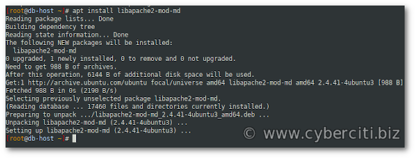

How do I secure Apache with mod\_md Let’s Encrypt on Ubuntu 20.04 and obtain a free TLS/SSL certificate? How do I secure Apache 2 with Let’s Encrypt on Ubuntu 20.04 LTS server?

 Apache server comes with a module named mod\_md. We can use this for certificate provisioning via the ACME protocol. This page explains how to install, set up and configure Apache with a mod\_md module to secure traffic with Let’s Encrypt free TLS/SSL certificate on Ubuntu 20.04 LTS server.

How to Secure Apache with mod\_md Let’s Encrypt on Ubuntu 20.04
---------------------------------------------------------------

Let’s Encrypt is a CA that follows the ACME protocol. One can use Let’s Encrypt to issue free TLS/SSL certificates for Apache, Nginx, and other servers. In this tutorial, you will use mod\_md to obtain a free TLS/SSL certificate for Apache 2 on Ubuntu 20.4 and set up your certificate to renew automatically too. Our sample set up is as follows:

* Domain – www42.cyberciti.biz
* HTTPS port – 443
* Virtual domain config file – /etc/apache2/sites-available/www42.cyberciti.biz.conf

Make sure Apache installed by following [How to install Apache on Ubuntu 20.04](https://www.cyberciti.biz/faq/how-to-install-apache-on-ubuntu-20-04-lts/) guide. 

### Step 1 – Installing mod\_md for Let’s Encrypt

First, apply updates using the [apt command](https://www.cyberciti.biz/faq/ubuntu-lts-debian-linux-apt-command-examples/):

```
sudo apt update
sudo apt upgrade
```

 Then, install the mod\_md by typing the following command:
`sudo apt install libapache2-mod-md`


#### Enabling mod\_md on Ubuntu 20.04 LTS

Turn on mod\_md, type:
`sudo a2enmod md`
Sample outputs:

    Enabling module md.
    To activate the new configuration, you need to run:
      systemctl restart apache2

Make sure you activate the mod\_ssl too, run:
`sudo a2enmod ssl`
Outputs:

    Considering dependency setenvif for ssl:
    Module setenvif already enabled
    Considering dependency mime for ssl:
    Module mime already enabled
    Considering dependency socache_shmcb for ssl:
    Enabling module socache_shmcb.
    Enabling module ssl.
    See /usr/share/doc/apache2/README.Debian.gz on how to configure SSL and create self-signed certificates.
    To activate the new configuration, you need to run:
      systemctl restart apache2

[Apache 2 must be reloaded or restarted](https://www.cyberciti.biz/faq/star-stop-restart-apache2-webserver/) with the help of the systemctl command”
`sudo systemctl reload apache2.service`

### Step 2 – Set up the SSL certificate

Make sure your Apache 2 is working and listens on port 80\. Verify using the ss command or netstat command:

```
sudo netstat -tulpn | grep ':80'
## or ##
sudo ss -tulpn | grep ':80'
```

 Sample outputs:

    tcp    LISTEN  0       128                        *:80                  *:*      users:(("apache2",pid=2550,fd=4),("apache2",pid=2549,fd=4),("apache2",pid=2548,fd=4))

All clients must connect to your server over port 80\. Otherwise, you will not get validated for Let’s Encrypt certificate. From your desktop, run:
`curl -I http://www42.cyberciti.biz`
 curl command outputs validting that we can connect to the port TCP port 80:

    HTTP/1.1 200 OK
    Date: Wed, 06 May 2020 19:30:43 GMT
    Server: Apache/2.4.41 (Ubuntu)
    Last-Modified: Wed, 06 May 2020 19:15:29 GMT
    ETag: "15e-5a4ff965902a3"
    Accept-Ranges: bytes
    Content-Length: 350
    Vary: Accept-Encoding
    Connection: close
    Content-Type: text/html

Let us edit the /etc/apache2/sites-available/www42.cyberciti.biz.conf, enter:
`sudo nano /etc/apache2/sites-available/www42.cyberciti.biz.conf`
 At the top of file add the following three mod\_md directives:

    ## Secure Apache with mod_md Let's Encrypt directives ##
    ServerAdmin webmaster@cyberciti.biz
    MDCertificateAgreement accepted
    MDomain www42.cyberciti.biz
    MDPrivateKeys RSA 4096

Where,

* **ServerAdmin webmaster@cyberciti.biz** : mod\_md will use this email address when registering your domains at Let’s Encrypt.
* **MDCertificateAgreement accepted** : You must accept the [Terms of Service](https://letsencrypt.org/documents/LE-SA-v1.2-November-15-2017.pdf) conditions as set by Let’s Encrypt.
* **MDomain www42.cyberciti.biz** : Declare a domain named that should be manged by mod\_md to issue and renew certificates. You can use full domain name such as www.cyberciti.biz or cyberciti.biz or www42.cyberciti.biz. Make sure it matches to ServerName.
* **MDPrivateKeys RSA 4096** : Set type and size of the private keys generated.

Here is my complete config file :

    ## Apache with mod_md Let's Encrypt ##
    ## mod_md config for Let's Encrypt ##
    ServerAdmin webmaster@cyberciti.biz
    MDCertificateAgreement accepted
    MDomain www42.cyberciti.biz
    MDPrivateKeys RSA 4096

    ## HTTP port 80 config ##
    <VirtualHost *:80>
        ServerAdmin webmaster@cyberciti.biz
        ServerName www42.cyberciti.biz
        DocumentRoot /home/cyberciti.biz/html
        DirectoryIndex index.html
        ErrorLog ${APACHE_LOG_DIR}/www42.cyberciti.biz-error.log
        CustomLog ${APACHE_LOG_DIR}/www42.cyberciti.biz-access.log combined
        # Redirect all http requests to HTTPS (uncomment the following two lines when HTTPS issued) 
        # RewriteEngine On
        # RewriteRule ^(.*)$ https://%{HTTP_HOST}$1 [R=301,L]
    </VirtualHost>

    ## HTTPS Config ##
    <VirtualHost *:443>
        SSLEngine on
        ServerAdmin webmaster@cyberciti.biz
        ServerName www42.cyberciti.biz
        DocumentRoot /home/cyberciti.biz/html
        DirectoryIndex index.html
        ErrorLog ${APACHE_LOG_DIR}/www42.cyberciti.biz-ssl-error.log
        CustomLog ${APACHE_LOG_DIR}/www42.cyberciti.biz-ssl-access.log combined
        # Turn on HTTP/2 
        Protocols h2 http/1.1
        # Set HTTP Strict Transport Security
        Header always set Strict-Transport-Security "max-age=63072000"
    </VirtualHost>
    ## Only enable TLS v1.3 and avoid older protocols ##
    SSLProtocol             all -SSLv3 -TLSv1 -TLSv1.1 -TLSv1.2
    SSLHonorCipherOrder     off
    SSLSessionTickets       off

    ## Turn on OCSP Stapling ##
    SSLUseStapling On
    SSLStaplingCache "shmcb:logs/ssl_stapling(32768)"

    ## Permission for our DocumentRoot  ##
    <Directory /home/cyberciti.biz/html>
        Options Indexes FollowSymLinks
        AllowOverride None
        Require all granted
    </Directory>

#### Turn on Apache’s mod\_rewrite and mod\_headers under Ubuntu

We have already declared a rewrite rule in our config, so we need mod\_rewrite. Hence, type the following command:

```
sudo a2enmod rewrite
Enabling module rewrite.
To activate the new configuration, you need to run:
systemctl restart apache2
```

 Turn on mod\_headers too:

```
sudo a2enmod headers
Enabling module headers.
To activate the new configuration, you need to run:
systemctl restart apache2
```

#### Check for config errors, run:

```
sudo apache2ctl configtest
Syntax OK
```

### Step 3 – Open HTTPS (TCP port 443) using the UFW firewall on Ubuntu

Run the following ufw command to open TCP port 443 for everyone:
`sudo ufw allow 443/tcp comment 'accept secure Apache connections'`
 Verify it rules:
`sudo ufw status`
 See “[How To Configure Firewall with UFW on Ubuntu 20.04 LTS](https://www.cyberciti.biz/faq/how-to-configure-firewall-with-ufw-on-ubuntu-20-04-lts/)” for more info.

### Step 4 – Obtaining an SSL certificate using mod\_md 

So far, we installed mod\_md for Apache on Ubuntu, turned on all essential modules, and open required TCP ports using a firewall. It is time to restart our Apache 2 server to obtain the free TLS/SSL certificate using Let’s Encrypt certificate authority (CA). Therefore, restart the Apache 2 server:
`sudo systemctl restart apache2.service`
 As soon as Apache 2 restarted mod\_md will contact Let’s Encrypt and request a certificate for your domain. Typically it takes up to one minute. You can check the server error log or Apache’s mod\_status page to see if the request was successful or not. Here is what you will see in erro.log file:
`sudo tail -f /var/log/apache2/error.log`
 One can use the [grep command](https://www.cyberciti.biz/faq/howto-use-grep-command-in-linux-unix/) too:
`sudo grep 'The Managed Domain' /var/log/apache2/error.log`
 Sample outputs indicating that LE has issued us a free TLS/SSL certificate:

    [Wed May 06 20:17:38.112849 2020] [md:notice] [pid 21777:tid 139807872861952] AH10059: The Managed Domain www42.cyberciti.biz has been setup and changes will be activated on next (graceful) server restart.

Of course we can visit server-status url too. For example:

```
http://www42.cyberciti.biz/server-status
http://your-public-ip-here/server-status
```

[](https://www.cyberciti.biz/media/new/faq/2020/05/Managed-Domain-Status.png)

Click to enlarge

 A graceful Apache 2 server restart now is recommended to activate the certificate:
`sudo systemctl reload apache2.service`

### Step 5 – Test secure Apache 2 connection

All you have to do is type the following command or use a web browser such as Firefox/Chrome to make sure you are getting HTTPS connection:
`curl -I https://www42.cyberciti.biz`


curl command in action verify that our HTTPS connection is working and traffic is secured and encrypted

 Here is outputs from SSL Lab’s test:


My secure Apache server with Let’s Encrypt TLS/SSL running on Ubuntu 20.04 LTS and verified by SSL Lab’s test

### Step 6 – Automatically renewing an SSL certificate using mod\_md and watchdog\_module 

The mod\_md uses [mod\_watchdog module](https://httpd.apache.org/docs/2.4/mod/mod_watchdog.html), which provides programmatic hooks for other modules to run tasks such as renewing TLS/SSL certificates and more periodically. In other words, auto-renew mode requires mod\_watchdog to be active in your server. Hence, verify that mod\_watchdog is activated using the following command:

```
sudo apache2ctl -M
sudo apache2ctl -M | grep -i watchdog
```

 Loaded Modules:

     core_module (static)
     so_module (static)
     watchdog_module (static)
     http_module (static)
     unixd_module (static)
     access_compat_module (shared)
     alias_module (shared)
     auth_basic_module (shared)
     authn_core_module (shared)
     ....
     ..
     ...
     ssl_module (shared)
     status_module (shared)

### Step 7 – Monitoring certificate status

Now we set up Apache with mod\_md and got a free TLS/SSL from Let’s Encrypt. It is time to monitor status of our certificate. There are two ways. First open /server-status URL:

```
https://www42.cyberciti.biz/server-status
https://your-public-ip-here/server-status
```

[](https://www.cyberciti.biz/media/new/faq/2020/05/Managed-Domains-Apache-Status.png)

Click to enlarge

 Edit your server config file, run:
`sudo nano /etc/apache2/sites-available/www42.cyberciti.biz.conf`
 Append the following: 

    <Location "/md-status">
      SetHandler md-status
    </Location>

Save and close the file. Restart the server and run:

```
sudo systemctl restart apache2.service
curl https://www42.cyberciti.biz/md-status
```

 Sample outputs:

    {
      "version": "2.0.10",
      "managed-domains": [
        {
          "name": "www42.cyberciti.biz",
          "domains": [
            "www42.cyberciti.biz",
            "www43.cyberciti.biz"
          ],
          "contacts": [
            "mailto:webmaster@cyberciti.biz"
          ],
          "transitive": 1,
          "ca": {
            "proto": "ACME",
            "url": "https://acme-v02.api.letsencrypt.org/directory",
            "agreement": "accepted"
          },
          "state": 2,
          "renew-mode": 1,
          "renew-window": "33%",
          "warn-window": "10%",
          "must-staple": false,
          "cert": {
            "valid-from": "Wed, 06 May 2020 19:17:37 GMT",
            "valid-until": "Tue, 04 Aug 2020 19:17:37 GMT",
            "serial": "040E339A0A7D2224819A550BBB4596279F67",
            "sha256-fingerprint": "d78933fa946cb71810111876049defa4feb6820c319c69918ba925b463bbd11c"
          },
          "renew": false
        }
      ]
    }

Where are my TLS/SSL certificate files located on disk?
-------------------------------------------------------

You need to cd into the **/etc/apache2/md** directory:

```
$ sudo -i
# cd /etc/apache2/md/
# ls -l
```

 We will see file as follows:

    total 28
    drwxr-xr-x 3 root     root 4096 Nov 13 13:02 accounts
    drwx------ 3 root     root 4096 Nov 13 13:02 archive
    drwxr-xr-x 2 www-data root 4096 Nov 13 13:02 challenges
    drwx------ 3 root     root 4096 Nov 13 13:02 domains
    -rw------- 1 root     root  116 Nov 13 12:52 md_store.json
    drwxr-xr-x 2 www-data root 4096 Nov 13 13:02 staging
    drwx------ 2 root     root 4096 Nov 13 13:02 tmp

Make sure you look into the domains directory:

```
# cd domains
# ls -l
# cd www42.cyberciti.biz
# ls -l
```

 Here are TLS/SSL files for your domain:

    total 16
    -rw------- 1 root root 3997 Nov 13 13:02 job.json
    -rw------- 1 root root  492 Nov 13 13:04 md.json
    -rw------- 1 root root 3272 Nov 13 13:02 privkey.pem
    -rw------- 1 root root 3916 Nov 13 13:02 pubcert.pem

Issuing www and non-www domains
-------------------------------

Want TLS/SSL certificate for both cyberciti.biz and www.cyberciti.biz domain? Try it as follows (note MDomain and ServerAlias directives added/updated):

    ServerAdmin webmaster@cyberciti.biz
    MDCertificateAgreement accepted
    # www and non-www TLS certicate #
    MDomain cyberciti.biz www.cyberciti.biz
    MDPrivateKeys RSA 4096

    ## HTTP port 80 config ##
    <VirtualHost *:80>
        ServerAdmin webmaster@cyberciti.biz
        ServerName www.cyberciti.biz
        ServerAlias cyberciti.biz
        DocumentRoot /home/cyberciti.biz/html
        DirectoryIndex index.html
        ErrorLog ${APACHE_LOG_DIR}/cyberciti.biz-error.log
        CustomLog ${APACHE_LOG_DIR}/cyberciti.biz-access.log combined
        # Redirect all http requests to HTTPS (uncomment the following two lines when HTTPS issued) 
        # RewriteEngine On
        # RewriteRule ^(.*)$ https://%{HTTP_HOST}$1 [R=301,L]
    </VirtualHost>

    ## HTTPS Config ##
    <VirtualHost *:443>
        SSLEngine on
        ServerAdmin webmaster@cyberciti.biz
        ServerName www.cyberciti.biz
        ServerAlias cyberciti.biz
        DocumentRoot /home/cyberciti.biz/html
        DirectoryIndex index.html
        ErrorLog ${APACHE_LOG_DIR}/cyberciti.biz-ssl-error.log
        CustomLog ${APACHE_LOG_DIR}/cyberciti.biz-ssl-access.log combined
        # Turn on HTTP/2 
        Protocols h2 http/1.1
        # Set HTTP Strict Transport Security
        Header always set Strict-Transport-Security "max-age=63072000"
    </VirtualHost>
    ## Only enable TLS v1.3 and avoid older protocols ##
    SSLProtocol             all -SSLv3 -TLSv1 -TLSv1.1 -TLSv1.2
    SSLHonorCipherOrder     off
    SSLSessionTickets       off

    ## Turn on OCSP Stapling ##
    SSLUseStapling On
    SSLStaplingCache "shmcb:logs/ssl_stapling(32768)"

    ## Permission for our DocumentRoot  ##
    <Directory /home/cyberciti.biz/html>
        Options Indexes FollowSymLinks
        AllowOverride None
        Require all granted
    </Directory>

### A note about ‘auto’ directive

The above approach work for one or two subdomains. But what if you have 4 or 5 domains? Such as cyberciti.biz, www.cyberciti.biz, forum.cyberciti.biz, webmail.cyberciti.biz? Then we can use the auto keyword as follows:

    MDomain cyberciti.biz auto

    <VirtualHost *:443>
        ServerName cyberciti.biz
        ServerAlias www.cyberciti.biz
        ServerAlias forum.cyberciti.biz
        ServerAlias webmail.cyberciti.biz
        ...
    </VirtualHost>

Whenever you add more ServerAlias names to this virtual host with ‘auto’ keyword, they will be added as well to the Managed Domain. If you prefer to explicitly declare all the domain names, use ‘manual’ mode.

### Multiple domains

Here is how to set up nixcraft.com and cyberciti.biz domains:

    MDomain cyberciti.biz auto
    MDomain nixcraft.com auto

    # cyberciti.biz #
    <VirtualHost *:80>
        ServerName cyberciti.biz
        ServerAlias www.cyberciti.biz
        ...
        .....
    </VirtualHost>
    <VirtualHost *:443>
        ServerName cyberciti.biz
        ServerAlias www.cyberciti.biz
        ...
    </VirtualHost>

    # nixcraft.com #
    <VirtualHost *:80>
        ServerName nixcraft.com
        ServerAlias www.nixcraft.com
        ...
    </VirtualHost>
    <VirtualHost *:443>
        ServerName nixcraft.com
        ServerAlias www.nixcraft.com
        ...
    </VirtualHost>

Conclusion
----------

In this tutorial, you learned how to secure Apache with mod\_md Let’s Encrypt module to issue and auto-renew free TLS/SSL certificate on Ubuntu 20.04 LTS Linux server. For more information, see mod\_md [documentation here](https://httpd.apache.org/docs/2.4/mod/mod_md.html). Keep reading read of the series:

This entry is **2** of **2** in the **Linux, Apache, MySQL, PHP (LAMP) stack on Ubuntu 20.04 Tutorial** series. Keep reading the rest of the series:

1. [How to install Apache on Ubuntu 20.04 LTS](https://www.cyberciti.biz/faq/how-to-install-apache-on-ubuntu-20-04-lts/)
2. Secure Apache with mod\_md Let’s Encrypt on Ubuntu 20.04 LTS

 🐧 Get the latest tutorials on Linux, Open Source & DevOps via **[RSS feed](https://www.cyberciti.biz/atom/atom.xml)** or **[Weekly email newsletter.](https://newsletter.cyberciti.biz/subscription?f=1ojtmiv8892KQzyMsTF4YPr1pPSAhX2rq7Qfe5DiHMgXwKo892di4MTWyOdd976343rcNR6LhdG1f7k9H8929kMNMdWu3g)**

 🐧 12 comments so far... [add one](https://www.cyberciti.biz/faq/how-to-secure-apache-with-mod_md-lets-encrypt-on-ubuntu-20-04-lts/#respond) **↓**

CategoryList of Unix and Linux commandsDisk space analyzers[df](https://www.cyberciti.biz/faq/df-command-examples-in-linux-unix/) • [ncdu](https://www.cyberciti.biz/open-source/install-ncdu-on-linux-unix-ncurses-disk-usage/) • [pydf](https://www.cyberciti.biz/tips/unix-linux-bsd-pydf-command-in-colours.html)File Management[cat](https://www.cyberciti.biz/faq/linux-unix-appleosx-bsd-cat-command-examples/) • [cp](https://www.cyberciti.biz/faq/cp-copy-command-in-unix-examples/) • [mkdir](https://www.cyberciti.biz/faq/linux-make-directory-command/) • [tree](https://www.cyberciti.biz/faq/linux-show-directory-structure-command-line/)Firewall[Alpine Awall](https://www.cyberciti.biz/faq/how-to-set-up-a-firewall-with-awall-on-alpine-linux/) • [CentOS 8](https://www.cyberciti.biz/faq/how-to-set-up-a-firewall-using-firewalld-on-centos-8/) • [OpenSUSE](https://www.cyberciti.biz/faq/set-up-a-firewall-using-firewalld-on-opensuse-linux/) • [RHEL 8 ](https://www.cyberciti.biz/faq/configure-set-up-a-firewall-using-firewalld-on-rhel-8/) • [Ubuntu 16.04](https://www.cyberciti.biz/faq/howto-configure-setup-firewall-with-ufw-on-ubuntu-linux/) • [Ubuntu 18.04](https://www.cyberciti.biz/faq/how-to-setup-a-ufw-firewall-on-ubuntu-18-04-lts-server/) • [Ubuntu 20.04](https://www.cyberciti.biz/faq/how-to-configure-firewall-with-ufw-on-ubuntu-20-04-lts/)Network Utilities[NetHogs](https://www.cyberciti.biz/faq/linux-find-out-what-process-is-using-bandwidth/) • [dig](https://www.cyberciti.biz/faq/linux-unix-dig-command-examples-usage-syntax/) • [host](https://www.cyberciti.biz/faq/linux-unix-host-command-examples-usage-syntax/) • [ip](https://www.cyberciti.biz/faq/linux-ip-command-examples-usage-syntax/) • [nmap](https://www.cyberciti.biz/security/nmap-command-examples-tutorials/)OpenVPN[CentOS 7](https://www.cyberciti.biz/faq/centos-7-0-set-up-openvpn-server-in-5-minutes/) • [CentOS 8](https://www.cyberciti.biz/faq/centos-8-set-up-openvpn-server-in-5-minutes/) • [Debian 10](https://www.cyberciti.biz/faq/debian-10-set-up-openvpn-server-in-5-minutes/) • [Debian 8/9](https://www.cyberciti.biz/faq/install-configure-openvpn-server-on-debian-9-linux/) • [Ubuntu 18.04](https://www.cyberciti.biz/faq/ubuntu-18-04-lts-set-up-openvpn-server-in-5-minutes/) • [Ubuntu 20.04](https://www.cyberciti.biz/faq/ubuntu-20-04-lts-set-up-openvpn-server-in-5-minutes/)Package Manager[apk](https://www.cyberciti.biz/faq/10-alpine-linux-apk-command-examples/) • [apt](https://www.cyberciti.biz/faq/ubuntu-lts-debian-linux-apt-command-examples/)Processes Management[bg](https://www.cyberciti.biz/faq/unix-linux-bg-command-examples-usage-syntax/) • [chroot](https://www.cyberciti.biz/faq/unix-linux-chroot-command-examples-usage-syntax/) • [cron](https://www.cyberciti.biz/faq/how-do-i-add-jobs-to-cron-under-linux-or-unix-oses/) • [disown](https://www.cyberciti.biz/faq/unix-linux-disown-command-examples-usage-syntax/) • [fg](https://www.cyberciti.biz/faq/unix-linux-fg-command-examples-usage-syntax/) • [jobs](https://www.cyberciti.biz/faq/unix-linux-jobs-command-examples-usage-syntax/) • [killall](https://www.cyberciti.biz/faq/unix-linux-killall-command-examples-usage-syntax/) • [kill](https://www.cyberciti.biz/faq/unix-kill-command-examples/) • [pidof](https://www.cyberciti.biz/faq/linux-pidof-command-examples-find-pid-of-program/) • [pstree](https://www.cyberciti.biz/faq/unix-linux-pstree-command-examples-shows-running-processestree/) • [pwdx](https://www.cyberciti.biz/faq/unix-linux-pwdx-command-examples-usage-syntax/) • [time](https://www.cyberciti.biz/faq/unix-linux-time-command-examples-usage-syntax/)Searching[grep](https://www.cyberciti.biz/faq/howto-use-grep-command-in-linux-unix/) • [whereis](https://www.cyberciti.biz/faq/unix-linux-whereis-command-examples-to-locate-binary/) • [which](https://www.cyberciti.biz/faq/unix-linux-which-command-examples-syntax-to-locate-programs/)User Information[groups](https://www.cyberciti.biz/faq/unix-linux-groups-command-examples-syntax-usage/) • [id](https://www.cyberciti.biz/faq/unix-linux-id-command-examples-usage-syntax/) • [lastcomm](https://www.cyberciti.biz/faq/linux-unix-lastcomm-command-examples-usage-syntax/) • [last](https://www.cyberciti.biz/faq/linux-unix-last-command-examples/) • [lid/libuser-lid](https://www.cyberciti.biz/faq/linux-lid-command-examples-syntax-usage/) • [logname](https://www.cyberciti.biz/faq/unix-linux-logname-command-examples-syntax-usage/) • [members](https://www.cyberciti.biz/faq/linux-members-command-examples-usage-syntax/) • [users](https://www.cyberciti.biz/faq/unix-linux-users-command-examples-syntax-usage/) • [whoami](https://www.cyberciti.biz/faq/unix-linux-whoami-command-examples-syntax-usage/) • [who](https://www.cyberciti.biz/faq/unix-linux-w-command-examples-syntax-usage-2/) • [w](https://www.cyberciti.biz/faq/unix-linux-w-command-examples-syntax-usage-2/)WireGuard VPN[Alpine](https://www.cyberciti.biz/faq/how-to-set-up-wireguard-vpn-server-on-alpine-linux/) • [CentOS 8](https://www.cyberciti.biz/faq/centos-8-set-up-wireguard-vpn-server/) • [Debian 10](https://www.cyberciti.biz/faq/debian-10-set-up-wireguard-vpn-server/) • [Firewall](https://www.cyberciti.biz/faq/how-to-set-up-wireguard-firewall-rules-in-linux/) • [Ubuntu 20.04](https://www.cyberciti.biz/faq/ubuntu-20-04-set-up-wireguard-vpn-server/)