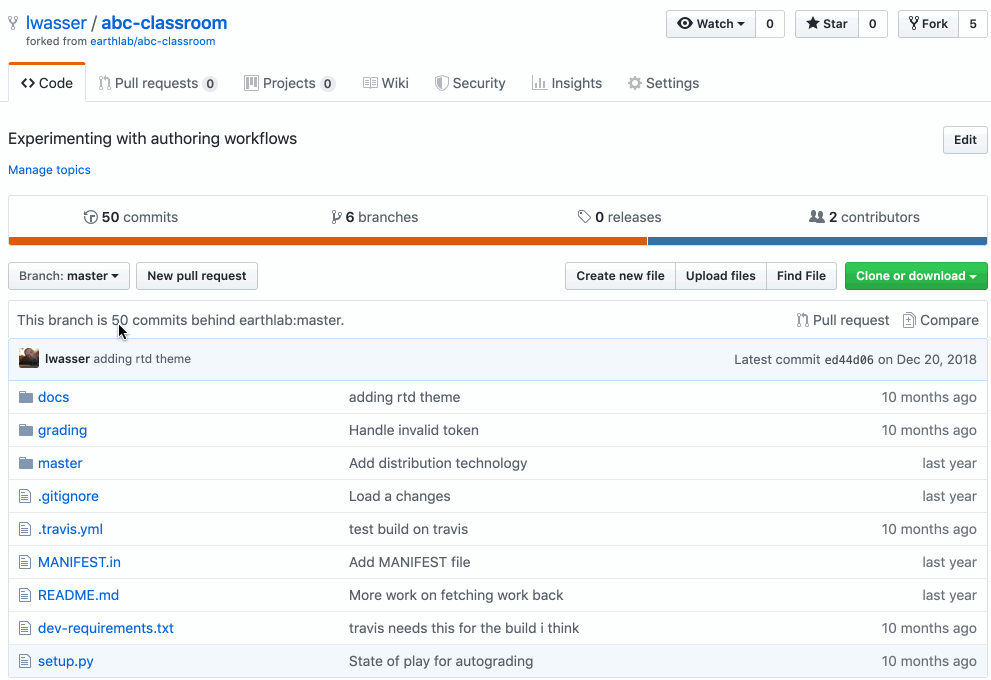
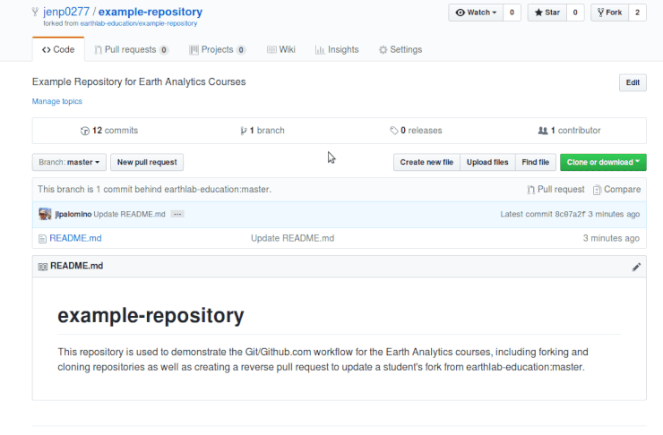
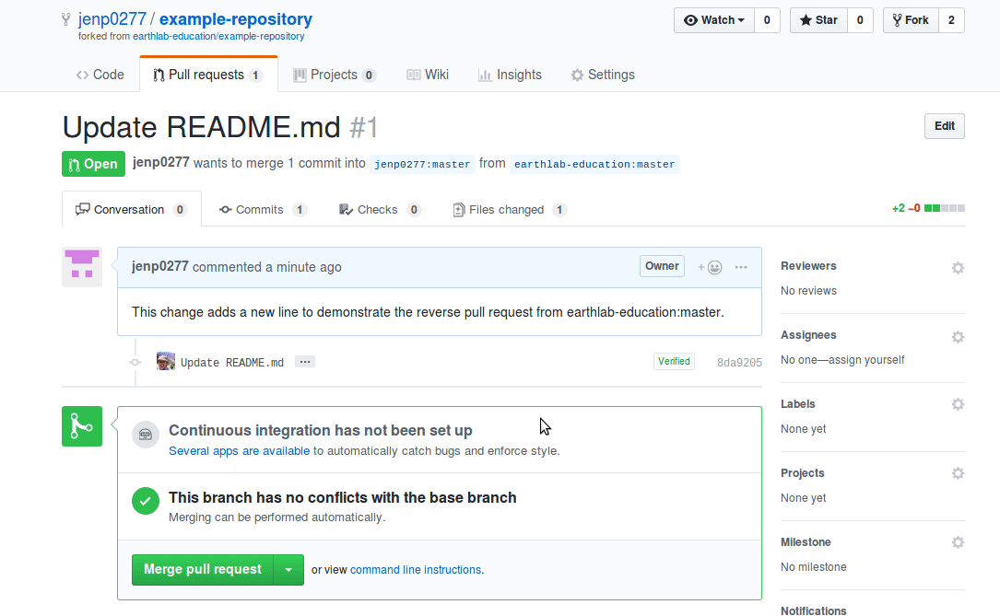

Learning Objectives
--------------------

* Sync your fork of a GitHub repo using **[GitHub.com](http://github.com/)**.
* Update your local clone of your forked repository (repo) using `git pull`.

Syncing GitHub Repos
--------------------

When you are collaborating with others on a project, there are often changes being made to the repo that you (and others) are contributing to. It is important keep your fork up to date or in sync with those changes as you work. Keeping your fork in sync with the central repo will reduce the risk of merge conflicts (a topic that you will learn more about in a later chapter).

### Syncing Your GitHub Repo Reduces the Chances of a Merge Conflict

A merge conflict occurs when two people edit the same line in a file. **Git** does not know how to resolve the conflict (i.e. which changes to keep and which to remove).

When **git** does not know how to resolve a conflict, it will ask you to manually fix the conflict. If you sync your files regularly, you will ultimately reduce the risk of a merge conflict.

### An Example Workflow Where Syncing Is Important

Pretend that you are working on a fork of your colleague’s repo. Your colleague’s repo is the final home for the code and content that you are working together on collaboratively.

Your colleague and others in your group may be updating code while you are working. It is important to ensure that your fork is in sync with your colleague’s repo, ideally before making a new pull request to that repo.

Your repo being in sync refers to your fork having all of the commits or changes to the code and files that have been made to the parent repo.

 Image of an out of sync forked repo. Notice that you can tell by the upper right hand corner of the repo that this fork is owned by lwasser. The parent repo is owned by earthlab. You can also see that this fork is BEHIND the parent repo by 50 commits. This fork is out of sync.

Two Ways to Sync A Repo - Command Line and on GitHub
----------------------------------------------------

There are a few ways to update or sync your repo with the central repo (e.g. your colleague’s repo).

1. You can perform a “Reverse Pull Request” on GitHub. A reverse pull request will follow the same steps as a regular pull request. However, in this case, your fork becomes the **base** and your colleague’s repo is the **head**. If you update your fork this way, you will then have to PULL your changes down to your local clone of the repo (on your computer) where you are working.
2. You can manually set or pull down changes from the central repo to your clone locally. This can be done in the Terminal. When you update your local clone, you will then need to push the changes or commits back up to your fork on **[GitHub.com](http://github.com/)**.

This lesson will focus on syncing your fork using a reverse pull request approach on **[GitHub.com](http://github.com/).**

 When you fork a repo that is being actively worked on by other people, it is good practice to periodically update your fork with updates. Remember that multiple people may be adding to this repo at any given time.

Sync Your Forked GitHub Repo Using A Pull Request
-------------------------------------------------

To sync your forked repo with the parent or central repo you:

1. Create a pull request on **[GitHub.com](http://github.com/)** to update your fork of the repository from the original repository, and
2. Run the `git pull` command in the Terminal to update your local clone. The following sections review how to complete these steps.

 An animated gif showing you how to sync a GitHub repo on [GitHub.com](http://github.com/). In this case, the user lwasser is updating her fork of the abc-classroom repo from the earthlab/abc-classroom repo. Note that the fork is the base (the repo being updated). The earthlab owned repo is the head. You can also sync individual branches within a repo using this same approach.

How To Sync or Update Your Forked Repo Using the Github Website
---------------------------------------------------------------

To update your fork on **[GitHub.com](http://github.com/)**, navigate in your web browser to the main **[GitHub.com](http://github.com/)** page of your forked repository (e.g. `https://github.com/your-username/example-repository` if you [created a fork](https://www.earthdatascience.org/courses/intro-to-earth-data-science/git-github/version-control/fork-clone-github-repositories/#create-a-copy-of-other-users-files-on-githubcom-forking) in previous chapter on version control with git).

On this web page, create a pull request by following these steps:

1. Click on the `New pull request` button to begin the pull request.
2. On the new page, choose your fork as the **base fork** and the original repository (e.g. your colleague’s repo) as the **head fork**.
  * **IMPORTANT:** You need to click on the text `compare across forks` to be able to select the base and head forks appropriately.
3. Then, click on `Create pull request`.
4. On the new page, click on `Create pull request` once more to finish creating the pull request.

  You can update your fork with changes made to the original Github repository by creating a pull request from the original repository to your fork.

When you create this pull request, you will see what files will be updated in your fork.

After creating the pull request, you need to **merge the pull request**, so that the changes in your colleague’s repo are merged into your fork. The next section of this page explains how to merge a pull request.

### How to Merge a Pull Request

To merge a pull request:

1. Open up the pull request if it is not already open on **GitHub**.
2. Click on the green button at the bottom of the pull request page that says `Merge pull request`.
3. Click on the `Confirm merge` button.

Once you have conformed the merge, all of the changes from your colleague’s repo are in your repo. When you return to your fork on **[GitHub.com](http://github.com/)**, you will see the changes that you have just merged into your fork.

  After creating a pull request, you merge the pull request to apply the changes from the original repository to your fork.

When you update your fork using a reverse pull request on **[GitHub.com](http://github.com/)**, you then need to update your files locally. The steps to do that are below.

### How to Update Your Local Clone

Once you have synced (i.e. updated) your fork on **[GitHub.com](http://github.com/)**, you are ready to update your cloned repo on your local computer.

To pull down (i.e. copy) the changes merged into your fork, you can use the Terminal and the `git pull` command.

To begin:

1. On your local computer, navigate to your forked repo directory.
2. Once you have changed directories to the forked repo directory, run the command `git pull`.

The code that you type into the terminal might look something like the example below:

    $ cd path-to-repo/repo-name
    $ git pull

You have now updated your local clone with the updates that you merged into your fork from original **GitHub** repository.

 [ GitHub Issues ](https://www.earthdatascience.org/courses/intro-to-earth-data-science/git-github/github-collaboration/github-issues-to-document-and-manage-repo-changes/) [ GitHub Pull Requests ](https://www.earthdatascience.org/courses/intro-to-earth-data-science/git-github/github-collaboration/how-to-submit-pull-requests-on-github/)