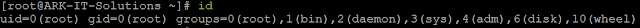

***Type of Users:***

**Root user** - Default user highly privileged UID is 0\. This will create while installing the operating system

**System users** - is nothing but services, at the time of installing particular package. UID starts from 1 to 499.

**Local users** - after installing of the operating system admin user will create these users. UID starts from 500 to 65534.

Ø After creating a user, user home directory will be created in default path /home.

Ø One group is will be created with same user name (primary group)

Ø Files from /etc/skel will be copied automatically to user home directory

Ø /etc/passwd file is updated with user information

Ø /etc/group file is update with primary group information

Important files

 /etc/passwdUser Information

 /etc/shadowUser Passwords

 /etc/groupGroup Information

 /etc/gshadowGroup Passwords

***User Administration Commands: ***

\# useradd \<user name\> - To create specified local user

\# useradd –d \<home directory\> \<user name\> - create a user with specified home path

\# useradd –u \<UID\> \<user name\> - create user with specific UID.

\# passwd \<user name\> - change the user password

\# userdel \<user name\> - delete user

\# userdel \<user name\> -  delete user including home directory

\# finger \<user name\> - See user properties

\# chfn \<user name\> -  Change user information

chfn Command Output

/etc/passwd file user entry

 \# chage –l \<user name\> - to check user password expiry and account expiry information

chage -l Command Output

\# su - \<user name\> - Switch to other user account

\# id \<user name\> - it will show the user id

id Command Output

\# system-config-users -  create and manage user account in GUI

***Usermod command options:***

-c = We can add comment field for the user account.

-d = To modify the directory for any existing user account.

-e = Using this option we can make the account expiry in specific period.

-g = Change the primary group for a User.

-G = To add a supplementary groups.

-a = To add anyone of the group to a secondary group.

-l = To change the login name 

-L = To lock the user account. This will lock the password so we can’t use the account.

-m = moving the contents of the home directory from existing home dir to new dir.

-p = To Use un-encrypted password for the new password. (NOT Secured).

-s = Create a Specified shell for new accounts.

-u = Used to Assigned UID for the user account between 0 to 999.

-U = To unlock the user accounts. This will remove the password lock and allow us to use the user account.

***Creating Groups:***

Group information is located/stored on /etc/group file.

\# groupadd \<group name\> - Create a group with specified name

\# usermod –G \<group name\> \<user name\> - Add user to group

\# gpasswd –a ravi Administrators – Adds the user ravi to the group Administrators

\# gpasswd –A ravi Administrators – give user ravi administrative rights to the group

\# gpasswd –d ravi Administrators – remove user ravi from the group Administrators

\# groupdel \<group name\> - Delete group name

\# groupmod –n \<new group name\> \<old group name\> - change group name

\# newgrp - \<group name\> - Login into the group if successful, re-initializes the user environment