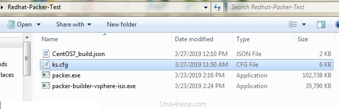
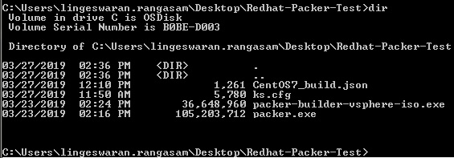

VMware template creation can be automated using packer. VMware Virtual Machine deployments are very faster because of the template based VM build. But due to rapid development and fast-paced Operating system releases, we might need to build multiple templates and keep it ready for deployment. A customer might ask different operating system release and you should be ready the prebuilt templates. In this article, we will walk through the VMware vSphere Template creation for Redhat/CentOS using Packer.

### **Download the following components:**

* [JetBrains-infra vSphere-iso (File Name: packer-builder-vsphere-iso.exe)](https://github.com/jetbrains-infra/packer-builder-vsphere/releases)
* [Packer](https://www.packer.io/downloads.html) (Download according to your laptop OS )
* Redhat Enterprise Linux 7.x or CentOS 7.x ISO.

On Your Laptop/Desktop,

1\. Create a new directory and copy all the downloaded components. RHEL/ CentOS ISO should be kept 0n VMware vSphere’s datastore.

Packer Executable

2\. Open a notepad and paste the following contents to it. Edit all the required values according to your infrastructure. Save this file as CentOS7\_build.json on the same directory.

    {
      "builders": [
        {
          "type": "vsphere-iso",

          "vcenter_server":      "192.168.2.212",
          "username":            "administrator@vsphere.local",
          "password":            "test@123",
          "insecure_connection": "true",
          "vm_name": "RHEL-Template",
          "notes": "Build via Packer",
          "datacenter": "STACK-BLR",
          "cluster": "UA-CLS",
          "host": "192.168.2.211",
          "datastore": "DATASTORE-BLR",
          "network": "VM Network",
          "resource_pool": "UA-ResPool",

          "guest_os_type": "centos7_64Guest",

          "ssh_username": "root",
          "ssh_password": "server",

          "CPUs":             1,
          "RAM":              1024,
          "RAM_reserve_all": false,

          "convert_to_template": true,

          "disk_controller_type":  "pvscsi",
          "disk_size":        25000,
          "disk_thin_provisioned": true,

          "network_card": "vmxnet3",

          "iso_paths": [
            "[DATASTORE-BLR] ISO/centos7_64.iso"
          ],
          "iso_checksum": "5b61d5b378502e9cba8ba26b6696c92a",
          "iso_checksum_type": "md5",
          "floppy_files": [
            "{{template_dir}}/ks.cfg"
          ],
          "boot_command": " <esc> <wait> linux inst.text inst.ks=hd:fd0:/ks.cfg <enter> " 
              }
      ]
    }

You might need to update the value for almost all the fields except the boot\_command, networ\_card, disk\_controller\_type, and provision type.

3\. You need to prepare traditional kickstart file to define the package selection and other configuration. [Download this kickstart file for RHEL 7 / ](https://www.unixarena.com/wp-content/uploads/2019/03/ks.txt)CentOS 7\. Please feel free to modify and update the kickstart file according to our need.

* *Root Credentials – root/server*
* *User – admin/admin123*

4\. Here is the snapshot of the directory contents.

Packer – Directory contents

5\. Open command prompt – Start – \> cmd – \> Enter. Navigate to the directory which we have created for this VM build.

Packer – Directory contents

6\. Trigger the packer build job using the following command. At this stage, the VM job is waiting for VM to boot with IP.

    C:\Users\lingeswaran.rangasam\Desktop\packer\Redhat-Packer-Test>packer.exe build CentOS7_build.json
    vsphere-iso output will be in this color.

    ==> vsphere-iso: Creating VM...
    ==> vsphere-iso: Customizing hardware...
    ==> vsphere-iso: Mount ISO images...
    ==> vsphere-iso: Creating floppy disk...
        vsphere-iso: Copying files flatly from floppy_files
        vsphere-iso: Copying file: C:\Users\lingeswaran.rangasam\Desktop\packer\Redhat-Packer-Test/ks.cfg
        vsphere-iso: Done copying files from floppy_files
        vsphere-iso: Collecting paths from floppy_dirs
        vsphere-iso: Resulting paths from floppy_dirs : []
        vsphere-iso: Done copying paths from floppy_dirs
    ==> vsphere-iso: Uploading created floppy image
    ==> vsphere-iso: Adding generated Floppy...
    ==> vsphere-iso: Set boot order temporary...
    ==> vsphere-iso: Power on VM...
    ==> vsphere-iso: Waiting 10s for boot...
    ==> vsphere-iso: Typing boot command...
    ==> vsphere-iso: Waiting for IP...
    ==> vsphere-iso: IP address: 192.168.2.67
    ==> vsphere-iso: Using ssh communicator to connect: 192.168.2.67
    ==> vsphere-iso: Waiting for SSH to become available...
    ==> vsphere-iso: Connected to SSH!
    ==> vsphere-iso: Shut down VM...
    ==> vsphere-iso: Deleting Floppy drives...
    ==> vsphere-iso: Deleting Floppy image...
    ==> vsphere-iso: Eject CD-ROM drives...
    ==> vsphere-iso: Convert VM into template...
    ==> vsphere-iso: Clear boot order...
    Build 'vsphere-iso' finished.

    ==> Builds finished. The artifacts of successful builds are:
    --> vsphere-iso: RHEL-Template

    C:\Users\lingeswaran.rangasam\Desktop\packer\Redhat-Packer-Test>

7\. Login to VMware vCenter and navigate to template section. Here you can see the Packer generated template.

VMware vSphere – VM template – Packer

We have successfully built CentOS/RHEL 7.x VM and concerted into VMware VM template using Packer. If you do not want to convert into a VM template, Refer the [REHL/CentOS VM build using ISO – Packer](https://www.unixarena.com/2019/03/packer-automation-build-redhat-centos-vm-template-on-vmware-vsphere.html/).

Hope this article is informative to you. Share it! Comment it!! Be Sociable!!!

Advertisements