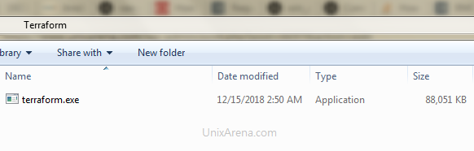
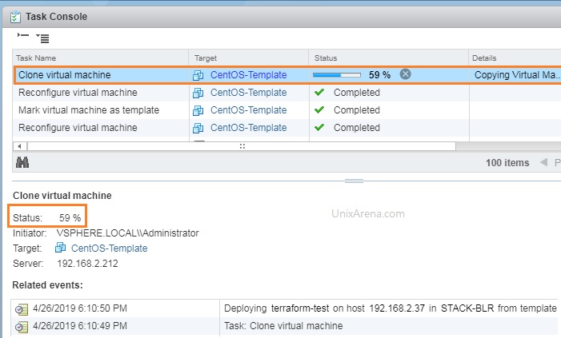
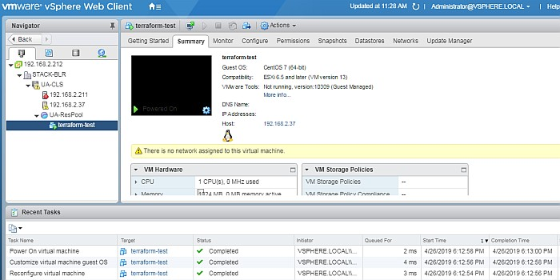
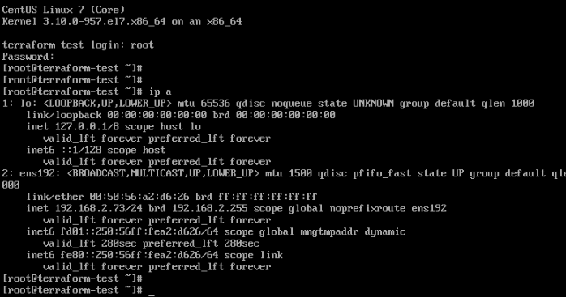

This article will provide step by step procedure for building “CentOS” /”Redhat Linux” Virtual Machine using Terraform tool on the VMware vSphere environment. Terraform is an excellent tool to build VM’s on VMware vSphere environment. Terraform doesn’t require any dedicated host. You could download an opensource/free version of Terraform on your laptop or desktop and trigger the VM builds. Terraform uses HCL (Hasicorp Language) which requires very few lines to create VM. Terraform is developed widely by the open source community and **HashiCorp**. It is an open source tool that codifies APIs into declarative configuration files that can be shared amongst team members, treated as code, edited, reviewed, and versioned.

### **Environment**:

* Windows 7 Laptop
* VMware vSphere: 6.0 / 6.5

### **Terraform – VM build – CentOS **

1\. Download Terraform executable from [Terraform.io](https://www.terraform.io/downloads.html). I have downloaded windows 64-bit Terraform executable.

2\. Create a new directory and copy terraform.exe into that.

Terraform – Download

3\. [Download the attached Terraform JSON](https://www.unixarena.com/wp-content/uploads/2019/04/Deploy_vm.txt) file and save it in the same directory with “\*.tf” file extension. Edit the following fields according to your requirement.

* “*STACK-BLR*” – DataCenter Name
* “*DATASTORE-BLR*” – Datastore Name
* “*UA-ResPool*” – Resource Pool. (If you do not have resource pool, remove the code block)
* “*VM Network*” – vSphere VM network
* “*CentOS-Template*” – VM template name
* “*terraform-test*” – New Virtual Machine Name
* “*terraform-test*” – Hostname (OS Level)
* “*ncpu*“, “*Memory*“, “*disk* (size )” adjust as per your requirement.

4\. Create one more file to accommodate the variables (file name- “terraform.tfvars”). This is just to separate the credentials from actual code.

    vsphere_user="administrator@vsphere.local"
    vsphere_password="password@123"
    vsphere_server="192.168.2.212"

5\. List the directory contents.

    

Terraform – Resources

* Open a command prompt and navigate to the terraform directory.

    Microsoft Windows [Version 6.1.7601]
    Copyright (c) 2009 Microsoft Corporation.  All rights reserved.
    C:\Users\lingeswaran.rangasam>cd Desktop
    C:\Users\lingeswaran.rangasam\Desktop>cd terraform

6\. Initialize the terraform resources. This will download the required terraform plugins which are required for VM build.

    C:\Users\lingeswaran.rangasam\Desktop\terraform>terraform.exe init

    Initializing provider plugins...
    - Checking for available provider plugins on https://releases.hashicorp.com...
    - Downloading plugin for provider "vsphere" (1.10.0)...

    The following providers do not have any version constraints in configuration,
    so the latest version was installed.

    To prevent automatic upgrades to new major versions that may contain breaking
    changes, it is recommended to add version = "..." constraints to the
    corresponding provider blocks in configuration, with the constraint strings
    suggested below.

    * provider.vsphere: version = "~> 1.10"

    Terraform has been successfully initialized!

    You may now begin working with Terraform. Try running "terraform plan" to see
    any changes that are required for your infrastructure. All Terraform commands
    should now work.

    If you ever set or change modules or backend configuration for Terraform,
    rerun this command to reinitialize your working directory. If you forget, other
    commands will detect it and remind you to do so if necessary.

    C:\Users\lingeswaran.rangasam\Desktop\terraform>

7\. Let’s run the dry run. – Terraform plan.

    C:\Users\lingeswaran.rangasam\Desktop\terraform>terraform.exe plan
    Refreshing Terraform state in-memory prior to plan...
    The refreshed state will be used to calculate this plan, but will not be
    persisted to local or remote state storage.

    data.vsphere_datacenter.dc: Refreshing state...
    data.vsphere_resource_pool.pool: Refreshing state...
    data.vsphere_network.network: Refreshing state...
    data.vsphere_virtual_machine.template: Refreshing state...
    data.vsphere_datastore.datastore: Refreshing state...

    ------------------------------------------------------------------------

    An execution plan has been generated and is shown below.
    Resource actions are indicated with the following symbols:
      + create

    Terraform will perform the following actions:

      + vsphere_virtual_machine.vm
          id:                                                   
          boot_retry_delay:                                     "10000"
          change_version:                                       
          clone.#:                                              "1"
          clone.0.customize.#:                                  "1"
          clone.0.customize.0.ipv4_gateway:                     "192.168.2.1"
          clone.0.customize.0.linux_options.#:                  "1"
          clone.0.customize.0.linux_options.0.domain:           "local.localdomain"
          clone.0.customize.0.linux_options.0.host_name:        "terraform-test"
          clone.0.customize.0.linux_options.0.hw_clock_utc:     "true"
          clone.0.customize.0.network_interface.#:              "1"
          clone.0.customize.0.network_interface.0.ipv4_address: "191.168.2.191"
          clone.0.customize.0.network_interface.0.ipv4_netmask: "24"
          clone.0.customize.0.timeout:                          "10"
          clone.0.template_uuid:                                "4222a808-3a1f-0662-635a-21bd41ad90b1"
          clone.0.timeout:                                      "30"
          cpu_limit:                                            "-1"
          cpu_share_count:                                      
          cpu_share_level:                                      "normal"
          datastore_id:                                         "datastore-81"
          default_ip_address:                                   
          disk.#:                                               "1"
          disk.0.attach:                                        "false"
          disk.0.datastore_id:                                  ""
          disk.0.device_address:                                
          disk.0.disk_mode:                                     "persistent"
          disk.0.disk_sharing:                                  "sharingNone"
          disk.0.eagerly_scrub:                                 "false"
          disk.0.io_limit:                                      "-1"
          disk.0.io_reservation:                                "0"
          disk.0.io_share_count:                                "0"
          disk.0.io_share_level:                                "normal"
          disk.0.keep_on_remove:                                "false"
          disk.0.key:                                           "0"
          disk.0.label:                                         "disk0"
          disk.0.path:                                          
          disk.0.size:                                          "50"
          disk.0.thin_provisioned:                              "true"
          disk.0.unit_number:                                   "0"
          disk.0.uuid:                                          
          disk.0.write_through:                                 "false"
          ept_rvi_mode:                                         "automatic"
          firmware:                                             "bios"
          force_power_off:                                      "true"
          guest_id:                                             "centos7_64Guest"
          guest_ip_addresses.#:                                 
          host_system_id:                                       
          hv_mode:                                              "hvAuto"
          imported:                                             
          latency_sensitivity:                                  "normal"
          memory:                                               "750"
          memory_limit:                                         "-1"
          memory_share_count:                                   
          memory_share_level:                                   "normal"
          migrate_wait_timeout:                                 "30"
          moid:                                                 
          name:                                                 "terraform-test"
          network_interface.#:                                  "1"
          network_interface.0.adapter_type:                     "vmxnet3"
          network_interface.0.bandwidth_limit:                  "-1"
          network_interface.0.bandwidth_reservation:            "0"
          network_interface.0.bandwidth_share_count:            
          network_interface.0.bandwidth_share_level:            "normal"
          network_interface.0.device_address:                   
          network_interface.0.key:                              
          network_interface.0.mac_address:                      
          network_interface.0.network_id:                       "network-30"
          num_cores_per_socket:                                 "1"
          num_cpus:                                             "1"
          reboot_required:                                      
          resource_pool_id:                                     "resgroup-84"
          run_tools_scripts_after_power_on:                     "true"
          run_tools_scripts_after_resume:                       "true"
          run_tools_scripts_before_guest_shutdown:              "true"
          run_tools_scripts_before_guest_standby:               "true"
          scsi_bus_sharing:                                     "noSharing"
          scsi_controller_count:                                "1"
          scsi_type:                                            "pvscsi"
          shutdown_wait_timeout:                                "3"
          swap_placement_policy:                                "inherit"
          uuid:                                                 
          vapp_transport.#:                                     
          vmware_tools_status:                                  
          vmx_path:                                             
          wait_for_guest_ip_timeout:                            "0"
          wait_for_guest_net_routable:                          "true"
          wait_for_guest_net_timeout:                           "5"

    Plan: 1 to add, 0 to change, 0 to destroy.

    ------------------------------------------------------------------------

    Note: You didn't specify an "-out" parameter to save this plan, so Terraform
    can't guarantee that exactly these actions will be performed if
    "terraform apply" is subsequently run.

    C:\Users\lingeswaran.rangasam\Desktop\terraform>

8\. Build the VM if the dry run looks good. Trigger the “terraform apply” to create the resource.

    C:\Users\lingeswaran.rangasam\Desktop\terraform>terraform.exe apply
    data.vsphere_datacenter.dc: Refreshing state...
    data.vsphere_datastore.datastore: Refreshing state...
    data.vsphere_resource_pool.pool: Refreshing state...
    data.vsphere_virtual_machine.template: Refreshing state...
    data.vsphere_network.network: Refreshing state...
    vsphere_virtual_machine.vm: Refreshing state... (ID: 4222962d-c1c7-2ba8-51bd-dc516ea85089)

    An execution plan has been generated and is shown below.
    Resource actions are indicated with the following symbols:
      + create

    Terraform will perform the following actions:

      + vsphere_virtual_machine.vm
          id:                                                   
          boot_retry_delay:                                     "10000"
          change_version:                                       
          clone.#:                                              "1"
          clone.0.customize.#:                                  "1"
          clone.0.customize.0.ipv4_gateway:                     "192.168.2.1"
          clone.0.customize.0.linux_options.#:                  "1"
          clone.0.customize.0.linux_options.0.domain:           "local.localdomain"
          clone.0.customize.0.linux_options.0.host_name:        "terraform-test"
          clone.0.customize.0.linux_options.0.hw_clock_utc:     "true"
          clone.0.customize.0.network_interface.#:              "1"
          clone.0.customize.0.network_interface.0.ipv4_address: "192.168.2.73"
          clone.0.customize.0.network_interface.0.ipv4_netmask: "24"
          clone.0.customize.0.timeout:                          "10"
          clone.0.template_uuid:                                "4222d114-c80f-d077-bd7b-6b2cb7ffe462"
          clone.0.timeout:                                      "30"
          cpu_limit:                                            "-1"
          cpu_share_count:                                      
          cpu_share_level:                                      "normal"
          datastore_id:                                         "datastore-81"
          default_ip_address:                                   
          disk.#:                                               "1"
          disk.0.attach:                                        "false"
          disk.0.datastore_id:                                  ""
          disk.0.device_address:                                
          disk.0.disk_mode:                                     "persistent"
          disk.0.disk_sharing:                                  "sharingNone"
          disk.0.eagerly_scrub:                                 "false"
          disk.0.io_limit:                                      "-1"
          disk.0.io_reservation:                                "0"
          disk.0.io_share_count:                                "0"
          disk.0.io_share_level:                                "normal"
          disk.0.keep_on_remove:                                "false"
          disk.0.key:                                           "0"
          disk.0.label:                                         "disk0"
          disk.0.path:                                          
          disk.0.size:                                          "50"
          disk.0.thin_provisioned:                              "true"
          disk.0.unit_number:                                   "0"
          disk.0.uuid:                                          
          disk.0.write_through:                                 "false"
          ept_rvi_mode:                                         "automatic"
          firmware:                                             "bios"
          force_power_off:                                      "true"
          guest_id:                                             "centos7_64Guest"
          guest_ip_addresses.#:                                 
          host_system_id:                                       
          hv_mode:                                              "hvAuto"
          imported:                                             
          latency_sensitivity:                                  "normal"
          memory:                                               "1024"
          memory_limit:                                         "-1"
          memory_share_count:                                   
          memory_share_level:                                   "normal"
          migrate_wait_timeout:                                 "30"
          moid:                                                 
          name:                                                 "terraform-test"
          network_interface.#:                                  "1"
          network_interface.0.adapter_type:                     "vmxnet3"
          network_interface.0.bandwidth_limit:                  "-1"
          network_interface.0.bandwidth_reservation:            "0"
          network_interface.0.bandwidth_share_count:            
          network_interface.0.bandwidth_share_level:            "normal"
          network_interface.0.device_address:                   
          network_interface.0.key:                              
          network_interface.0.mac_address:                      
          network_interface.0.network_id:                       "network-30"
          num_cores_per_socket:                                 "1"
          num_cpus:                                             "1"
          reboot_required:                                      
          resource_pool_id:                                     "resgroup-84"
          run_tools_scripts_after_power_on:                     "true"
          run_tools_scripts_after_resume:                       "true"
          run_tools_scripts_before_guest_shutdown:              "true"
          run_tools_scripts_before_guest_standby:               "true"
          scsi_bus_sharing:                                     "noSharing"
          scsi_controller_count:                                "1"
          scsi_type:                                            "pvscsi"
          shutdown_wait_timeout:                                "3"
          swap_placement_policy:                                "inherit"
          uuid:                                                 
          vapp_transport.#:                                     
          vmware_tools_status:                                  
          vmx_path:                                             
          wait_for_guest_ip_timeout:                            "0"
          wait_for_guest_net_routable:                          "true"
          wait_for_guest_net_timeout:                           "5"

    Plan: 1 to add, 0 to change, 0 to destroy.

    Do you want to perform these actions?
      Terraform will perform the actions described above.
      Only 'yes' will be accepted to approve.

      Enter a value: yes

    vsphere_virtual_machine.vm: Creating...
      boot_retry_delay:                                     "" => "10000"
      change_version:                                       "" => ""
      clone.#:                                              "" => "1"
      clone.0.customize.#:                                  "" => "1"
      clone.0.customize.0.ipv4_gateway:                     "" => "192.168.2.1"
      clone.0.customize.0.linux_options.#:                  "" => "1"
      clone.0.customize.0.linux_options.0.domain:           "" => "local.localdomain"
      clone.0.customize.0.linux_options.0.host_name:        "" => "terraform-test"
      clone.0.customize.0.linux_options.0.hw_clock_utc:     "" => "true"
      clone.0.customize.0.network_interface.#:              "" => "1"
      clone.0.customize.0.network_interface.0.ipv4_address: "" => "192.168.2.73"
      clone.0.customize.0.network_interface.0.ipv4_netmask: "" => "24"
      clone.0.customize.0.timeout:                          "" => "10"
      clone.0.template_uuid:                                "" => "4222d114-c80f-d077-bd7b-6b2cb7ffe462"
      clone.0.timeout:                                      "" => "30"
      cpu_limit:                                            "" => "-1"
      cpu_share_count:                                      "" => ""
      cpu_share_level:                                      "" => "normal"
      datastore_id:                                         "" => "datastore-81"
      default_ip_address:                                   "" => ""
      disk.#:                                               "" => "1"
      disk.0.attach:                                        "" => "false"
      disk.0.datastore_id:                                  "" => ""
      disk.0.device_address:                                "" => ""
      disk.0.disk_mode:                                     "" => "persistent"
      disk.0.disk_sharing:                                  "" => "sharingNone"
      disk.0.eagerly_scrub:                                 "" => "false"
      disk.0.io_limit:                                      "" => "-1"
      disk.0.io_reservation:                                "" => "0"
      disk.0.io_share_count:                                "" => "0"
      disk.0.io_share_level:                                "" => "normal"
      disk.0.keep_on_remove:                                "" => "false"
      disk.0.key:                                           "" => "0"
      disk.0.label:                                         "" => "disk0"
      disk.0.path:                                          "" => ""
      disk.0.size:                                          "" => "50"
      disk.0.thin_provisioned:                              "" => "true"
      disk.0.unit_number:                                   "" => "0"
      disk.0.uuid:                                          "" => ""
      disk.0.write_through:                                 "" => "false"
      ept_rvi_mode:                                         "" => "automatic"
      firmware:                                             "" => "bios"
      force_power_off:                                      "" => "true"
      guest_id:                                             "" => "centos7_64Guest"
      guest_ip_addresses.#:                                 "" => ""
      host_system_id:                                       "" => ""
      hv_mode:                                              "" => "hvAuto"
      imported:                                             "" => ""
      latency_sensitivity:                                  "" => "normal"
      memory:                                               "" => "1024"
      memory_limit:                                         "" => "-1"
      memory_share_count:                                   "" => ""
      memory_share_level:                                   "" => "normal"
      migrate_wait_timeout:                                 "" => "30"
      moid:                                                 "" => ""
      name:                                                 "" => "terraform-test"
      network_interface.#:                                  "" => "1"
      network_interface.0.adapter_type:                     "" => "vmxnet3"
      network_interface.0.bandwidth_limit:                  "" => "-1"
      network_interface.0.bandwidth_reservation:            "" => "0"
      network_interface.0.bandwidth_share_count:            "" => ""
      network_interface.0.bandwidth_share_level:            "" => "normal"
      network_interface.0.device_address:                   "" => ""
      network_interface.0.key:                              "" => ""
      network_interface.0.mac_address:                      "" => ""
      network_interface.0.network_id:                       "" => "network-30"
      num_cores_per_socket:                                 "" => "1"
      num_cpus:                                             "" => "1"
      reboot_required:                                      "" => ""
      resource_pool_id:                                     "" => "resgroup-84"
      run_tools_scripts_after_power_on:                     "" => "true"
      run_tools_scripts_after_resume:                       "" => "true"
      run_tools_scripts_before_guest_shutdown:              "" => "true"
      run_tools_scripts_before_guest_standby:               "" => "true"
      scsi_bus_sharing:                                     "" => "noSharing"
      scsi_controller_count:                                "" => "1"
      scsi_type:                                            "" => "pvscsi"
      shutdown_wait_timeout:                                "" => "3"
      swap_placement_policy:                                "" => "inherit"
      uuid:                                                 "" => ""
      vapp_transport.#:                                     "" => ""
      vmware_tools_status:                                  "" => ""
      vmx_path:                                             "" => ""
      wait_for_guest_ip_timeout:                            "" => "0"
      wait_for_guest_net_routable:                          "" => "true"
      wait_for_guest_net_timeout:                           "" => "5"
    vsphere_virtual_machine.vm: Still creating... (10s elapsed)
    vsphere_virtual_machine.vm: Still creating... (20s elapsed)
    vsphere_virtual_machine.vm: Still creating... (30s elapsed)
    vsphere_virtual_machine.vm: Still creating... (40s elapsed)
    vsphere_virtual_machine.vm: Still creating... (50s elapsed)
    vsphere_virtual_machine.vm: Still creating... (1m0s elapsed)
    vsphere_virtual_machine.vm: Still creating... (1m10s elapsed)
    vsphere_virtual_machine.vm: Still creating... (1m20s elapsed)
    vsphere_virtual_machine.vm: Still creating... (1m30s elapsed)
    vsphere_virtual_machine.vm: Still creating... (1m40s elapsed)
    vsphere_virtual_machine.vm: Still creating... (1m50s elapsed)
    vsphere_virtual_machine.vm: Still creating... (2m0s elapsed)
    vsphere_virtual_machine.vm: Still creating... (2m10s elapsed)
    vsphere_virtual_machine.vm: Still creating... (2m20s elapsed)
    vsphere_virtual_machine.vm: Still creating... (2m30s elapsed)
    vsphere_virtual_machine.vm: Still creating... (2m40s elapsed)
    vsphere_virtual_machine.vm: Still creating... (2m50s elapsed)
    vsphere_virtual_machine.vm: Still creating... (3m0s elapsed)
    vsphere_virtual_machine.vm: Still creating... (3m10s elapsed)
    vsphere_virtual_machine.vm: Still creating... (3m20s elapsed)
    vsphere_virtual_machine.vm: Still creating... (3m30s elapsed)
    vsphere_virtual_machine.vm: Still creating... (3m40s elapsed)
    vsphere_virtual_machine.vm: Still creating... (3m50s elapsed)
    vsphere_virtual_machine.vm: Still creating... (4m0s elapsed)
    vsphere_virtual_machine.vm: Creation complete after 4m1s (ID: 42225886-95b8-2fa0-c28e-0fe0d35b2a99)

    Apply complete! Resources: 1 added, 0 changed, 0 destroyed.

    C:\Users\lingeswaran.rangasam\Desktop\terraform>

### **VMware vCenter Console: **

During the build, you can navigate to the vCenter console to check the build progress. Log in to the vCenter console.

1\. Check the current tasks (Check immediately after triggering the terraform apply.).

Terraform VM build – UnixArena

2\. Here you can see that VM is created and build is in progress.

Terraform VM build – UnixArena – console

Once the terraform Job is completed, you are good to login to the VM and check the status.

VM console – CentOS – VMware

We have successfully built CentOS 7.x / RHEL 7.x using Terraform code. Using Terraform Provisioners, we can also perform the post-build steps if needed.

Advertisements