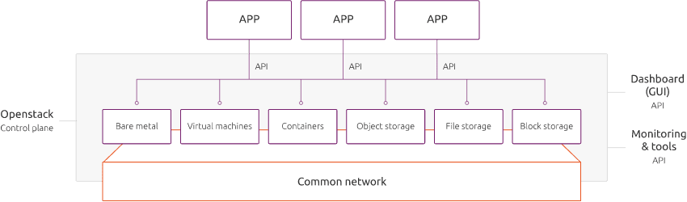

OpenStack is an open source cloud computing platform that allows businesses to control large pools of compute, storage and networking in a data centre.

The fact that OpenStack is open source means that anyone that chooses to use it, can access the source code, make changes, and share these with the community. One of the key benefits of this model is that the source code can then be checked by a much larger set of people than proprietary code, which is restricted to its owners.

Governed by the OpenStack Foundation, there are more than 34,000 individual contributors and over 550 companies that participate in the project.

[Get fully managed OpenStack](https://ubuntu.com/openstack/managed)

[ Watch the webinar - “Open source infrastructure: from bare metal to microservices” ](https://www.brighttalk.com/webcast/6793/404267/open-source-infrastructure-from-bare-metal-to-microservices)

 Software-defined networks and storage 
---------------------------------------

 OpenStack includes the ability to provide on-demand networks, IP addresses, firewalls and routers. Basic capabilities for these are built-in and OpenStack can also be integrated with telco-oriented SDN offerings from network equipment providers such as Juniper, Cisco and Nokia. For a business, the ability to define networks through an API enables fast-paced infrastructure automation and cloud-style operations. 

 Similarly, OpenStack includes a framework for software-defined storage, including both block (‘disk’) and object storage mechanisms. There are pure software implementations of these that are built in to OpenStack, but it is also possible to integrate with third-party offerings from EMC, NetApp, PureStorage and others. 

Companies involved in OpenStack
-------------------------------

OpenStack was originally launched in July 2010 by Rackspace and NASA as an open source initiative that combined NASA’s Nebula platform and Rackspace’s Cloud Files platform.

Today, hundreds of companies contribute to OpenStack code, with many more playing a part in the broader community.

### Influential contributors to openStack

* 
* 
* 
* 
* 
* 

What makes up OpenStack?
------------------------

At its most basic, OpenStack is comprised of storage, compute, and networking projects, such as the following core examples...

### Nova

Nova is the primary compute engine of OpenStack, used for deploying and managing virtual machine and instances for computing tasks. Nova supports a wide range of hypervisors; KVM, XenServer®, VMware ESXi, and Microsoft Hyper-V. Linux Containers such as LXC are also supported.

### Neutron

Neutron is the networking element of OpenStack that provides ‘networking as a service’ capabilities. The software defined networking (SDN) replaced the original networking technology of choice called Quantum.

Support for multiple network models such as: Flat, VLAN, VXLAN, static IPs, and DHCP is included in Neutron, whilst it can also take advantage of SDN platforms such as OpenFlow to use advanced networking capabilities.

### Cinder

Cinder is a block storage component that provisions and manages block devices (Cinder volumes). Users are able to request and consume storage resources through a self-service application programming interface (API).

Fully integrated with Nova, Cinder supports integration with a wide range of storage platforms.

### Swift

Swift is a storage system for objects and files. Swift works in a different way to the traditional method of referring to files by their disc drive location, instead it is possible for developers to refer to a unique identifier that refers to the file of piece of information, letting OpenStack decide where this information is stored.

One of the main benefits of this is the ease of use it creates for scaling. By removing the need for developers to worry about the capacity on a single system behind the software. Another added advantage is that the system takes care of ensuring that the data is backed up, rather than relying upon the developer to do so.

Who uses OpenStack?
-------------------

There are thousands of users of OpenStack across a broad range of industries. Particularly favoured for its security, scalability, resilience.

In addition to CERN, the UK Civil Service, and numerous universities around the world, OpenStack has become a popular choice for telecommunication companies such as ATT, Verizon, and China Mobile.

Use cases are also growing in the media area with SkyTV and DirecTV having already adopted.

Financial services have been a keen adopter, with BBVA, Banco Santander, Commonwealth Bank, and China UnionPay just some that have adopted.

Further adoption has been seen in healthcare, manufacturing, and retail.

How to install OpenStack
------------------------

The OpenStack system consists of several key services that are separately installed. These services work together depending on your cloud needs and include the Compute, Identity, Networking, Image, Block Storage, Object Storage, Telemetry, Orchestration, and Database services. You can install any of these projects separately and configure them stand-alone or as connected entities

[Install OpenStack and its main services](https://ubuntu.com/openstack/install)

Or browse the [list of Openstack Services](https://www.openstack.org/software/project-navigator/openstack-components#openstack-services)

### Growing your cloud?

Take advantage of reliable support from our enterprise subscription, spanning all aspects of open infrastructure.

[Plans and pricing](https://ubuntu.com/advantage)

### Talk to us

Let our cloud experts help you get started in the right direction with OpenStack, with consulting, training or outsourced operations.

[Contact us](https://ubuntu.com/openstack/contact-us)

### Further reading

* [A guide to ML model serving](https://ubuntu.com/blog/guide-to-ml-model-serving)
* [Deploying Mattermost and Kubeflow on Kubernetes with Juju 2.9](https://ubuntu.com/blog/deploying-mattermost-and-kubeflow-on-kubernetes-with-juju-2-9)
* [Canonical & Ubuntu at KubeCon Europe 2021](https://ubuntu.com/blog/ubuntu-and-canonical-at-kubecon-europe-2021)
* [Multi-cloud infrastructure in Italy](https://ubuntu.com/blog/multi-cloud-infrastructure)
* [KubeCon co-located events: Operator Day is back!](https://ubuntu.com/blog/kubecon-colocated-events-operator-day-2021)