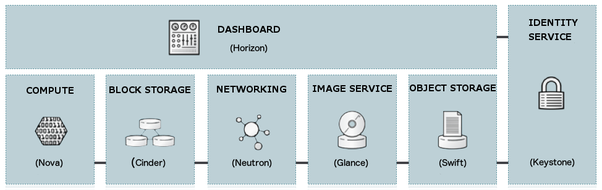

Basic Architecture of OpenStack is given below.

*OpenStack Architecture:*

*It includes several major component:*

1. Dashboard (Horizon): Users log into U I specifies V M ( Virtual Machine ) parameters (such as name , flavor , keys etc .
2. Nova : compute ; manages the life cycle of compute instances in an OpenStack environment. It includes Spawning , scheduling and decomposing of virtual machines on demand.
3. Cinder ( Block storage ): It provides persistent block storage to running instances
4. Neutron ( Networking ): It provides connectivity between the interface of other OpenStack services such as Nova .
5. Glance ( Image service ) : It stores and retrieves virtual machine disk images . Images can be used as a template in setting up a new server. Usually images are stored in swift ( object ) service.
6. Swift (Object storage ) : It stores and retrieves arbitrary unstructured data objects via a HTTP based API . It is highly fault tolerant with its data replication and scale out architecture.
7. Keystone ( Identity ) : It provides an authentication and authorization service for other open stack services.