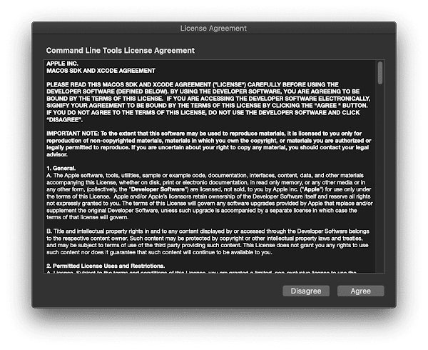
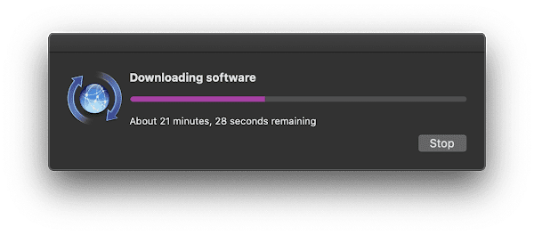
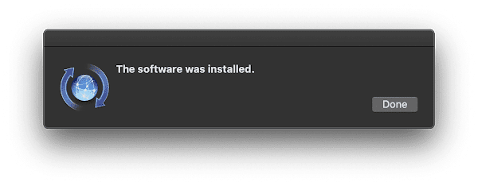

# Xcode Command Line Tools Installation FAQ

## How to install, update, and uninstall Xcode command line tools on macOS

** [Apr 7, 2020](https://www.godo.dev/tutorials/xcode-command-line-tools-installation-faq/ "permanent link") ** [cli](https://www.godo.dev/tags/cli), [macos](https://www.godo.dev/tags/macos)** 4 min read

Xcode is an IDE from Apple to create apps for iPhone, iPad, Mac, Apple Watch, and Apple TV. You probably need some of its tools without install the entire package. Maybe you want to write a command-line software on macOS, or maybe you need to use [Homebrew](https://brew.sh/) package manager. In that case, you only need the subset of it: Xcode command-line tools.

In this post, I documented three most frequently asked questions about the Xcode command-line tools.

* [How to Install Xcode Command Line Tools](https://www.godo.dev/tutorials/xcode-command-line-tools-installation-faq/#how-to-install-xcode-command-line-tools)
* [How to Uninstall Xcode Command Line Tools](https://www.godo.dev/tutorials/xcode-command-line-tools-installation-faq/#how-to-uninstall-xcode-command-line-tools)
* [How to Update Xcode Command Line Tools](https://www.godo.dev/tutorials/xcode-command-line-tools-installation-faq/#how-to-update-xcode-command-line-tools)
* [Manually Install Command Line Tools for Xcode](https://www.godo.dev/tutorials/xcode-command-line-tools-installation-faq/#manually-install-command-line-tools-for-xcode)

## How to Install Xcode Command Line Tools

macOS is bundled with `xcode-select`. By using this command, you can download and install the latest Xcode command-line tools. What you need is to enter the following command.

**

```
xcode-select --install

```

Here is an example session when I install Xcode command-line tools.

**

```
$ xcode-select --install
xcode-select: note: install requested for command line developer tools

```
After you entered the previous command on Terminal, a pop-up window will appear for confirmation. Click `Install` to continue. If you need to rethink again, click `Cancel`.

Xcode command line tools install confirmation

A standard License Agreement will appear. If you want to, you can read them all. Click `Agree` to continue the installation process.

Xcode command line tools license agreement

A pop-up window will appear informing you of the download progress. This time you do nothing. Wait until the download process finished. This can take a long time, it depends on your internet speed.

Downloading Xcode command line tools

After the downloading finished, the final pop up window will appear. This is to inform you that the Xcode command-line tools were installed on your machine successfully.

Xcode command line tools was installed successfully

## How to Uninstall Xcode Command Line Tools

In the case in the future you don’t need it again and want to free some space, you can uninstall it.

Unfortunately, there is no `xcode-select --uninstall` command. So, you have to do it manually. Just type the following command to the terminal.

**

```
sudo rm -rf /Library/Developer/CommandLineTools

```

It’ll ask your password you used for login. Enter your password and wait until it’s finished.

## How to Update Xcode Command Line Tools

As I mention earlier, you probably use Xcode command line tools just for the Homebrew package manager. So am I on the other machine.

One time when I do some check and update, I got the following message.

**

```
$ brew doctor
Please note that these warnings are just used to help the Homebrew maintainers
with debugging if you file an issue. If everything you use Homebrew for is
working fine: please don't worry or file an issue; just ignore this. Thanks!

Warning: A newer Command Line Tools release is available.
Update them from Software Update in System Preferences or
https://developer.apple.com/download/more/.

```

But when I open macOS `Software Update`, there is no available at all.

Then I try to re-install from the command-line but got the following error message instead.

**

```
$ xcode-select --install
xcode-select: error: command line tools are already installed, use "Software Update" to install updates

```

Unfortunately, there is also no `xcode-select --update` command. That means we need to do two manual steps to update Xcode command-line tools: uninstall and install.

So here is the solution. First, uninstall Xcode installation by removing its folder.

**

```
sudo rm -rf /Library/Developer/CommandLineTools

```

Then re-install again from the beginning.

**

```
xcode-select --install

```

Follow the installation guideline and wait until it’s finished. Xcode command-line tools now updated to the latest version.

## Manually Install Command Line Tools for Xcode

If none of above methods work, you can download the installer manually from [Apple Developer](https://developer.apple.com/download/more/). To install the command line tools manually, read following steps.

1. Visit Apple Developer download [page](https://developer.apple.com/download/more/).
2. Login with your Apple ID.
3. Search for `Command Line Tools for Xcode`.
4. Select the latest version you need.
5. Download the `Command Line Tools for Xcode*.dmg` file.
6. Open the package installer and follow installation instruction.

## References

* [Technical Note TN2339: Building from the Command Line with Xcode FAQ](https://developer.apple.com/library/archive/technotes/tn2339/_index.html)