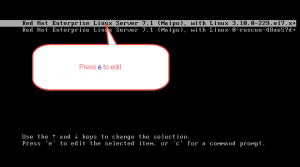
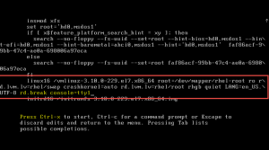
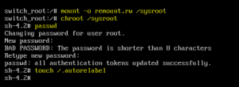

reset root user password rhel7 and centos 7\. Sometimes if you forgot root user password, you can’t reset root user password from any other user since Linux is not allowed to reset the root user password from other Normal / Administrator user. Maybe you have to rebuild entire host, using this below method if you have physical access to server you can recover root password.

If your going to write RHCSA ([Red hat Certified System Administrator](https://www.youtube.com/watch?v=BskRmjvWG5Y&list=PL8cE5Nxf6M6ZHEt4-CgdvbMyJ3hRAoth3)) and RHCE (Red hat Certified Engineer) certifications this is the first step you have to resolve.

reset root user password RHEL7
------------------------------

When you type wrong password above authentication failure screen will appear. Then in the top right corner there is a power button will appear as shown in below screenshot, click on power button then click restart

Click Restart

Server will restart.

When server is loading boot menu then press any key (Arrow Key / Space Bar) to stop the boot menu, then press ‘e’ to edit the kernel line. Whenever kernel lines are edited below screen will appear

in kernel line where you see “linux16” word go to end of that line and type rd.break console=tty1 then press CTRL+X

server will continue to boot in single user mode. File system in this mode will be in Read Only mode. So we have to remount the file system as Read / Write then only we can able to make a change in configuration files. when we change an Password of root user encrypted password will be stored in /etc/shadow.

    switch_root# mount -o remount,rw /sysroot

above command will mount an file system as read-write

    switch_root# chroot /sysroot

above command will change as actual root

    sh-4.2# passwd

above command will change the password of root user

Now root password is changed. 

Note: In RHEL7 by default SELinux is in enforcing state so we have to relabel the SELinux then only server will boot properly when you reboot to do that follow the below steps

**sh-4.2\#** touch /.autorelabel

Above mentioned command will create an hidden file under the slash which means SELinux will auto matically relabel the SELinux policy when server is booting.

That’s it After the successful boot of server use new password to login.

Please provide your valuable comments on the same

Keywords:
---------

reset root user password rhel7, reset root user password centos 7, changing root user password rhel7, how to reset root user password in linux

Related Articles
----------------

[Linux Learners Guide Book](https://arkit.co.in/linux-learners-guide-book-written-by-ankam-ravi-kumar/)

[RHCSA and RHCE Certification Guide](https://arkit.co.in/one-linux-tutorial/)

**Thanks for your wonderful Support and Encouragement **

* [Get Email](https://feedburner.google.com/fb/a/mailverify?uri=arkit) | [Download E-Books](https://arkit-in.tradepub.com/)
* [Facebook Page](https://www.facebook.com/Linuxarkit)
* [Youtube Channel](https://www.youtube.com/Techarkit?sub_confirmation=1)
* [Twitter](https://twitter.com/aravikumar48)
* [Exclusive Telegram Group](https://t.me/Linuxarkit)
* [Discuss On WhatsApp Group](https://github.com/techarkit/TechArkit-YouTube/blob/master/whatsapp_group.md)

More than 40000 Techies in our community do you want part of it Join Now